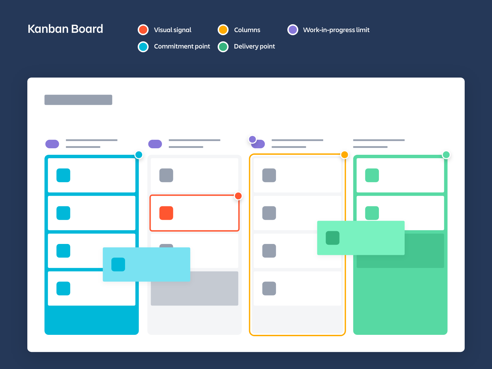
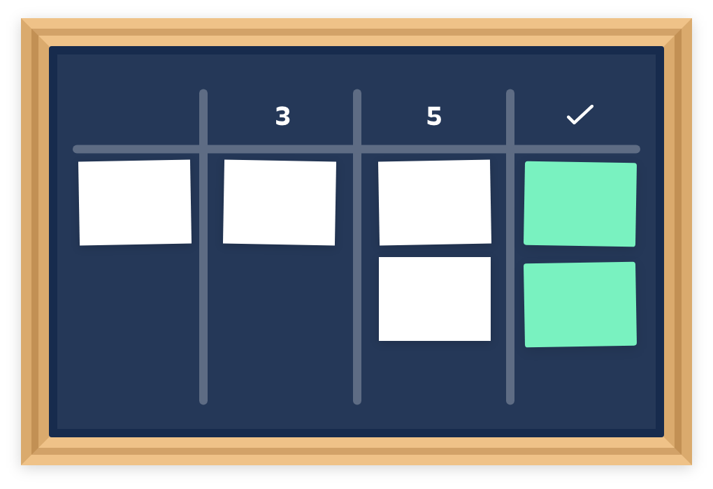

# What is kanban?
Kanban is a popular framework used to implement agile software development. It requires real-time communication of capacity and full transparency of work. Work items are represented visually on a kanban board, allowing team members to see the state of every piece of work at any time.

[Youtbe Video: What is kanban](https://www.youtube.com/embed/iVaFVa7HYj4)

# What is a kanban board?
A kanban board is an agile project management tool designed to help visualize work, limit work-in-progress, and maximize efficiency(or flow). Kanban boards use cards, columns, and continous improvement to help technology and service teams commit to the right amount of work, and get it done!

[Youtube Video: What is kanban board](https://youtu.be/Bcid33tgq8A)

> "Kanban" is the Japanese word for "visual signal". If  you work in services or technology, your work is often times invisible and intangible. A kanban board helps make your work visible so you can show it to others and keep everyone on the same page.

Kanban has come a long way its from origins in lean manufactureing thanks to a small but might group of kanban enthusiasts. David Anderson's work defining the kanban method helped bring kanban into the software and servie space, and Personal Kanban, by Jim Benson and Tonianne DeMaria, helped expand the applications of kanban to places you wouldn't believe.

## Element of kanban board
David Anderson established that kanban boards can be broken into five components: Visual Signals, Columns, work-in-progress limits, a commitment point, and a delivery point.

1. **Visual Signals**- One of the first things you'll notice about a kanban board are the visual cards (sticker, tickets or otherwise). Kanban team write all of their projects and work items onto card, usually one per card. For agile teams, each card could encscapulate one user story. Once on the board theses visual signals help teammates and stackholders quickly understand what the team is working on.
2. **Columns** - Another hallmark of the kanban board are the columns. Each column represents a specific activity that together compose a "worflow". Cards flow through the workflow unit completion. Workflows can be as simple as "To Do", "In progress", "Complete", or much more complex.
3. **Work in progress(WIP) Limits** - WIP limits are the maximum number of cards that can be in one column at any given time. A column with a WIP limit of three cannot have more than three cards in it. When the column is "maxed-out" the team needs to swarm on those cards and move them forword before new cards can move into the stage of the workflow. These WIP limits are critical for exposing bottlenecks in the workflow and maximizing flow. WIP limits give you an early warning sign that you committed to too much work.
4. **Commitment point** - Kanban teams often have a backlog for their board. This is were customers and teammates put ideas for projects that the team can pickup when they are ready. The commitment point is the moment when an idea is picked up by the team and work starts on the project.
5. **Delivery point** - The delivery point is the end of a kanban team's workflow. For most teams, the delivery point is when the product or service is in the hands of the customer. The team's goal is to take cards from the commitment point to the delivery point as fast as possible. The elapsed time betweeen the two is the called Lead Time. Kanban teams are continously improving to decrease their lead time as much as possible.

A kanban board with these five elements will undoubtedly set your team up for success. But now, I'll present an opposing point of view.

Jim Benson says that kanban only has two rules: Limit work in progress and visualize your work. If you start with just those rules and apply them to your work, your kanban board will look much different than one described above. And that ok! Jim advocates for starting with just these two rules because he says, "There more rules you add, the less contexts it fits into".

## Types and examples of kanban boards
Kanban can be adapted to many environments, from manufacturing, to agile software development, to human resources. The type of environment adapting kanban often dicates if  the board is physical or digital. In my research I learned of a $58 million dollor construction job managed with a physical board in a trailer and I spoke to many, many software teams using digital kanban boards.

### Physical boards
The simplest kanban boards are physical boards divided into vertical columns. Teams mark up a whiteboard or blackboard and place sticky notes onto the board. These sticky notes move through the workflow and demonstrate progress.

One advantage of a physical board is that its "always on". You can't open a new tab on a giant rolling whiteboard sitting right by your desk. It's simple to set up, simple to show others, and is often times the better way to communicate with certain teams. However, physical boards are not ideal for remote teams or people with terrible handwriting, like me.

Optimizely makes software to help companies learn what variants of a web page or product users like best. They use Jira to track work items large and small, but Keith Nottonson, Senior Director of Development, saw a gap.

Individual teams, were humming in Jira, but they weren't talking to each other. To get everyone on the same page, Keith erected a massive physical kanban board called "the wall of work".

Their board have every project engineering team is working on, with metrics, team members, and status on display for all. While this was helpful for understanding their whole portfolio of work, an even more interesting value began to play out.

"At first, the wall was just "to-do", "doing", and "done", but over time people began having conversations about how we work," Keith said. Keith went on to share that thanks to those conversations, the wall grew and evolved and in a matter of weeks, Optimizely had clearer picture of how work gets done ever before. 

Optimizely's board is especially great because it has a commitment and delivery point. Once a project is defined and meets certain criteria, an engineering team will pick up the project and commit to getting it done. At this point, the project goes in Jira so they can capture all the juiciy data and interactions involved in the final delivery.

Keith recommends that teams start with a physical kanban boards as those early conversations will lead to rapid iterations of the workflow and board.

### Digital boards
As the kanban system gained favor with software and engineering teams, kanban boards underwent a digital transformation. Digital boards allow teams that do not share a physical office space to use kanban boards remotely and asynchronously.

[Trello](https://www.trello.com/) is as fast and simple way to make a digital kanban board. The setup involves just  a few clicks to create digital lists, which represent the stages of your kanban process, on a board view that whole team can access and manage.

For example, you might create lists for "Backlog", "Up Next", "In progress", and "Done!" Each task is organized as a card, which you move across the list as they are queued up, work on, and completed.

The advantages of a digital kanban board like this are the speed to set it up, the ease in sharing it with others, and the ability to asynchronously track an infinite number of conversations and comments as the project progresses. No matter where or when team members check in on the kanban board, they'll see the most up-to-date status of the project. Plus, you can even use a Trello kanban workflow for your personal to-dos, [like this sample board shows](https://trello.com/b/lZmvFcpe/cause-if-anyone-can-tash-kanban).

### Kanban board vs. Scrum board
The differene between kanban and scrum is actually quite subtle. By most interpretations, scrum teams use a kanban board, just with scrum processes, artifacts, and roles along with it. There are however, some key difference.
- Scrum sprint have start and stop dates whereas kanban is an ongoing process.
- Team roles are clearly defined in scrum (product owner, dev team, and scrum master), while Kanban has no formal roles. Both teams are self organized.
- A kanban board is used throughout the lifecycle of a project whereas a scrum board is cleared and recycled after each sprint.
- A scrum board has a set number of taks and strict deadline to complete them.
- Kanban boards are more flexibe with regards to tasks and timing. Tasks can be reprioritized, reassigned, or updated as needed.

### Getting started with Kanan boards
Kanban is a "start with what you do now" method. That means you don't have to uproot what your're doing to get started with kanban. The kanban method assumes three things:
1. You understand current processes, as they are actually praticed, and respect current roles, responsibilities, and job titles.
2. You agree to pursue continous improvement through evolutionary change.
3. You encourage acts of leadership at every level - from individual contributors to senior management.

This is a team process, so the first thing your team should do is get together! You'll want to try and break your work into the distinct activities that compose the workflow (columns). From there, you can figure how and where new work(cards) get added to the board. Will you have a service desk where customers submit ideas or will the team set uo a meeting to write down and post their cards?

You'll also want to decide the size and scope of on card. Try and find a estimate or complexity estimate that will be uniform across all the cards. If something is too meaty or challenging, try to break it uo into multiple cards.

Once you decide on a commitment point and delivery point you're ready to get to work. As time progresses, rely on your team to critique and improve the process . Remember kanban calls for acts of leadership at all levels on an ongoing basis, a concept called Kaisen. With the kanban values of respect for people and continous improvement in mind, you'll be up to speed in no time.

# What are WIP Limits?
In agile development, work in progress(WIP) limits set the maximum amount of work that can exist in each status of a workflow. Limiting the amount of work in progress makes it easier to identify inefficency in a team's workflow. Bottlenecks in a team's delivery pipeline are clearly visible before a situation become dire.

## Why are WIP Limits important?
So now you're thinking, "Tell me more!" (Well, I hope you are.)

Wip limits improve throughput and reduce the amount of work " nearly done", by forcing the team to focus on a smaller set of tasks. At a fundamental level WIP limits encourage a culture of "done". More important, WIP limits make blockers and bottleneck visible. Teams can swarm around blocking issues to get them understood, implemented, and resolved when there is a clear indicator of what existing work is causing a bottleneck. Once blockages are removed, work across the team begins to flow again. These benefits guarantee that increments of value are delivered to customers sooner making WIP limits a valuable tool in agile development.
> Also, multitasking is deceptively time-intensive

During development, it's easy to think "Oh, I'll pause on this one issue while I begin work on another." Having two issues open means context switching between two different things or transferring work between teammates. Ramping down on one issue and up on another isn't free-it takes time and degrades focus. It's almost always better to work through the original issue rather than starting and not completing-new work. In other words, WIP limits discourage us from impeding our own flow.

Finally, WIP limits point out areas of chronic idealness or overload. They help the team see inefficiencies in the entire process rather than just the particular area in which they work.

>PRO TIP:
>For teams new to WIP limits, they will feel awkward. Take the time to discuss them in the first few iterations. Understand when and why the team hit the WIP limits. Resist the temptation to arbitrarily adjust them at first, If a breach becomes consistent, that's a sign that either the WIP limit is too restrcitive or the team's process is inefficent.

## Using WIP limits on agile teams
Now that you're sold on their value, let's go down to brass tacks.

When rolling out a new workflow, make a team decision to determine the WIP limits for each status. We recommend setting WIP limits after monitoring the average number of work items in each status for a few sprints. Below is a sample agile board with WIP limit used by a typical software development team.

Above, a WIP limit has been set on code review. Since the column is exceeding its limit, the background has turned red.

Since there's nothing left to do once an issue reaches done, there is no need for a WIP limit there. In the board above, "Ready for dev" signifies that the story has been fully vetted by the product owner and team. The development pulls work from "ready for dev" into "in progress" as they start on work items. As a best practice, it is important to keep enough work in the "ready for dev" status so that each member of the development team remains fully utilized. By keeping only just enough stories in the "ready for dev" state, the product owner doesn't get too far ahead of the game when it comes to fleshing out requirements, and the program becomes more responsive to change.

The "in progress" status list work that's under active development. The goal of WIP limits in this case is to ensure that everyone has work to do, but no one is multitasking. In the board above, the limit for "in progress" items is 4, and there are currently 3 items in that state. This tells the team they've got capacity to take on more work. As a best practice, some teams set the maximun WIP limit below the number of team members. The idea is to bake in room for good agile pratices. If a developer finishes an item, but the team is already at their WIP limit, they know it's time to knock out a few code reviews or join another developer for some pair programming.

The "code review" status indicates stories that have been fully written but need to reviewed before merging into the code base. Timely code reviews are a best practice that establish quality, get new innovation out to market faster, make merges easier by reducing open branches, and spread knowledge across the engineering team. Items in this status should be acted on urgently, for few reasons:
- The code doesn't rot as team members check in new code.
- The developer doesn't lose the context he or she gained in the writing the original code.
- The feature can be merged into the main branch of release.

WIP limits guarantee un-reviewed code doesn't pile up.

Note that in the agile board above, the team has too many code reviews, so the column has turned red to indicate that.
> ANTI-PATTERNS TO WATCH FOR:
> - WIP limit are raised as needed so the team doesn't hit them anymore. ("Debt ceiling" anyone?)
>- Everyone has large "background task" on their plate to mask time when they'd otherwise be idle.
> - Team members sit idle waiting for more work to pull in, rather than swarming on bottlenecks.
> - Throwing more person hours at persistent bottlenecks is preferred over improvements in eginerring practices or team processes.

## 4 goals for agile teams using WIP limits
Like any new activity, WIP limits may feel awkward at first. The goal here is to optimize the team over the medium-term, and the short-term awkwardness is actually a good thing. It's causing the team to feel some pain points in their process. After the team uses their WIP limits for a few weeks, make adjustments as needed. Resist the temptation to raise a WIP limit just because the team keeps hitting it. Seize that opportunity to increase capacity-ideally, by educating the team and giving each member new skill sets or making some aspect of the development process more efficient.
- **Goal 1**: Size individual tasks consistently. When breaking down requirements and user stories, it's important to keep individual tasks to no more than 16 hours of work. Doing so increase the team's ability to estimate confidently, and it helps prevent bottlenecks. Nothing slow down a team and aggravates WIP limits like a big work item clogging up the pipeline.
> PRO TIP:
> When work in progress limits are working for the team, an issue's cycle time will drop. Cycle time is the amount of time it takes to complete an issue. 
- **Goal 2**: Map WIP limits to the team's skills. The above example assumes team members have similar skill sets. If you team has specialist on it, work in progress limits may differ when the specialist is involved. Create a status specific for the specialist's work. If bottleneck occur in that status, use the opportunity to educate other team members to add additional capacity for the specialist's skill sets and increase flow across the entire team.
- **Goal 3**: Reduce idleness. When a team member has some downtime, encourage them to help an upstream or downstream team member. They'll contribute to the overall productivity of the team, and learn something along the way!
- **Goal 4**: Protect a sustainable engineering culture. Work in progress limits do not mean developers need to rush through work to avoid work overload in a particular status. They are meant to support solid agile engineering pratices that protect the quality of the product and health of the code base.

 
