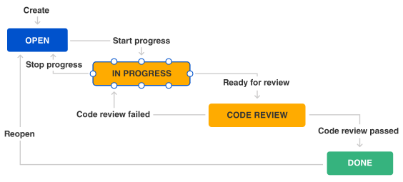
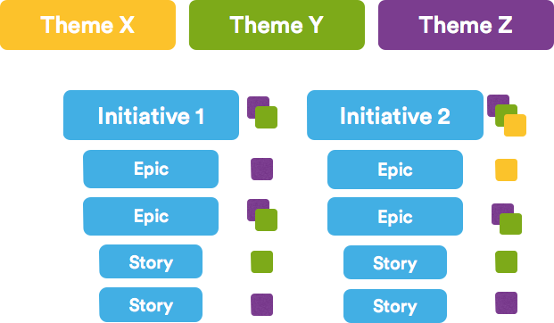
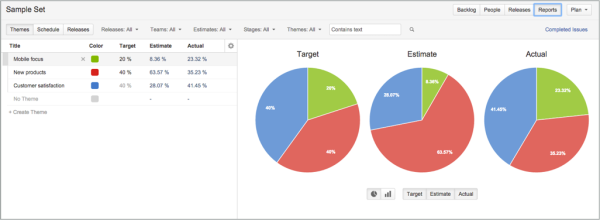
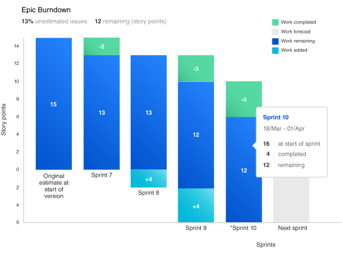
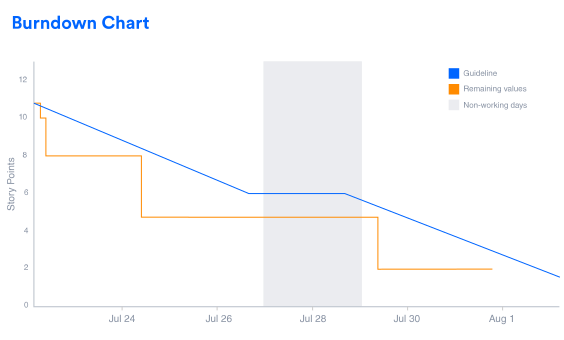
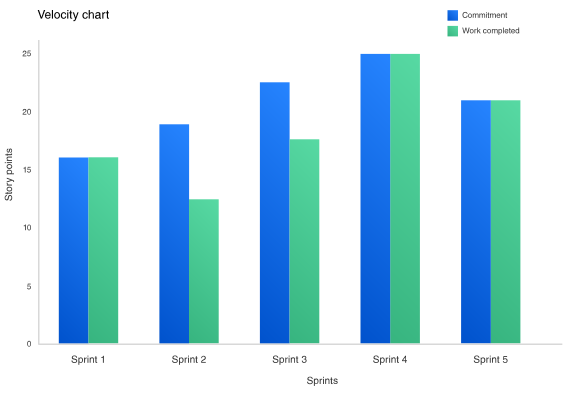
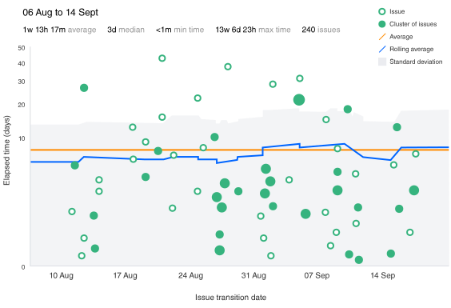
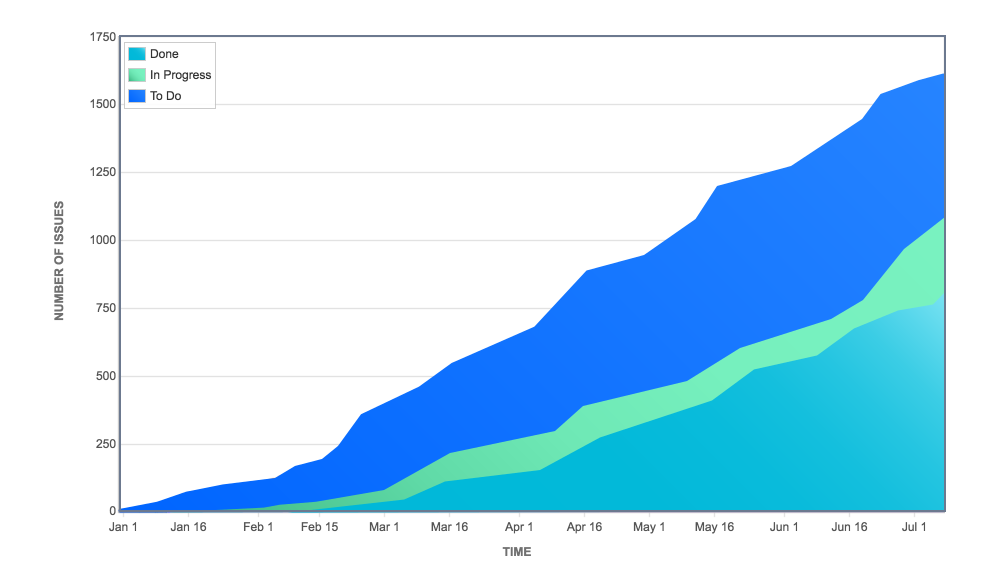

# Agile Project Management 

## What is agile project management?
Agile project management is an  iterative approach to managing software development projects that focus on continous releases and incorporating customer feedback with every iteration.

### History
Stemming from Toyota's lean manufacturing concept of the 1940s, software development teams have embraced agile methodologies to reduce waste and increase transparency while quickly addressing their customers' ever-changing needs. A stark change from waterfall project management that focus on "big bang" launches, agile help software teams collaborator better and innovate faster than ever before.

Traditional agile project management can be categoried into two frameworks: scrum and kanban. While scrum is focused on fixed-length project iterations, kanban is focused on continous releases. Upon completion, the team immediately moves on to the next.

### How scrum works
Scrum is a framework for agile project management that uses fixed-length iteration of work, called sprints. There are four ceremonies that bring structure to each point.

It all start with the backlog, or body of work that need to be done. In scrum, there are two backlogs: one is the product backlog(owned by the product owner) which is the prioritized list of features, and the other is the spring backlog which is filled by taking issues from the top of the product backlog until the capacity for the next spring is reached. Scrum teams have unique role specific to their stake in the process. Typically there's a scrum master, or champion of the scrum method for the team; the product owner who's the voice of the product; and the scrum team, who are often cross-functional team members in change of getting s@#$ done.

#### The four ceremonies of scrum
|Sprint Planning|Sprint Demo|Daily Standup|Retrospective|
|---------------|-----------|-------------|-------------|
|A team planning meeting that determines that what to complete in the coming sprint|A sharing meeting where the team shows what they've shipped in that spring|Also known as a stand-up, a 15 minute mini-meeting for the software team to sync|A review of whant did and didn't go well with actions to make the next spring better.|

#### The scrum board
A scrum board is used to visiualize all the work in a given sprint. During the spring planning meeting, the team moves items from the product backlog into the sprint backlog. Scrum boards can have multiple steps visible in the workflow, like To Do, In Progress, and Done. Scrum boards are the key component for increasing transparency in agile project managment.

### How Kanban works
Kanban is a framework for agile project management that matched the work to the team capacity. It's focused on getting things done as fast as possible, giving teams the ability to react to change even faster than scrum.

Unlike scrum, kanban has not backlogs(usually). Instead, work sit in the To Do Column. This enables kanban teams to focus on continous releases, which can be done at any time. All work is visible, scoped, and ready to execute on so that when something is completed, the team is immediately moves on to the next. The amount of work is matched to the team capacity through WIP limts, which is a predefined limit of work that can be in a single column at one time(except the To Do Column). The kanban framework includes the following four components:
#### The four component of kanban
|List of work(or stories)|Columns or lanes|Work in progress Limit(WIP)|Continous Releases|
|------------------------|----------------|---------------------------|------------------|
|List of work, or stories are defined as issues or task that need to get done|Used on kanban board to distinguish tasks from different workstreams, users, projects, etc.|A rule to limit the amount of work to be done based on the team capacity|The team works on the amount of stories withing the WIP limit and can release at anytime.|

#### The kanban board
A kanban board is used to visiualize all the work that being done. It's also used for planning resource allowing project managers to see the work and develop timelines accordingly. A kanban board is structured into columns and lanes that stories pass through on their way to completion. Stories sit in the To Do column until the WIP limit allow for the next task to be worked on. The list of work should be split into relatively small issues and organized by priority.

### Estimate, report and plan
Whatever agile framework you choose to support your software development, you'll need a way to see your team's progress so you can plan future work on sprints. Agile project estimating helps both scrum and kanban teams understand their capacity. Agile reports show the team's progress over time. And backlog grooming helps project managers keep the list of work current and redy for the team to tackle.

#### Agile project estimating
Project estimating is an extremenly important aspect of both kanban and scrum project management. For kanban, many teams set their WIP limit for each state based on their previous experience and team size. Scrum teams use project estimating to identify how much work can be done in particular sprint.  Many agile teams adopt unique estimating techniques like planning poker, ideal hours, or story points to determine a numeric value for the task at hand. This gives agile team a point of reference to refer back to during spring retrospectives to see how their team performed.

#### Agile Reporting
Project estimations come into play at the beginning and end of each sprint.  They help teams determine what they can get done at beginning of the sprint, but also show how accurate those initial estimates where at the end. Agile reports, such as Burndown charts, show how many story points are completed during the spring. 

#### Backlog Management and grooming
A product backlog is a pritorized list of worl for the development to do that comes from product roadmap and its requirements. The development team pulls work from the product backlog for each sprint.
Gromming and maintaining your backlog help teams achieve their long-term goals by continually adding and removing items based on the team's long term capacity and changing business objectives. 

## Runing agile program (without losing your mind)
>Some may think transitioning to agile means losing sight of the bigger picture. We couldn't disagree more.

Early adapter of agile development were small, self contained teams working on small, self-contained projects. They proved the agile model can work, to the joy and betterment of software makes around the world. More recently, larger organizations are scaling agile beyond single teams or projects, and seeking ways to apply it to whole programs.
This is not without its challenges. But that doesn't mean it can be done!

### Waterfall versus agile
Traditional project management styles, like waterfall, build in phases. Below is an illustration of a standard waterfall project. This style of product development folds everything into a single, "bing bang", high risk release. Once a project passes one phase, it's painful to revisit it because teams are always pressing forward to the next stage.

Traditional project management styles often create "critical paths", where the project can't move forward until a blocking issue is resolved. TO add insult to injury, the end customer can't interact with the product until it's fully complete. Thus, important issues in the product design, and code, go unddiscovered until release.

Let's constrast that with an agile project management style, which takes an iterative approach to development with regular feedback intervals. These iterations allow for the team to be diverted to (and productive in) another area of the project while a blocking issuse is resolved.

##### Besides removing critical paths, iterations let you inyeract with the product during development
This, in turn, gives the team constant opportunities to build, deliver, learn, and adjust. Market changes don't catch you flat-footed and teams are prepared to adapt quickly to new requirements.
An even greater benefit is shared skill sets among the software team. The team's overlapping skill sets add flexibility to the work in all parts of the team's code base. This way, work and time isn't wasted if the project direction changes.

### How to build a great agile program
When a program transistions from traditional project management to agile, the team and the stakeholders must embrace two important concepts:
1. The product owner's focus is to optimize the value of the development team output. The development team relies on the product owner prioritizing the most important work first.
2. The development team can only accept works as it has capacity for it. The product owner doesn't push work to the team or commit them to arbitrary deadlines. The development team pulls work from the program backlog as it can accept new work.

### Roadmaps
A roadmap outlines how a product or solution develop over time. Roadmaps are composed of initiatives, which are large areas of functionality, and include timelines that communicate when a feature will be avialable. As the program develops, it's accepted that roadmap will change - sometimes subtly, sometimes broadly. The goal is to keep the roadmap focused on current market conditions and long term goals.

### Requirements
Each initiative in the roadmap break down into a set of requirements. Agile requirements are lightweight description of required functionality, rather than the 100-page documents associated with traditional projects. They evolve over time and captialize on the team's shared understanding of the customer and the desire product. Agile requirements remain lean while everyone on the team develops a shared understanding via ongoing coverstion and collaboration. Only when implementation is about to begin are they are fleshed out with full details.

### Backlog
THe backlog sets the priorities for the agile program. The team includes all work items in the backlog: new features, bugs, enhancements, technical or architectural tasks, etc. The product owner prioritizes the work on the backlog for the engineering team. The development team then uses the prioritized backlogs as its single source of truth for what work need to be done.

### Agile delivery vehicles
Agile can be implemented using various frameworks(like scrum and kanban) to deliver software. Scrum teams use sprints to guide development, and kanban team often work without fixed work intervals. Both frameworks, however, use largely delivery vechiles like epics and version to structure development for a synchronized release cadennce out to production.

### Agile metrics
Agile team thrive on metrics.Work in progress(WIP) limit keep the team, and the business, focused on delivering the highest priority work. Graph like burndown and control charts help the team predict their delivery cadence, and continous flow diagrams help identify bottlenecks. These metrics and artificts keep everyone focused on the big goals and boost confidence in the team's ability to deliver future work.

### Agile run on trust
An agile program cannot function without a high level of trust amongst team members. It requires candor to have diffcult conversations regarding what's right for the program and the product. Because conversations happen at regular intervals, ideas and concerns are regularly expressed. That means team member also have to be confident in each other's ability(and willingness) to execute on the decisions made during those conversations.

## Wordflow
>Everyone hate "process", but let's face it: without an established workflow, you're going nowhere fast.

Every software team has a process they use to complete work. Normalizing that process-i.e., establishing it as a workflow - makes it clearly structured and repeatable, which, in turn makes it scalable. 

### Start simple, start now
When implementing a workflow for the team, always start simple. Fight the temptation to spend weeks(over-) engineering it. Overly complex workflow are hard to understand and adopt-not to mention adapt. For software teams, we recommend these basic workflow states:
> TO DO -  Work that has not been started

> IN PROGRESS - Work that is actively being looked at by the team 

> CODE REVIEW - Work that is completed, but awaiting review.

> DONE - Work that is completely finished and meets the team's definition of done.

In an issue tracker, these statuses flow from one to the next using transitions which structure the workflow.

Some software teams include additional states in their workflow that help them track the status of work more precisely.

> AWAITING_QA - Work that has been implemented, but is still waiting for a tester review.

> READY TO MERGE - Code that has been reviewed and is ready to merge into master or relase branch

Each state in the workflow doesn't need to be handled by different person. As an agile team matures developers handle more and more of the work-from design all the way through to delivery. An autonomous team that can handle heterogeneous work is one of the hallmarks of agilitiy, after all
> Healthy workflows adapt to the needs of the team. Osscasional pain is normal. Chronic pain is not.

Discuss each pain point in the team retrospective, and keep in mind that each team will have slightly different values based on their project, technology stack, and method in which they like to work. That's why it's important to choose an issue tracker that has a flexible workflow configuration. Too many teams compromise their work style to fit a particular toolset, which is frustrating for everyone. So team member start to avoid using that tool altogether, compunding frustration across the team and generally wreaking havoc. And when morale falls, productivity suffers. That's a double whammy we all want to avoid!

Team that are new to agile or that don't have cross-functional skills often end up with "mini waterfalls" in their workflow. For example design kicks off a work item with a mockup. Development does the implementation. Test confirms quality. Each state is blocked until the former state is complete. Sound familiar? That's waterfall. But we can do much better with agile workflows to unblock the team and make development easier.

### Optimize the workflow
When you're comforatable with the basic workflow and are ready to customize it, create statues for each type of work in a team's process. Ideation, design, development, code review, and test are functionality different and can be individual statuses that still clearly communicate what phase a piece of work is in.

Project statuses can also be shared with the rest of the organization. When building a workflow, think about which metrics are important to report on and what non-team members might be interested in learning. For example, a well designed workflow answers the following questions:
- What work has the team completed ?
- Is the backlog of work increasing or keeping pace with the team ?
- How many items are in each status ?
- Are there any bottleneck that are slowing the team down?
- How long does it take to complete an averabe task?
- How many work items didn't pass our quality standards the first time around?

The next step is optimizing the workflow is to ensure a steady stream of work through the workflow. Work-in-progress(WIP) limits dictate a minimum number of issues in a particular state of the workflow has enough work to keep the team fully utilized, but not so much that they lose focus because they're juggling priorities. Enforcing work-in-progress limit will quickly show which processes in the team are slowing down the overall work through the pipeline. As the team leants to optimize around its work-in-progress limits, throughput will increase.

### The challenges of scaling a workflow
Organizations that have several agile teams face special challenges with workflows. Team often want to optimize their own worflow to reflect their unique process and culture. Prefectly understandable. But it can create headaches when diffetent teams use different processes but work on the same project.

Agile teams that work together can benefit from sharing the same workflow. Using the same workflow can make transitioning work between agile team easier, because they use the same conventions for defining and delivering work. Creating a common process usually involves some give and take from both teams. That's good! They'll learn from one another and come out with a better workflow in the end.

No matter what your workflow look like, the process of developing it should be agile too, Discuss it in retrospectives from time to time, and adapt it as the team's culture and composition changes.

## Epics, Stories, Themes, and Initiatives
> These simple structure help agile team gracefully manage scope and structure work.

Let's say you and your team want to do something ambitious, like launch a rocket into space. To do so, you will need to structure your work: from the largest objectives down to the minute details. You'll want to be able to respond to change, report your progress, and stick to a plan. Epics, stories, themes and initiatives are precisely the tools you'll need to do so.

By understanding how these popular agile methodologies help organize work, you team can strike a healthy balance between structure, flexibility, and launching rocket into space.

### What are stories, epics, initiatives, and themes?
- **Stories**, also called "user stories", are short requirment or request written from the perpestive of an end user.
- **Epics** are large bodies of work that can be broken down into a number of small tasks ( called stories).
- **Initiatives** are collection of epics that drive toward a common goal
- **Themes** are large focus areas that span the organization.

### Agile Epic Vs Story
In a sense, stories and epics in agile are similar to stories and epics in film or literature. Ap story is one simple narrative; s series of releated and interdependent stories makes up and epic. The same is true for your work managment, where the completion of releated stories leads to the completion of an epic. The stories tell the arc of the work completed which the epic shares a high-level view of the unifying objective.

On an agile team, stories are something the team can commit to finish withing a one or two-week spring. Oftentimes, developers would work on dozens of stories a month. Epics, in constrast, are few in number and take longer to complete. Teams often have two or three epics they work to complete each quarter.

If your company was launching rockets into space, and wanted to improve the streaming service for your launches, you might structure your stories like the ones below.

#### Examples of an agile story:
- iphones users need access to a vertical view of the live feed when using the mobile app.
- Desktop users need a "view fullscreen" button in the lower right hand corner of the video player.
- Android users need to be linked ot apple store.

The above stories are all releated and could all considered individual tasks that drive toward the completion of the larger body work (an epic). In this case, the epic might be **"Improve Streaming Service for Q1 Launch."**

Organizing work into stories and epics also helps you and your team communicate effectively withing the organization. If you were reporting your team progress to the Head Enginerring, you'd be speaking in epics. If you were talking to a colleagure on your development team, you'd speak at the story level.

### Agile Epic vs Initiative
In the same way that epics are made up of stories, initiatives are made up of epics. Initiatives offer another level of organization above epics. In many cases, an initiative compiles epics from multiple teams to achieve a much broader, bigger goal than any of the epics themseleves. While an epic is something you might to complete in a month or a quarter, initiatives are often completed in multiple quarters to a year.
 

**Example of epic in an initiative:**
Let's say your rocket ship company wants to decrease the cost per launch by 5% this year. THat's a great fit for an ititative, as no single epic could likely achieve that big of a goal. Within that initiative there would be epics such as, "Decrease launch-pase fuel consumption by 1%", "Increase launches per quarter from 3 to 4", and "Turn all thermostats down from 71 to 69 degrees #Dadmode".

### Initiatives vs Themes
In many organziations the founders and management team will encourage the pursuit of some aspirational destination. These are the (sometimes super corny) goals announced each year or quarter, and themes are how you keep track of them.
- Initiatives are collections of epics.
- Themes are labels that track high-level organization goals.

Initiatives have a structural design. THe house epics, and the completion of those epics will lead to the completion of the initiative. Themes are an organizational tool that allows you to label backlog items, epics, and initiatives to understand what work contributes to what organizational goals. Themses should inspire the creation of epic and initiative but doesn't ha e a ridgit 1-to-1 releationship with them. A theme for a rocket ship company would be something like "Safety First". 

This is what themes look lin Portfolio for JIRA:

### Structuring your work:
Beign agile and embracing structure are not mutually exclusive, and the structure laid out here is not one size filts all. Success is when you and your team understand these concepts and adapt them to you nedds. For us, that stories, epics, initiatives, and themes.

## Agile Epics: Definition, Examples, & Templates
> An epic is a large body of work that can be broken down into a number of smaller stories.

An agile epic is a body of work that can be broken down into specific tasks (called "stories" , or "user stories") based on the needs/requests of customer or end users.

Epic are a helpful way to organize you work and to create a hierarchy. The idea is to break work down into shippable pieces, so that large project can actually get done and you can continue to ship value to your customers on a regular basis. Epics help teams break their work towards a bigger goal.

Maintaining agility when organizing large tasks, like epics, is no small task(pun intended). Learning how epic relate to a healthy agile program is an essential skill no matter the size of your organization.

### What is an Agile Epic?
An epic is a large body of work that can be broken down into a number of smaller stories, or sometimes called "Issues". Epics often encompass multiple teams, on multiple projects, and can even be tracked on multiple boards.

Epics are almost always delivered over a set of sprints. As a team learns more about an epic through development and customer feedback, user stories will be added and removed as necessary. That's the key with agile epics: Scope is flexible, based on customer feedback and team cadence.

### Agile Epic Example
Let's say it's 2050 and we work for a recreational space-travel orgaization. We do about a dozen launches a year, so each launch isn't the single biggest thing we do in a year, but it's still far from routine and will take many person-hours to complete. That sizing is just right for an epic.

An example epic "March 2050 Space Tourism Launch" includes stories for routine work items as well as stories for routing work items as well as stories aimed to improve keys apsects of the shuttle launch, from customers buying space travel tickets to the launch of the rocket itself. As such, multiple teams will contribute to this epic by working on a wide range of stories.

The software team supporting purchasing of tickets for March 2050 launch might structure their epic as so:

<table>
<tr><td colspan=3><strong>Epic : March 2050 Launch</strong></td></tr>
<tr>
	<td>Story:update date range to include March 2050 Launch dates.</td>
	<td>Story: Reduce load times for requested flight listing to < 0.45 seconds</td>
	<td>Story: Promote saturn summer sale on confirm page for First class bookings</td>
</tr>
</table>	

Concurrently, the propulsion teams might contribute to same epic with these stories

<table>
<tr><td colspan=3><strong>Epic : March 2050 Launch</strong></td></tr>
<tr>
	<td>Story:keep fuel tanks PSI > 250 on launch</td>
	<td>Story: Reduce overall fuel consumption by 1%</td>
	<td>Story: Hire new propulsion engineer to replace Gary #garygate 2050</td>
</tr>
</table>	

### Understaning Epics within a Complete Agile program
An epic should give the development team everything they need ti be successful. From a pratical perspective, it's the top tier of their work hierarchy. However, understanding how an epic relates to other agile structures provides important context for the daily dev work.
- A product roadmap is a plan of action for how a product or solution will evolve over time.
- A **theme** is an organization goal that drive the creation of epics and initiatives
- The product roadmap is expressed and visualized as a set of initiatives plotted along a timeline.
- Breaking initiatives into epics helps keep the team's daily work - expressed in smaller stories - connected to overall business goals.

A set of completed epics drives a specific initiative, which keeps the overall product developing and evoling with market and customer demands on top of organizational themes.

From our example above, a theme would be increasing space shuttle launches, the roadmap would track towards increasing launches from 3 per quarter to 4, the initiatives would be to drive down costs and increase ticket sales, and each epic would roll up into the initiatives.

### Creating an Agile Epic
When creating a new epic consider other planning and organization tools you team may already have in place. Creating epics around a team's quarterly goals or OKRs(Objectives and Key Results) is a great start. When creating an epic consider the following:
- **Reporting** - Create epic for the project that managers and executives will want to keep an eye on.
- **Storytelling** - Using epics, and the stories that roll up into them, as a mechanism to tell the story of how you arrived at the current state of a feature or product.
- **Culture** - Let organizational culture dicate the size and granularity of an epic.
- **Time** - Most development teams rely on estimation frameworks instead of time, but it's a worthwhile gut check to make sure your epics will take a couple weeks to complete. Not too long and not too short.

### Break down an Agile Epic
Breaking down an epic into more pratical stories helps in understanding a project and maintaining momentum, but it can be a daunting task for the uninitiated. There is no one-size-fits all solution for creating stories from an epic, but there are a lot of good options to consider:
- **User role or persona** - Create a unique story for each user persona. "Quicker login for new visitors", "quicker login for return customers", etc.
- **Ordered steps** - Break down the process and create a story for each step.
- **Culture** - Let team norms dictate if a story is a quick task or a week-long project.
- **Time** - Barring another agreed upon convention, design stories that can be completed in one print or less.

Theere is no universal definition that draws a line between a big story and an epic. In general, any scope of work that the team estimates at "weeks" (or longer) to complete rather than "hours" or "days" should be considered an epic and broken down into smaller stories.

### Measuring Agile Epic
Burndown charts can be used to visualize epics, and serve to keep teams motivated and the executive stakeholders informed. A good epic burndown chart is where the agility of the organization really shines.

An epic burndown chart shows the actual and estimated amount of work to be done in a sprint or epic. The horizontal x-axis in a Burndown Chart indicates time, and the vertical y-axis indicates stories or issues.

Use Burndown chart to track the total work remaining and to project the likelihood of achieving the sprint goal. By tracking the remaining work throughout the iteration, a team can manage its progress and respond accordingly. 

By monitoring a Burndown Chart, it becomes clear how the team is progressing and where the blockers are. Having these data points clearly visible keeps everyone on the same page and facilitates open conversation about the evolution of the product and completion forecasts. Not to mention that transparency builds trust!

### Understing Agile Epics
Epics are not the absolute foundation of an agile program, but they are the practical drivers for most agile teams. Understanding where they fit into a healthy agile program creates context for your work, breaking them down into stories create momentum.

## User Stories
> User stories are development task often expressed as "persona + need + purpose."

It's tempting to think that user stories are, simply put software system requirements. But they're not.

A key component of agile software development is putting people first, and user-stories put actual end users at the center of the conversation. Stories use non-technical language to provide context for the development team and their efforts. After reading a user story, the teams knows why they are building what they're building and what value it creates.

User stories are one of the core components of an agile program. They help provide a user-focused framework for daily work - which drives collaboration, creativity, and a better product overall.

### What Are Agile User Stories?
A user story is the smallest unit of work in an agile framework. It's an end goal, not a feature, expressed from the software user's perspective.

The purpose of a user story is articulate how a piece of work will deliver a particular value back to the customer. Note that "customers" don't have to be external end users in the traditional sense, they can also be internal customers or colleaguses withing your organization who depend on your team.

User stories are a few sentences in simple language that outline the desire outcome. They don't go into detail. Requirment are added later, one agreed upon by the team.

Stories fit neatly into agile framework like scrum and kanban. In scrum, user stories are added to sprints and "burned down" over the duration of the sprint. Kanban teams pull user stories into their backlog and run them through their workflow. It's this work on user stories that help scrum teams get better at estimation and sprint planning, leading to more accurate forecasting and greater agility. Thanks to stories, kanban teams learn how to manage work-in-progress(WIP) and can further refine their workflows.

User stories are also the building blocks of larger agile frameworks like epics and initaitives. Epics are large work items broken down into a set of stories, and multiple epics comprise and initiative. These larger structure ensure that the day to day work of the development team (on stones) contributes to the organizational goals built into epics and initiatives.

### Why Create User Stories?
For development teams new to agile, user stories sometimes seem like an added step. Why not just break the big project(the epic) into a series of steps and get on with it? But stories give the team important context and associate tasks with value those task bring.

User stories server a number of key benefits:
- **Stories keep the focus on the user.** A To Do list keeps the team focused on tasks that need checked off, but a collection of stories keeps the team focused on solving problems for real users.
- **Stories enable collaboration.** With the end goal defined, the team can work together to decide how best to serve the user and meet that goal.
- **Stories drive creative solutions.** Stories encourage the team to think critically and creatively about how to best solve for an end goal.
- **Stories create momentum.** With each passing story the develop,ent team enjoys a small challenge and a small win, driving momentum.

### Working with User Stories
Once a story has been written, it's time to integrate it into your workflow. Generally a story is written by the product owner, product manager, or pragram manager and submitted for review.

During a sprint or iteration planning meeting, the team decides what stories they'll tackle that sprint. Team now discuss the requirements and functionality that each user story requires. This is an opportunity to get technical and creative in the team's implementation of the story.Once agreed upon, these requirements are added to the story.

Another common step in this meeting is to score the stories based on their complexity or time to completion. Team use t-shirts sizes, the fibonacci sequence, or planning poker to make proper estimations. A story should be sized to complete in one sprint, so as the team specs each story, they make sure to break up stories that will go over that  completion horizon.

### How to Write User Stories
Consider the following when writing user stories:
- **Defination of "Done"**- The story is generally "done" when the user can complete the outlined task, but make sure to define what that is.
- **Outline subtasks or tasks** - Decide which specific steps need to be completed and who is responsible for each of them.
- **User personas** - For whom? If ther are multiple end users, consider making multiple stories.
- **Ordered Steps**- Write a story for each step in a larger process.
- **Listen to feedback** - Talk to your user and capture the problem or need in their words. No need to guess at stories when you can source them from your customers.
- **Time** - Time is a touchy subject. Many development teams avoid discussions of time altogether, relying instead on their estimation framework. Since stories should be completable in one sprint, stories , stories that might take weeks or months to complete should be broken up into smaller stories or should be considered their own epic.

Once the user stories are clearly defined, make sure they are visible for the entire team.

### User Story Template and Eamples
Use stories are often expressed in a simple sentence, structured as follows:

**"As a [persona], I [want to], [so that]."**

Breaking this down:
- "As a [persona]": Who are we building this for? We're not just after a job title, we're after the persona of the person. Max. Our team should have a shared understanding of who Max is. We've hopefully interviewed plenty of Max's. We understand how the person works, how they think and what they feel. We have empathy for Max.
- "Wants to": Here we're describing their intent - not the features they use. What is it they're actually trying to achieve? This statement should be implementation free - if you're describing any part of the UI and not what the user goal is you're missing the point.
- "So that": how does their immediate desire to do something this fit into their bigger picture? What's the overall benefit they're trying to achieve? What is the big problem that needs solving?

For example, user stories might look like:
- As Max, I want to invite my friends, so we can enjoy this servie together.
- As Sascha, I want to organize my work, so I can feel more in control.
- As a manager, I want to be able to understand my colleagues progress, so I can better report our success and failures.

This structure is not required, but it is helpful for defining done. When that persona can capture their desired value, then the story is complete. We encourage teams to define their own structure, and then to stick to it.

### Getting Started with Agile User Stories
User stories describe the why and the what behind the day-to-day work of development team members, often expressed as persona + need + purpose. Understanding their roles as the source of truth for what your team is delivering but also why, is key to smooth process.

Start by evaluating the next or most pressing, large project(e.g. an epic). Break it down into smaller user stories, and work with the development team for refinement. Once your stories are out in the wild where the whole team can see them, you're ready to get to work.

## Estimation
> Good estimation helps product owner optimize for efficiency and impact. That's why it's so important

Estimation is hard. For software developers, it's among the most diffcult-if not the most diffcult-aspects of the job. It must take into accont of slew of factors that help product owners make decisions that affect the entire team-and the business. With all that at stake, it's no wonder everyone from developers to upper management is prone to getting their undies in a bunch about it. But that's a  mistake. Agile estimation is just that: an estimate. Not a blood-oath.

There's no requirment to work weekends in order to compensate for under-estimating a piece of work. That said, let's look at some ways to make agile estimates as accurate as possible.

### Collaborating with the product owner
In agile development, the product owner is tasked with prioritizing the backlog-the ordered list of work that contains short descriptions of all desired features and fixes for a product. Product owners capture requirments from the business, but they don't always understand the details of implementation. So good estimation can give the product owner new insight into the level of effort for each work item, which then feeds back into their assessment of each item's releative priority.

When the engineering team begins its estimation process, questions usually arise about requirements and user stories. And that's good those questions help the entire team understand the work more fully. For product owners specifically, breaking down work items into granular pieces and estimates via story points helps estimates via story points helps them prioritize all(and potentially hidden!) areas of work. And once they have estimates from the dev team, it's not uncommon for a product owner to reorder items on the backlog.

### Agile estimation is a team sport
Involivng everyone (developers, designers, testers, deployers... everyone) on the team is key. Each team member bring a different perspective on the product and work required to deliver a user story. For example, if product management want to do something that seems simple, like support a new web browser development and QA need to weigh in because their experience has taught them what dragons may be lurking beneath the surface.

Likewise, design changes require not only the design team's input but that of development and QA as well. Leaving part of the broader product team out of the estimation process creatres lower quality estimates, lowers morable because key contributors don't feel included, and compromises the quality of the software.

So don't let your team fall victim to estimates made in a vacuum. It's a fast track to failure!

### Story points vs hours
Traditional software team give estimates in a time format: days, weeks, months. Manay agile teams, howeaver, have transitional to story points. Story points rate the releative effort of work in a Fibonacci-like format 0, 0.5, 1, 2, 3, 5,8,13,20,40,100. It may sound counter-intuituve, but that abstraction is actually helpful because it pushes the team to make tougher decisions around the diffculuty to work. Here are few reasons to use story points:
- Dates don't account for the non-project releated work that inevitably creeps into our days: emails, meetings, and interviews that a team member may be involved in.
- Dates have an emotional attachment to them. Relative estimation removes the emotional attachement.
- Each team will estimate work on a slightly different scale, which means their velocity(measured in points) will naturally be different. This, in turn, makes it impossible to play politics using velocity as a weapon.
- Once you agree on the releative effort of each story point value, you can assign points quickly without much debate.
- Story points reward team members for solving problems based on diffculity, not time spent. This keeps team members focused on shipping value, not spending time.

### Story points and planning poker
Teams starting out with story points use an excercise called planning poker. The team will take an item from backlog, discuss it briefly, and each member will mentally formulate an estimate. Then everyone holds up a card with the number that reflects their estimate. If everyone is in agreement, great! If not, take some time(but not too much time-just couple minutes) to understand rationale behind different estimates. Remember though estimation should be high level activity. If the team is too far into the weeds, take a breath, and uplevel the dicussion.

### Estimate smarter, not harder
No individual task should be more than 16 hours of work. (If you're using story points, you may decide that say, 20 point is the upper limit). It's simply too hard to estimate individual work items larger than that with a high degree of confidence. And that confidence is especially important for items at the top of the backlog. When something is estimated above your team's 16-hour (or 20-point) threashold, that a signal to break it down into more granular pieces and re-estimate.

For items deeper in the backlog, give a rough estimate. By the time the team actually beigns to work on those items, the requirements may chage, and your application certainly will have changed. So prior estimates won't be as accurate. Don't waste time estimating work that is likely to shift. Just give the product owner a ballpark figure he/she can use to prioritize the product owner roadmap appropriately.

### Learn from past estimates
Retrospectives are a time for the team to incorporate insights form past iteration - including the accuracy of their estimates. Many agile tools (like Jira Software) track story points, which makes reflecting on and re-calibrating estimates a lot easier. Try, for examplr, pulling up the last 5 user stories the team delivered with story point value 8. Dicuss whether each of those work items had a similar level of effort If not, discuss why. Use that insight in future estimation discussions.

Like everthing else in agile estimation is a pratice. You'll get better and better with time.

## Metrics
>Stats and charts are powerful tools. Use them for good, dear agilists...use them for good

Metrics are a touchy subject.

On the one hand, we've all been on a project where no data of any kind was tracked, and it was hard to tell whether we're on track for release or getting more efficient as we go along. On the other hand, many of us have had the misfortune of being on a projects where stats were used as a weapon, pitting one team against another or justifying mandatory weekend work. So it's no suprise that most teams have a love/hate relationship with metrics.

But it doesn't have to be this way. Tracking and sharing sound agile metrics can reduce confusion and shine a light on the team's progress (and setbacks) throughout the development cycle. Here's how.

### Know your business
"Done" only tells half the story. It's about building the right product, at the right time, for the right market. Staying on track throughout the program means collecting and analysing some data along the way. In any agile program, it's important to track both business metrics and agile metrics. Business metrics focus on whether the solution is meeting the market need, and agile metrics measure aspects of the development process.

> **A program's business metric should be rooted in its roadmap**

For each initiative on the roadmap include several key performance indicators(KPI) that map to the program's goal. In addition, include success criteria for each product requirment such as adoption rate by end-users or percentage of code covered by automated tests. These success criteria feed into the program's agile metrics. And the more teams learn, the better they can adapt and evolve.

### How to use agile metric to optimize
The agile metrics discussed below focous on the delivery of software. Whether you are a scrum or kanban team, each of these agile metrics will help the team better understand their development process, making releasing software easier.

#### Sprint burndown
Scrum teams organize development into time-boxed sprints. At the outset of the sprint, the team forecasts how much work they can complete during a sprint. A sprint burndown report then tracks the completion of work throughout the sprint. The x-axis are represent time, and the y-axis refers to the amount of work left to complete, measured in either story points or hours. The goal is to have all the forecasted work completely by the end of the sprint.

A team that consistently meets its forecast is a compelling advertistment for agile in their organization. But don't let that tempt you to fudge the numbers by declaring an item complete before it really is. It may look good in the short term, but in the long run only hampers learning and improvement.

##### ANTI-PATTERNS TO WATCH FOR
- The team finishes early sprint after sprint because they aren't committing to enough work
- The team misses their forecast sprint after sprint because they're committing to too much work.
- The burndown line makes steep drops rather than a more gradual burndown because the work hasn't been broken down into granular.
- The product owner adds or changes the scope mid-sprint.

#### Epic and release burndown
Epic and release burndown charts track the progress of development over a large body of work than the sprint burndown, and guide development for both scrum and kanban teams. Since sprint(for scrum teams) may contain work for several epics and versions, it's important to track both the progress of individual sprints as well as epics and versions.

"Scope creep" is the injection of more requirments into a previously-defined project. For example, if the team is delivering a new website for the company, scope creep would be asking for new feature after the initial requirements had been sketched out. While tolerating scope creep during a sprint is bad practice, scope change within epics and version is a natural consequence of agile development. As the team moves through the project, the product owner may decide to take on or remove work based on what they're learning. The epic and release burndown charts keeps everyone aware of the ebb and flow of the work inside the epic and version.

##### ANTI-PATTERNS TO WATCH FOR
- Epic or release forecasts aren't updated as the team churns through the work.
- No progress is made over a period of several iterations.
- Chronic scope creep, which may be a sign that the product owner doesn't fully understand the problem that body of work is trying to solve.
- Scope grows faster than the team can absorb it.
- The team isn't shipping incremental releases throughout the development of an epic.

#### Velocity
Velocity is the average amount of work a scrum team completes during a sprint, measured in either story points or hours, and is very owner can use velocity to predict how quickly a team can work through the backlog, because the report tracks the forecasted and completed work over several iterations-the more iterations, the more accurate the forecast.

Let's say the product owner wants to complete 500 story points in the backlog, We know that the development team generally completes 50 story points per iteration. The product owner can reasonably assume the team will need 10 iteration (give or take) to complete the required work. 

It's important to monitor how velocity evolves over time. New teams can expect to see an increase in velocity as the team optimizes relationships and the work process. Existing teams can track their velocity to ensure consistent performance over time, and can confirm that a particular process change made improvements or not. A decrease in average velocity is usually a sign that some part of the team's development process has become inefficient and should be brought up at the next retrospective.

##### ANTI-PATTERNS TO WATCH FOR
When velocity is erratic over a long period of time, always revisit the team estimation pratices. During the team's retrospective, ask the following questions:
- Are there unforeseen development challenges we didn't account for when estimating this work? How can we better break down work to uncover some of these challenges?
- Is there outside business pressure pushing the team beyond its limits? Is adherance to development best pratices suffering as a result?
- As a team, are we overzealous in forecasting for the sprint?

Each team's velocity is unique. If team A has a velocity of 50 and team B has a velocity of 75, it doesn't mean that team B has higher throughput. Since each team's estimation culture is unique, their velocity will be as well. Resist the temptation to compare velocity across teams. Measure the level of effort and output of work based on each team's unique interpretation of story points.

#### Control Chart
Control charts focus on the cycle time of individual issues - the total time from "in progress" to "done". Teams with shorter cycle times are likely to have higher throughput, and teams with consistent cycle time across many issues are more predictable in delivering work. While cycle time is primary metric for kanban teams, scrum teams can benefit from optimized cycle time as well.

Measuring cycle time is an efficient and flexible way to improve a team's processes because the results of changes are discernable almost immediately, allowing them to make any further adjustments right away. The end goal is to have a consistent and short cycle time, regardless of the type of work (new feature, technical debt, etc).

##### ANTI-PATTERNS TO WATCH FOR
Control charts can appear fickle at first. Don't be so connected with every outlier. Look for trends. Here are two areas to watch out for:
- Increasing cycle time - Increasing cycle time saps the teams of it's hard earned agility. In the team's retrospective take time to understand an increase. One exception: if the team's definition of done has expanded, cycle time will probably expand too.
- Erratic cycle time - The goal is to have consistent cycle time for work items which have similar story point values. Filter the control chart for each story point value to check for consistency. If cycle time is erratic on small and large story point values, spend time in the retrospective examining the misses and improving future estimation.

#### Cumulative flow diagram
The cumulative flow diagram is a key resource for kanban teams, helping them ensure the flow of work across the team is consistent. With number of issues on the Y axis, time on X axis, and color to indicate various workflow states, it visually points out shortages and bottlenecks and works in conjunction with WIP limits.

The cumulative flow diagram should look smooth(ish) from left to rigt. Bubbles or gaps in any one color indicate shortages and bottlenecks, so when you see one, look for ways to smooth out color band across the chart.

#### ANTI-PATTERNS TO WATCH FOR
- Blocking issues create large backups in some parts of the process and starvation in others.
- Unchecked backlog growth over time. This result from product owners not closing issues that are obsolete or  simply too low in priority to ever be pulled in.

### Even more metrics
Good metrics aren't limited to the reports discussed above. For example, quality is an important metric for agile team and there are a number of traditional metrics that can be applied to agile development:
- How many defects are found...
	* during development ?
	* after release to customers ?
	* by people outside of the team?
- How many defects are deferred to a future release ?
- How many customer support requests are coming in ?
- What is the percentage of automated test coverage ?

Agile teams should also look at release frequency and delivery speed. At the end of each sprint, the team should release software out to production. How often is that actually happening? Are most release builds getting shipped? In the same vein, how long does it take for the team to release an emergency fix out to production? Is release easy for the team or does it require heroics?

Metrics are just one part in building a team's culture. They give quantitative insight into the teams's performance and provide measureable goals for the team. While they're important don't get obsessed. Listening to the team's feedback during retrospectives is equally important in growing trust across the team, quality in the product, and development speed through the release process. Use both the quantitative and qualitative feedback to drive change. 

