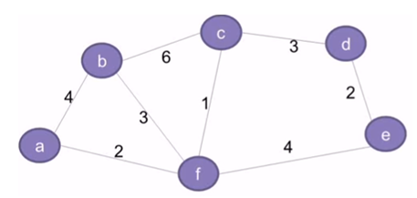

# Optimal Solution
An optimal solution is a feasible solution where the objective function reaches its maximum (or minimum) value - for example, the most profit or the least one cost. A globally optimal solution is one where there are no other feasible solutions with better objective function values.

# Greedy Algorithms
An algorithm is designed to achieve optimum solution for a given problem. In greedy algorithm approach, decisions are made from given solution domain. As being greedy, the closest solution that seems to provide an optimum solution is chosen.
Greedy algorithms try to find a localized optimum solution, which may eventually lead to globally optimized solutions. However, generally greedy algorithms do not provide globally optimized solutions.

The greedy algorithm, as the name suggest, always makes the choice that seems to be the best at that moment. This means that it makes a locally-optimal choice in the hope that this choice will lead to a globally-optimal solution.

## Counting Coins
This problem is to count to a desired value by choosing the least possible coins and the greedy approach forces the algorithm to pick the largest possible coin. If we are provided coins of Rs. 1, 2, 5 and 10 and we are asked to count Rs.18 then the greedy procedure will be -
1. Select one Rs.10 coin, the remaining count is 8
2. Then select one Rs.5 coin, the remaining count is 3
3. Then select one Rs.2 coin, them remaining count is 1
4. Then select one Rs.1 coin solve the problem.

Though, it seems to be working fine, for this count we need to pick only 4 coins. But if we slightly change the problem then the same approach may not be able to produce the same optimum result.

For the currency system, where we have coins of 1, 7, 10 value, counting coins for value 18 will be absolutely optimum but for count like 15, it may use more coin than necessary. For example, the greedy approach will use 10 + 1 + 1 + 1 + 1 + 1, total 6 coins. Whereas the same problem could be solved by using only 3 coins (7 + 7 + 1)

## When to use Greedy Algorithms
For a problem with the following properties, we can use the greedy technique:
1. **Greedy Choice Property**: This states that a globally optimal solution can be obtained by locally optimal choices.
2. **Optimal Sub-Problem**: This property states that an optimal solution to a problem, contains within it, optimal solution to the sub-problems. Thus a globally optimal solution can be constructed from locally optimal sun solutions.

Generally, optimization problem, or the problem where we have to find maximum or minimum of something or we have to find some optimal solution, greedy technique is used.

An optimization problem has two type of solutions:
- **Feasible Solution**: This can referred as approximate solution (subset of solution) satisfying the objective function and it may or may not build up tp the optimal solution.
- **Optimal Solution**: This can be defined as a feasible solution that either maximizes or minimum objective function.

## Key Terminologies used in Greedy Algorithms
- **Objective Function**: This can be defined as the function that needs to be either maximized or minimized.
- **Candidate Set**: The global optimal solution is created from this set. 
- **Selection Function**: Determines the best candidate and includes it in the solution set.
- **Feasibility Function**: Determines whether a candidate is feasible and can contribute to the solution.

## Advantage of Greedy Approach/Technique
1. This techinque is easy to formulate and implement.
2. It works efficiency in many scenarios.
3. This approach minimizes the time required for generating the solution.

## Disadvantages of Greedy Approach/Technique
1. This approach does not guarantee a global solution since it never looks back at the choice made for finding the local optimal solution.

## Activity Selection Problem
The Activity selection problem is an optimization problem which deals with the selection of non-conflicting activities that needs to be executed by a single person or machine in a given time frame.

Each activity is marked by a start and finish time. Greedy technique is used for finding the solution since this is an optimization problem.

### What is Activity Selection Problem?
Let's consider that you have `n` activities with their start and finish times, the objective is to find solution set having **maximum number of non-conflicting activities** that can be executed in a single time frame, assuming that only one person or machine is available for execution.

Some points to note here:
- It might not be possible to complete all activities, since their timming can collapse.
- Two activities say i and j are said to be non-conflicting if `si >= fj` or `sj >= fi` where `si` and `sj` denote the starting times of activities and i and j respectively, and `fi` and `fj` refer to the finishing time of the activities i and j respectively.
-  Greedy approach can be used to find the solution since we want to maximize the count of activities that can be executed. This approach will greddily choose an activity with earliest finish time at every step, thus yielding an optimal solution.

**Input Data** for the Algorithm
* `act[]` array containing all the activities.
* `s[]` array  containing the starting time of all activities.
* `f[]` array containing the finishing time of all activities.

**Output Data** from the Algorithm
- `sol[]` array refering to the solution set containing the maximun number of non-conflicting activities.

#### Step for Activity Selection Problem
Following are the steps we will be following to solve the activity selection problem.
**Step 1**: Sort the given activities in ascending order according to their finishing time.
**Step 2**: Select the first activity from sorted array `act[]` and add it to `sol[]` array.
**Step 3**: Repeat steps 4 and 5 for the remaining activities in `act[]`
**Step 4**: If the start time of the currently selected activity is greather than or equal to the finish time of previously selected activity, then add it to the `sol[]` array.
**Step 5**: Select the next activity in `act[]` array.
**Step 6**: Print the `sol[]` array.

## Spanning Tree

The network shown in the above figure basically represents a graph **G = (V, E)** with a set of vertices **V = {a, b, c, d, e, f}** and a set of edges **E = {(a,b), (b,c), (c,d), (d,e), (e,f), (f,a), (b,f), (c,f)}**. The graph is:
- Connected (there exists a path between very pair of vertices)
- Undirected (the edges do not any direction associated with them such that (a,b) and (b,a) are equivalent).
- Weighted (each edge has a weight or cost assigned to it)

A spanning tree `G'= (V, E)` for the given graph G will include:
- All the vertices (V) of G
- All the vertices should be connected by minimum number edges (E') such that E' belong to E.
- G' can have maximum n-1 edges, where n is equal to the total number of edges in G.
- G' should not have any cycles . This is one of the basic differences between a tree and graph that a **graph can have cycles, but a tree cannot**. Thus, a tree is also defined as an **acyclic graph**.

### What is a Minimum Spanning Tree?
The cost of a spanning tree is the total of the weights of all the edges in the tree. For example, the cost of spanning  tree in above figure is (2+4+6+3+2) = 17 units
Since we can have multiple spanning treee for a graph, each having its own cost value, the objective is to find the spanning tree with minimum cost. This is called a **Minimum Spanning Tree(MST)**.
**Note**: There can be multiple minimum spanning tree for a graph, if any two edges in the graph have the same weight. However, if each edge has a distinct weight, then there will be only one minimum spanning tree for any given graph.

