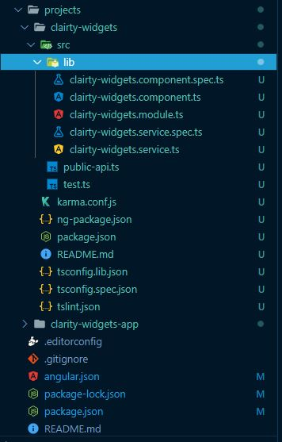

# Angular Libraries

## Overview of Angular Libraries
Many applications need to solve the same general problems, such as presenting a unified user interface, presenting-data and allowing data entry. Developers can create general solutions for particular domains that can be adapted for re-use in different apps. Such a solution can be built as Angular libraries and these libraries can be published as npm packages.

An Angular library is an Angular project that differs from an app in that it cannot run on its own. A library must be imported and used in an app. 

Libraries extends Angular's base functionality. For example, to add reactive forms to an app, add the library packages using  `ng add @angular/forms` then import the ReactiveFormModule from the `@angular/forms` library in your application code. Similarly, the adding the `service worker` library to an Angular application is one of the steps for tunning an application into a `Progressive Web App (PWA)`. Angular Material is an example of a large general-purpose library that provides sophisticated, resuable, and adaptable UI components.

## Creating libraries
If you developed functionality that is suitable for reuse, you can create your own libraries. The libraries can be used locally in your workspace, or you can publish them as `npm packages` to share with other projects or other Angular developers. These packages can be publisjed to the npm registry, a private npm Enterprise registry, or private package management system that supports npm packages. 

Whether you decide to package functionality as a library is an architectural decision, similar to deciding whether a piece of functionality is component or service, or deciding on the scope  of a document.

Packaging functionality as a library forces the artifacts in the library to be decoupled from the application business logic. This can help to avoid various bad practices or architecture mistakes that can make it diffcult to decouple and reuse code in the future.

Putting code into a separate library is more complex than simply putting everthing in one app. It requires more of an investment in time and thought for managing, maintaining, and updating the library. The complexity can pay off, however, when the library is being used in mutliple apps.

## Using published libraries
When building Angular applications you can take advantage of sophisticated first-part libraries, such as Angular Material, as well as rich ecosystem of third-party libraries.

### Installing libraries
Libraries are published as npm packages, usually together with schematics that integrate them with the Angular CLI. To integrate resusable library code into an application, you need to install the package and import provided functionality where you will use it. For most published Angular libraries, you can use the Angular CLI `ng add <lib_name>` command.

The ng add command uses the npm package manager or yarn to install the library package, and invokes schematics that are included in the package to other scaffolding withing the project code, such as adding import statements, fints, themes, and so on.

### Library typings
Library packages often include typing in `.d.ts` files, see example in `node_modules/@angular/material`. If your library's package does not include typings and your IDE complains, you may need to install the library associated `@types/<lib_name>` package.

For example, suppose you have library named d3:
```bash
npm install d3 --save
npm install @types/d3 --save-dev
```
Types defined in a @types/ package for a library installed into the workspace are automatically added to the Typescript configuration for the project that uses that library. Typescript look for types in the node_modules/@types folder by default, so you don't have to add each type package.

If a library doen't have typings available at @types/ you can still use it by manually adding typings for it. To do this:
1. Create a `typings.d.ts` in your src/ folder. This file is automatically included as global type definition.
2. Add the following code in src/typings.d.ts
```javascript
declare module 'host' {
    export interface Host {
        protocol?: string;
        hostname?: string;
        pathname?: string;
    }

    export function parse(url: string, queryString?: string): Host;
}
```
3. In the component or file that uses the library add the following code.
```typescript
import * as host from 'host';
const parsedUrl = host.parse('http://angular.io')
console.log(parsedUrl.hostname);
```

## Creating libraries
You can create and publish new libraries to extend Angular functionality. If you find that you need to solve the same problem in more than one app (or want to share your solution with other developers), you have a candidate for a library.

A simple example might be a button that sends users to your company website, that  would be included in all apps that your company builds.

### Getting started
Use the Angular CLI to generate a new library skeleton with the following command:

```bash
ng new my-wrokspace --create-application=false
cd my-workspace
ng generate library my-lib
```
This creates the projects/my-ib folder in your workspace, which contains a component and a service inside a NgModule. The workspace configuration file, angular.json updated with a project of type library.

```json
"projects": {
  ...
  "my-lib": {
    "root": "projects/my-lib",
    "sourceRoot": "projects/my-lib/src",
    "projectType": "library",
    "prefix": "lib",
    "architect": {
      "build": {
        "builder": "@angular-devkit/build-ng-packagr:build",
        ...
```
You can build, test and lint the project with CLI commands:
```bash
ng build my-lib
ng test my-lib
ng lint my-lib
```
Notice that the configured builder for the project is different from the default builder for app projects. This builder, among other things, ensures that the library is always built with the AOT compiler, without the need to specify the --prod flag.

To make library code resuable you must define a public API for it. This "user layer" defines what is available to consumers of your library. A user of your library should be able to access public functionality (such as NgModules service providers and general utility functions) through a single import path.

The public API to your library is maintained in the `public-api.ts` file in your library folder. Anything exported from this file is made public when your library is imported into an application. Use an NgModule to expose services and components.

### Refactoring parts of an app into a library
To make your solution reusable, you need to adjust it so that it does not depend on app-specific code. Here are some things to consider in migrating application functionality to a library.
- Declarations such as component and pipes should be designed as stateless, meaning they don't rely on or alter external variables. If you do rely on state, you need to evaluate every case and decide whether it is application state or state that the library would manage.
- Any observables that the component subscribe to internally should be cleaned up and and disposed of during the lifecycle of those components.
- Components should expose their interactions through inputs for providing context and outputs for communicating events to other components.
- Service should be declare their own providers (rather than declaring providers in the NgModule or a component), so that they are _tree-shakable_. This allows the compiler to leave the service out of the bundle if it never gets injected into the application that imports the library. 
- If you register global service providers or share providers across multiple NgModules, use the forRoot() and forChild() pattern provided by RouterModule.
- Check all internal dependencies
  * For custom classes or interfaces used in component or services check whether they depend on additional classes or interface that also need to be migrated.
  * Similarly, if you library code depends on a service, that service needs to be migrated.
  * If your library code or its template depend on other libraries (such as Angular Material, for instance), you must configure your library with those dependencies.

###  Reusable code and schematics
A library typically includes _reusable code_ that defines component, services and other Angular artificats (pipes, directives and so on) that you simply import into a project. A library is packaged into an npm package for publishing and sharing and this package can also include schematics that provide instructions for generating or transforming code directly in your project, in the same way that the CLI creates a new generic skeleton app with ng generate component. A schematic that is combined with a library can for example, provide the Angular CLI with the information it needs to generate a particular component defined in that library.

What you include in your library is determined by the kind of task you are trying to accomplish. For example, if you want a dropdown with some canned data to show how to add it to your app, your library could define a schematic to create it. For a component like a dropdown that would contain different passed-in values each time, you could provide it as a component in a shared library.

Suppose you want to read a configuration file and then generate a form based on that configuration. If that form will need additional customization by the user, it might work best as a schematic. However, if the forms will always be the same and not need much customization by developers, them you could create a dynamic component that takes the configuration and generates the form. In general, the more complex the customization, the more useful the schematic approach.

### Integratic with the CLI
A library can include schematics that allow it to integrate with the Angular CLI.
- Include an installation schematic so that `ng add` can add your library to a project.
- Include generation schematics in your library so that `ng generate` can scaffold your defined artifacts (components, services, tests and so on)
- Include an update schematics so that `ng update` your library's dependencies and provide migrations for breaking changes in a new releases.

### Publishing your library
Use the Angular CLI and the npm package manager to build and publish your library as an npm package. It is not recommended to publish Ivy libraries to NPM repositories. Before publishing a library to NPM, build it using the --prod flag which will use the older compiler and runtime known as View Engine of Ivy.
```
ng build my-lib --prod
cd dist/my-lib
npm publish
```

### Managing assets in a library
Starting with version 9.x of the ng-packagr tool, you can configure the tool to automatically copy assets into your library package as part of the build process. You can use this feature when your library needs to publish optional theming files, Sass mixins, or documentation (like a changelog)

### Linking libraries
While working on a published library, you can use `npm link` to avoid reinstalling the library on every build.

The library must be rebuilt on every change. When linking a library, make sure that the build step run in watch mode, and that library's package.json configuration points at the correct entry points. For example, main should point at a Javscript file, not a TypeScript file.

### Use TypeScript path mapping for peer depedencies
Angular libraries should list all `@angular/*` dependencies as peer dependencies. This ensure that when modules ask for Angular, they all get the exact same module. If a library lists `@angular/core` in dependencies instead of  peerDependencies, it might get a different Angular module instead which would cause your application to break.

While developing a library, you must install all peer dependencies through devDependencies to ensure that the library compiles properly. A linked library will then have its own set of Angular libraries that it uses for building located in node_modules folder. However, this can cause problems while building or running your application.

To get around this problem you can use Typescript path mapping to tell Typescript that it should load some modules from a specific location. List all the peer dependencies that your library uses in the workspace Typescript configurtion file ./tsconfig.json and point them at the local copy in the app's node_modules folder.
```javascript
{
  "compilerOptions": {
    // ...
    // paths are relative to `baseUrl` path.
    "paths": {
      "@angular/*": [
        "./node_modules/@angular/*"
      ]
    }
  }
}
```
This mapping ensures that your library always loads the local copies of the modules it needs.

### Using your own library in apps
You don't have to publish your library to the npm package manager in order to use it in your own apps, but you do have to build it first.

To use your own library in an app:
- Build the library. You cannot use a library before it is built.
``` 
ng build my-lib
```
- In your apps, import from the library by name:
```javascript
import {myExport} from 'my-lib';
```

### Building and rebuilding your library
The build step is important if you haven't published your library as an npm package and then installed the package back into your app from npm. For instance, if you clone your git repository and run npm install your editor will show the my-lib imports as missing if you haven't yet built your library.

> When you import soemthing from a library in an Angular app, Angular looks for a mapping between the library name and a location on disk. When you install a library package, the mapping is in the node_modules folder. When you build your own library, it has to find the mapping in your tsconfig paths.
>
>  Generating a library with the Angular CLI automatically adds its path to the tsconfig file. The Angular CLI uses the tsconfig paths to tell the build system where to find the library.

If you find that changes to your library are not reflected in your app, your app is probably using an old build of the library. 

You can rebuild your library whenever you make changes to it, but this extra step take time. Incremental builds functionality improves the library-development experience. Every times a file is changed a partial build is performed that emits the amended files.

Increment builds can be run as a background in your dev environment. To take  advantage to this feature add the --watch flag to the build command:

```
ng build my-lib --watch
```

> The CLI build command uses a different builder and invokes a different build tool for libraries thant it does for applications.
> - The build system for apps, @angular-devkit/build-angular, is based on webpack, and is included in all new Angular CLI projects.
> - The buld systems for libraries is based on ng-packagr. It is only added to your dependencies when you add a library using ng generate library my-lib.
>
> The two build system support different things, and even where they support the same things do those things differently. This means that the Typescript source can result in different Javascript code in a built library thant it would in a built application.
>
> For this reason, an app that depends on a library should use only Typescript paths mappings that point to the built library. Typescript mappings should not point to the library source .ts files.

### Example
We will create an Angular library, as well as a demo application to consume this library. We can create these with the following commands:
```
ng new clarity-widget-workspace --create-application=false
cd clarity-widgets
ng generate library clarity-widgets
ng generate application clarity-widgets-app
```

Using the `--create-application=false` flag prevents Angular from creating an application with name 'clarity-widgets', which is the name we want to give to the library itself and ont the test application.

If we now look inside of the workspace which we just created, we can see that there is a `projects` folder containing a sub-folder for each of the library(clarity-widgets) and the appliction (clarity-widgets-app) which we just generated. There is alos a third folder containing and e2e test project, which we can ignore.

Let now build our library and see what happens:
```
ng build --project=clarity-widgets
```
If we look in the dist folder, we will see that our library has been built and that inside of the build folder we have a number of different folders containing the application in various different module formats suitable for different consumers, as well as a folder containing Typescript definitions.
- bundles - UMD module format
- esm5 - module format which uses mostly es5, but also the import/export syntax from es6.
- esm2015 - module format which uses es2015/es6
- fesm5 - flattened version of esm5
- fesm2015 - flattened version of `peerDependencies` esm2015
- lib - Typescript definitions for library.

This format is called Angular Package Format and it is the format used as the output of `ng-packagr`, the tool which Angular CLI uses to transpile libraries.



  
