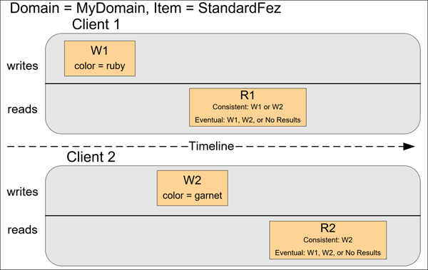

# Amazon S3
Amazon Simple Storage Service is storage for the Internet. It is designed to make web-scale computing eaiser for developers.

Amazon S3 has a simple web service interface that you can use to store and retrieve any amount of data, at any time, from anywhere on the web. It gives any developer access to the same highly scalable, reliable, fast, inexpensive data storage infrastructure that Amazon use to run its own global network of web sites. The service aims to maximize benefits of scale and to pass those benefits on the developers.

# Overview of Amazon S3
Amazon S3 has a simple web service interface that you can use to store and retrieve any amount of data, at any time, from anywhere on the web.

## Advantage of using Amazon S3
Amazon S3 is intentionally built with a minimal feature set that focuses on simplicity and robustness. Following are some of the advantage of using Amazon S3.
* **Creating buckets** - Create and name a bucket that stores data. Buckets are the fundamental containers in Amazon S3 for data storage.
* **Storing data** - Store an infinite amount of data in a bucket. Upload as many objects as you like into an Amazon S3 bucket. Each object can contain up a 5 TB of data. Each object is stored and retrieved using unique developer-assigned key.
* **Downloading data** - Download your data or enable others to do so. Download your data anytime you like, or allow others to do same.
* **Permissions** - Grant or deny to others who want to upload or download data into your Amazon S3 bucket. Grant upload and download permissions to three types of users. Authentication mechanisms can help keep data secure from unathourized access.
* **Standard Interfaces** - Use standard-based REST and SOAP interfaces designed to work with any internet development toolkit.

# Amazon S3 Concepts

## Buckets
A bucket is a container for objects stored in Amazon S3. Every object is contained in a bucket. For example, if the object named `photos/puppy.jpg` is stored in the `awsexamplebucket1` in the US West(Oregon) Region, then it is addressable using the URL `https://awsexamplebucket1.s3.us-west-2.amazonaws.com/photo/puppy.jpg`

Bucket serve serveral purposes:
* They organize the Amazon S3 namespace at the highest level.
* The identify the account responsible for storage and data transfer charges.
* The play a role in access control.
* They serve as the unit of aggregation for usage reporting.

You can configure buckets so that they are created in a specific AWS region. 

## Objects
Objects are the fundamental entities stored in Amazon S3. Objects consist of object data and metadata. The data portion is opaque to Amazon S3. The metadata is a set of name-value pairs that describe the object. These include some default metadata, such as the date last modified, and standard HTTP metadata, such as `Content-Type`. You can also specify custom metadata at the time the object is stored.

An object is uniquely identified withing a bucket by a key(name) and version ID. 

## Keys
A key is the unique identifier for an object withing a bucket. Every object in a bucket has exactly one key. The combination of a bucket key, and version ID uniquely identify each object. So you think of Amazon S3 as a basic data map between "bucket + key + version" and object itself. Every object in Amazon S3 can be uniquely addressed through the combination of the web service endpoint, bucket name key, and optionally, a version. For example, in the URL `https://docs.s3.amazonaws.com/2006-03-1/AmazonS3.wsdl` "doc" is the name of the bucket and `2006-03-01/AmazonS3.wsdl` is the key.

## Regions
You can choose the geographical AWS region where Amazon s3 will store the buckets that you create . You might choose a Region, to optimize latency, minimize costs, or adress regulatory requirements. Objects stored in a Region never leave the Region unless you explicitly transfer them to another Region. For example, objects stored in the Europe(Ireland) region never leave it.

# Amazon S3 data consistency model
Amazon S3 provides read-after-write consistency for PUTS of new objects in your S3 bucket in all Regions with one caveat is that if you make a HEAD or GET request to a key name before the object is created, then create the oject shortly after that, a subsequenct GET might not return the object due to eventual consistency.

Amazon S3 offers eventual consistency for overwrite PUTS and DELETES in all Region.

Updates to a single key are atomic. For example, if you PUT to an existing key, a subsequent read might return the old data or the updated data, but it never returns corrupted or partial data.

Amazon S3 achieves high availability by replicating data across multiple servers within AWS  data center. If a PUT request is successful, your data is safely stored. However, information about the changes must replicate across Amazon S3, which can take some time, and so you might observe the following behaviors:
- A process writies a new object to Amazon S3 and immediately lists keys within its bucket. Until the change is fully propagated the object might not appear in the list.
- A process replaces an existing object and immediately tries to read it. Until the change is fully propagated. Amazon S3 might return the previous data. 
- A process deletes an existing object and immediately tries to read it. Until the deletion is fully propagated, might return the deleted data.
- A process deletes an existing object and immediately lists keys within its bucket. Until the deletion is fully propagated, Amazon S3 might list the deleted object.

> Note:
> - Amazon S3 does not support object locking for concurrent updates. If two PUT requests are simultaneously made to the same key, the request with the latest timestamp wins. If this is an issue, you will need to build an object-locking mechansim into your application.
>
>   Object locking is different from the S3 Object lock feature. With S3 Object lock, you can store objects using a write-once-read-many(WORM) model and prevent an object from being deleted or overwritten for a fixed amount of time or indefinitely.
>
> - Updates are key-based. There is no way to make atomic update across keys. For example, if you delete a bucket and immediately list all buckets, the deleted bucket might still appear in the list.

Bucket configuration have similar eventual consisteny model, with the same caveats. For example, if you delete a bucket and immediately list all dependent on the update of another key unless you design this functionality into your application.

> Read-after-write consistency : 

# Concurrent applications
This section provides examples of eventually consistent and consistent read requests when multiple clients are writing to the same items.

In this example, both W1(write 1) and W2(write 2) complete before the start R1(read 1) and R2(read 2). For consistent read, R1 and R2 both return `color=ruby`. For an eventually consistent read, R1 and R2 might `color = red` or `color = ruby` depedending on the amount of time that has elapsed.

In the next example, W2 does not complete before the start of R1. Therefore, R1 might return `color = ruby` or `color=garnet` for either a consistent read or an eventually consistent read. Also depending on the amount of the time that has elapsed, an eventually consistent read might return no results.

For consistent read, R2 return `color = garnet`. For an eventually consistent read, R2 might `color = ruby` or `color = garnet` depending on the amount of time that has elapsed.

In the last example, Client 2 perform W2 before Amazon returns a success for W1, so the outcome of the final value is unknown (`color = garnet` or `color = brick`). Any subsequent reads (consistent read or eventually consistent) might return either value. Also, depending on the amount of time that has elapsed, an eventually consistent read might return no results.

# Amazon S3 features

## 1. Storage classes
Amazon S3 offers a range of storage classes designed for different use cases. These include Amazon S3 STANDARD for general purpse storage of frequently accessed data, Amazon S3 STANDARD_IA for long live, but less frequently access data, and S3 Glacier for long-term archive.

## 2. Bucket polices
Bucket polices provide centeralized access control to buckets and object based on a variety of conditions including Amazon S3 operations, requesters, resources, and aspects of the request(for example, IP address). The policies are expressed in the access policy language and enable centralized management of permissions. The permission attached to a bucket apply to all of the objects in that bucket.

Both individuals and companies can use bucket policies. When companies register with Amazon S3, they create an account. Thereafter, the company becomes synonymous with the account. Accounts are financially responsible for the AWS resources that they (and their employees) create. Accounts have the power to grant bucket policy permissions and assign employees permission based on a variety of conditions. For example, an account could create a policy that gives a user write access:
- To a particular S3 bucket.
- From an account's corporate network.
- During business hours.

An account can grant one user limited read and write access, but allow another to create and delete bucket also. An account could allow several field offices to store their daily reports in a single bucket. It could allow each office to write only to a certain set of names (for example, "Nevada/* " or "Utah/* ") and only from the office IP address range.

Unlike access control lists, which can add(grant) permissions only on individual objects, policies can either add or deny permissions across all (or a subset) of objects within a bucket. With one request, an account can set the permission of any number of objects in a bucket. An account can use wildcards (similar to regular expression operators) on Amazon Resources Names (ARNs) and other values. The account coluld then control access to groups of objects that begin with a common prefix or end with a given extension, such as .html.

Only the bucket owner is allowed to associate a policy with a bucket. Policies allow or deny requests based on the following:
- Amazon S3 bucket operations (such as `PUT ?acl`) and object operations (such as `PUT Object` or `GET Object`)
- Requester
- Condition specified in the policy.

An account can control access based on specific Amazon S3 operations such as `GetObject`, `GetObjectVersion`, `DeleteObject`, or `DeleteBucket`.

The conditions can be such things as IP addresses, IP addresses ranges in CIDR notation, dates, user agents, HTTP Referrer, and transports (HTTP and HTTPS).

## 3. AWS identity and access management
You can use AWS Identity and access Management (IAM) to manage access to your Amazon S3 resources.

For example, you can use IAM with Amazon S3 to control the type of access a user or group of users has to specific parts of an Amazon S3 bucket your AWS account owns.

## 4. Acess Control lists
You can access to each of your buckets and object using an access control list (ACL). 

## 5. Versioning
You can use versioning to keep multiple version of an object in the sampe bucket.

## 6. Operations
Following are the most common operations that you'll execute through the API.
**Common operations**
* **Create Bucket** - Create and name your own bucket in which to store your objects.
* **Writing an object** - Store data by creating or overwriting an object. When you write an object, you specify a unique key in the namespace of your bucket. This is also a good time to specify any access control you want on the object.
* **Read an object** - Read data back. You can download the data via HTTP or BitTorrent.
* **Delete an object** - Delete some of your data.
* **List Keys** - List the keys contained in one of your buckets. You can filter the key list based on a prefix.

# Amazon S3 application programming interfaces (API
The Amazon S3 architecture is designed to be programming language-netural, using AWS supported interfaces to store and retrieve objects.

Amazon S3 provides a REST and a SOAP interface. They are similar, but there are some difference. For example, in the REST interface, metadata in returned in HTTP headers. Because we only support HTTP requests of up to 4 KB(not including the body), the ampunt of metadata you can supply is restricted.

# Paying for Amazon S3
Pricing for Amazon S3 is designed so that you don't have to plan for the storage requirments of your application. Most storage providers force you to purchase a predetermined amount of storage and network transfer capacity. If you exceed that capacity, your service is shut off or you are charged high overage fees. If you do not exceed that capacity, you pay as though you used it all. 

Amazon S3 charges you only for what you actually use, with no hidden fee and no overage charges. This gives developers a variable-cost service that can grow with their business while enjoying the cost advantages of the AWS infrastructure.

Before storing anything in Amazon S3, you must register with the service and provide a payment method that is charged at the end of each month. There are no set up fees to begin using the service. At the end of the month, your payment method is autmatically charged for the month's usage. 

# Making requests using the AWS SDKs

## Making requests using AWS Account or IAM user credentials
You can use AWS account or IAM user security credentials to send authenticated requests to Amazon S3. 

Each of these SDK uses an SDK-specific credentials provider chain to find and use credentials and perform actions on behalf of the credentials owner. What all
