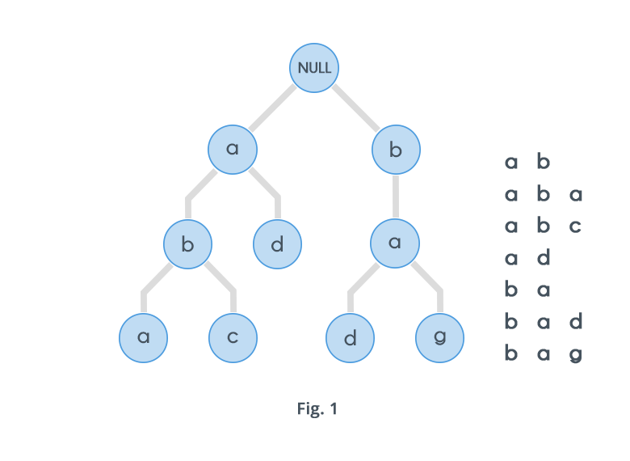

# Trie

> Wikipedia - In computer science, a **trie**, also called **digital tree** or **prefix tree**, is a kind of search tree- an ordered tree data structure used to store a dynamic set or associative array where keys are usually strings. Unlike a binary search tree, no node in the tree stores the key associated with that node; instead, its  position in the tree defines the key with which it is associated. All the descendant of a node have a common prefix of the string associated with he empty string. Keys tend to be associated with leaves, through some inner nodes may correspond to keys of interest. Hence, keys are not necessary associated with every node.

Strings can essentially be views as the most important and common topics for a variety of programming problems. String processing has a variety of a real world applications tool such as:
- Search Engines
- Genome Analysis
- Data Analytics

All the content presented to us in textual from can be visualized as nothing but just strings.

Tries are an extremely special and useful data-structure that are based on the prefix of a string. They are used to represent the "Retrieval" of data and this the name `Trie`.
Trie is an efficent information re**Trie**val data structure. Using, Trie, search complexities can be brought to optimal limit (key length). If we stroe keys in binary search tree, a well balanced BST will need time proportional to M * log N, where M is maximum string and N is number of keys in tree. Using Trie, we can search the key in O(M) time. However the penalty is on Trie storage requirment.
Every node of Trie consists of multiple branches. Each branch represents a possible character of keys. We need to mark the last node of every keys as end of word node. A Trie node field `isEndOfWord` used to distingush the node as end of word node. A simple structure to represent node of the English alphabet can be as following:
```java
class TrieNode {
    private static final int ALPHABET_SIZE = 26;

    TrieNode[] children = new TriNode[ALPHABET_SIZE;
    boolen isEndOfWord;
}
```
A trie can also be used to replace a hash table, over which it has the following advantages:
- Looking up data in a trie is faster in the worst case, O(m) time (where m is the length of a search string) compared to an imperfect hash table. An imperfect hash table can have key collisions. A key collision is the hash function mapping of different keys to the same position in a hash table. The worst-case lookup speed in an imprefect hash table is O(N) time, but far more typically is O(1) with O(m) time spent evaluating the hash.
- There are no collisions of different keys in a trie.
- Buckets in a trie, which are analogous to hash table buckets that store key collisions are necessary only if a single key is associated with more than one value.
- There is no need to provide a hash function or to change hash functions as more keys are added to a trie.
- A trie can provide an alphabetical ordering of the entries by key.
However, a trie also have some drawbacks compared to a hash table.
- The lookup can be slower than hash table lookup, especially if the data is directly accessed on a hard disk or some other secondary storage device where the random-access compared to main numbers.
- Some keys, such as floating point numbers, can lead to long chains and prefixes that are not particularly meaningful. Nevertheless, a bitwise trie can handle standard IEEE single and double format floating point numbers.
- Some tries can require more space than a hash table, as a memory may be allocated for each character in the search string rathere than single chunk of memory for the whole entry as in most hash tables.

## Prefix: What is prefix:
The prefix of a string is nothing but any n letters n <= |S| that can be considered beginning strictly from starting of a string. For example, the word "abacaba" has the following prefixes:
a
ab
aba
abac
abaca
abacab

A Trie is a special data structure used to store strings that can be visualized like a graph. It consists of nodes and edges. Each node consists of at max 26 children and edges connect each parent node to its children. These 26 pointers are nothing but pointers for each of the 26 letters of the English alphabet A separate edge is maintained for every edge.

Strings are stored in a top to bottom manner on the basis of their prefix in a trie. All prefixes of length 1 are stored at until level 1, all prefixes of length 2 are sorted at until level 2 and so on.

For example, consider the following diagram: 


Now, one would be wondering why to use a data structure such as a trie for processing a single string? Actually, Tries are generally used on groups of strings, rather than a single string. When given multiple strings, we can solve a variety of problems based on them. For example , consider a English dictionary and a single string `s`, find the prefix of maximum length from dictionary strings matching the string `s`. Solving this problem using a naive approach would require us to match the prefix of the given string with the prefix of every word in the dictionary and note the maximum. The is an expensive process considering the amount of time it would take. Tries can solve this problem in much more efficient way.

Before processing each Query of the type where we need to search the length of the longest prefix, we first need to add all the existing words into the dictionary. A Tries consists of a special node called the root node. This node doesn't have any incoming edges. It only contains 26 outgoing edges for each letter in the alphabet and is the root of the Trie.

Some the insertion of any string into a Trie starts from the root node. All prefixes of length one are direct children of the root node. In addition, all prefixes of length 2 become children of the nodes existing at level one.

The pseudo code for insertion of a string into a tire would look as follows:
```java
void insert(String s) {
    for (every char in string) {
        if(child node belonging to current char is null) {
            child node = new Node()
        }
        current_node = child node
    }
}
```

The pseudo code to check wether a single word exists in a dictonary of words or not is as follows:
```java
boolean check(String s){
    for(every char is s) {
        if(child_node is null) {
            return false;
        }
    }
    return true;
}
```

### Strengths
- Sometimes **Space-Efficient**. If you're storing lots of words that start with similar patterns tries may reduce the overall storage cost by storing shared prefixes once.
- **Efficient Prefix Queries**. Tries can quickly answer queries about words with shared prefixes like:
    * How many word start with "choco" ?
    * What's the most likely next letter in a word that starts with "strawber"?

### Weaknesses
- Usually Space-inefficient. Tries rarely save space when compared to storing strings in a set.
    ASCII characters in a string are one byte each. Each link between trie node is a pointer to an address - eight bytes on a 64-bit system. So, the overhead of linking nodes together often outweights the saving from storing fewer characters.
- Most languages don't come with a built-in-trie implementation. You'll need to implement once yourself.

