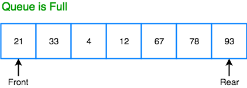
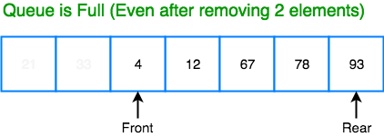
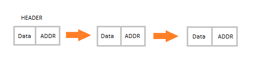

# Stack
Stack is an abstract data type with a bounded (predefined) capacity. It is a simple data structure that allows adding and removing elements in a particular order. Every time an element is added, it goes on the top of the stack and the only element that can be removed is the element that is at the top of the stack, just like a pile of objects.

# Queue
Queue is also an abstrat data type or a linear data structure, just like stack data structure, in which the first element is inserted from one end called REAR (also called tail), and the removail of existing element takes place from the other end called as FRONT(also called head).
This make queue as FIFI(First in First out) data structure, which means that element inserted first will be removed first.

## Circular Queue
In a Linear queue, once the queue is completely full, it's not possible to insert more elements. Even if we dequeue the queue to remove some of the elements, until the queue is reset, no new elements can be inserted. You must be wondering why ?

When we dequeue any element to remove it from the queue, we are actually moving the front of the queue forward, there by reducing the overall size of the queue. And we cannot insert new elements, because the rear pointer is still at the end of the queue.

The only way is to reset the linear queue, for a fresh start.

Circular Queue is also a linear data structure, which followis the principle of FIFO, but instead of ending the queue at the last position, it again starts from the first position after the last, hence making the queue behave like a circular data structure.

# Linked List
Linked List is a very commonly used linear data structure which consists of group of nodes in a sequence.
Each node holds its own data and the address of the next node hence forming a chain like structure.
Linked lists are used to create tree and graphs.

## Linear Linked List (Single Linked List)
Linear Linked list the default linked list and data structure in which data is not stored in contingous memory locations but each node is connected to the next data node via a pointer, hence forming a chain.
The element in such a linked list can be inserted in 2 ways:
- Insertion at begining of the list.    
- Insertion at the end of the list.

# Double Ended Queue
Double ended Queue us more generalized form of queue data structure which allow insertion and removal of element from both the ends i.e. front and back.

# Binary tree
A binary tree is a hierarchical data structure in which each node has at most two children generally referred as left child and right child.
Each node contains three components: 
1. Pointer to left subtree
2. Pointer to right subtree
3. Data element.
The topmost node in the tree is called the root. An empty tree is represented  by NULL pointer.

Type of Binary Trees
- **Rooted binary tree**: It has a root node and every node has atmost two children.
- **Full binary tree**: It is a tree in which every node in the tree has either 0 or 2 children.
    * The number of nodes n, in a full binary tree is atleast n = 2h -1, and atmost n = 2h+1 - 1, where h is the height of the tree.
    * The number of leaf nodes l, in a full binary tree is number, L of internal nodes + 1 i.e. i = L + 1
- **Prefect binary tree**: It is binary tree in which all interior nodes have two children and all leaves have the same depth or same level.
    * A prefect binary tree with l leaves has n = 2l-1
    * In prefect full binary tree, l = 2h and n = 2h + 1 where, n is umber of nodes, h is height of tree and l is number of leaf nodes.
- **Complete binary tree**: It is a binary tree in which every level, except possible the last, is completely filled, and all nodes are as far left as possible.
    * The number og internal nodes in a complete binary tree of n nodes is floor(n/2)
- **Balanced binary tree**: A binary tree is height balanced if it satisfies the following constrainsts:
    * The left and right subtrees height differ by at most one , AND
    * The left subtree is balanced, AND
    * The right subtree is balanced.
- **Degenerate tree**: It is a tree is which each parent node has only one child node. It behaves like a linked list.

## Complexity Analysis
|Algorithm|Average Case|Worst Case|
|---------|------------|----------|
|Space|O(n)|O(n)|
|Insert|O(log n)|O(n)|
|Search|O(log n)|O(n)|
|Traverse|O(n)|O(n)|

