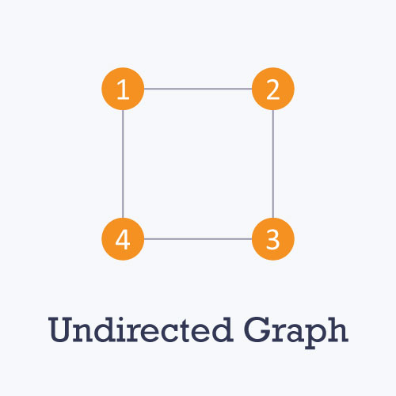
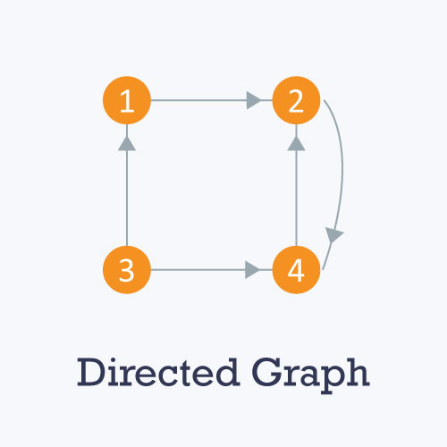
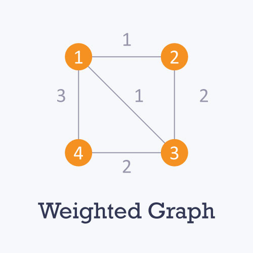

# Graph
Graphs are mathematical structures that represent pairwise relationship between objects. A graph is a flow structure that represents the relationship between various objects. It can be visualized by using the following two basic components:
- **Nodes**: These are the most important components in any graph. Nodes are entities whose relationships are expressed using edges. If a graph comprises 2 nodes A and B and an undirected edge between them then it expressed a bi-directional relationship between the nodes and edge.
- **Edges**:  Edges are the components that are used to represent the relationships between various nides in a graph. An edge between two nodes expresses a one-way or two-way relationship between the nodes.

## Type of nodes
- **Root Node**: The root node is the ancestor of all other nodes in a graph. It does not have any ancestor. Each graph consists of exactly one root node. Generally, you must start traversing a graph from the root node.
- **Leaf Node**: In a graph, leaf nodes represent the nodes that do not have any successors. These node only have ancestor. They can have any number of incoming edges but they will not have any outgoing edges.

## Type of graphs
- **Unidirected**: An unidirected graph is a graph in which all the edges are bi-directional i.e. the edges do not point in any specific direction


- **Directed**: A directed graph is a graph in which all the edges are uni-directional ie.e the edges point in a single direction.


- **Weighted**: In a weighted graph, each edge is assigned a weight or cost. Consider a graph of 4 nodes as in the diagram below. As you can see each edge has a weight/cost assigned to it. If you want to go from vertex 1 to vertex 3, you can take one of the following 3 paths
    * 1 --> 2 --> 3
    * 1 --> 3
    * 1 --> 4 --> 3
Therefore the total cost of each path will be as follows :- The total const of 1-->2-->3 will be (1+2) i.e. 3 units, The total cost of 1-->3 will be 1 unit, The total const of 1-->4--> will be (3+2) i.e. 5 units.


- **Cyclic**: A graph is cyclic if the graph comprises a path that starts from vertex and ends at the same vertex. That path is called a cycle. An acyclic graph is a graph that has no cucle.
A tree is an undirected graph in which any two vertices are connected to only one path. A tree is an acyclic graph and has N-1 edges where N is the number of vertices. Each node in a graph may have one or multiple parent nodes. However, in a tree each node (except the root node) comprises exactly one parent node.


## Graph Representation
You can represent a graph in many ways. The two most common ways of representing a graph is as follows:
- **Ajacency Matric**: An ajajacency matrix is VxV matrix A. Element A<sub>ij</sub> is 1 if there is an edge from vertex i to vertext j else  A<sub>ij</sub> is 0.

The adjacency matric can also be modified for the weight graph in which instead of sotring of 0 or 1 , the weight or cost of the edge will be stored.
In an unidirected graph if A<sub>ij</sub> = 1 then A<sub>ji</sub> = 1 , may or may not be 1.

Adjajceny matrix provides constanvt time access(O(1)) to determine if there is an edge between two nodes. Space complexity of the adjancency matrix is O<V <sup>2</sup>>.

- **Adjacency List**: The other way to represent a graph is by using an adjancency list. An adjacency list is an array A of seperate lists. Each element of the A<sub>i<sub> is a list. which contains all the vertices that are adjacent to vertex i.
For weighted graph, the weight or cost of the edge with the vertex in the list using pairs. In an undirected graph, if vertex j is in the A<sub>i</sub> then vertex i will be in list A<sub>j</sub>.

# Breadth First Search
Graph traversal means visiting every vertex and edge exactly once in a well-defined order. While using certain graph algorithms, you must ensure that each vertex of the graph is visited exactly once. The order in which vertices are visited are important and may depend upon the algorithm or question that you are solving.
During a traversal, it is important that you track which vertices have been visited. The most common way of tracking vertices is to mark them.

BFS is a traversing algorithm where you should start traversing from a selected node(source or starting node) and traverse the graph layerwise thus exploring the neighbour nodes(nodes which are directly connected to source node). You must then move towward the next-level neighbour nodes.

As the name BFS suggest, you are required to traverse the graph breathwise as follows:
1. First move horizontally and visit all the nodes of the current layer.
2. Move to the next layer.

Consider the following diagram:


The distance between the nodes in layer 1 is comparitively lesser than the distance between the nodes in layer 2. Therefore in BFS you must traverse all the nodes in layer 1 before you move to the nodes in layer 2. 

## Traversing child nodes
A graph can contain cycles, which may bring you to the same node again while traversing the graph. To avoid processing of same node again, use a boolean array which marks node after it is processed. While visiting the node layer of a graph, store them in a manner such that you can traverse the corresponding child nodes in a similar order.

In the earilier diagram, start traversing from 0 and visit its child nodes 1, 2 and 3. Store them in the order in which they are visited. This will allow you to visit the child nodes of 1 first (i.e 4 and 5), then of 2 (i.e. 6 and 7), and then of 3 (i.e. 7) etc.

To make this process easy, use a queue to store the node and mark it as 'visited' until all its neighbours (vertices that are directly connected to it) are marked. The queue follows the First In First Out(FIFO) queuing method and therefore the neigbors of the node will be visited in the order in which they were inserted in the node i.e. the node that was inserted first will be visited first and so on.

## Pseudocode
```c
BFS (G, s) { //where G is the graph and s is the source node
    let Q be queue
    Q.enqueue(s)
    mark s as visited

    while Q is not empty
        //Removing that vertex from queue, whose neighbour will be visited now
        v = Q.dequeue

        //processing all neighbours of v
        for all neighbours w of v in Graph G
            if w is not visited
                Q.enqueue(w) //Store w in Q to further visits its neighbour
                make w  as visited

}
```

## Complexity
The tome complexity of BFS is O(V + E) where V is the number of nodes and E is the number of edges.

# Depth First Search
The DFS algorithm  is a recursive algorithm that uses the idea of backtracing. It involves exhaustive searches of all the nodes by going ahead, if possible else by backtracking.

Here, the word backtrack means that when you are moving forward and there are no more nodes along the current path, you move backwards on the same path to find nodes to traverse . All the nodes will be visted on the current path till all the unvisited nodes have been traversed after which the next path will be selected.

This recursive nature of DFS can be implemented using stacks. The basic idea is as follows: 
Pick a starting node and push all it adjacent node into a stack.
Pop a node from stack to select the next node to visit and push all its adjacent node into a stack.
Repeat this process until the stack is empty. However, ensure that the nodes that are visited are marked. This will prevent you from visiting the same node more than once. If you do not mark the nodes that are visited and you visit the same node more than once you may end up in a infinite loop.

## Pseudocode
```c
DFS-iterative(G, s) :
let S be stack
S.push(s)
mark s as visited
while(s is not empty) {
    v = s.top()
    s.pop()
    for(all neighbours w of v in Graph G):
        if w is not visited
            S.push(w)
            mark w as visited
}

DFS-recursive(G, s):
mark s as visited
for all neighbours w of s in Graph G:
if w is not visited
    DFS-recursive(G, w)
```