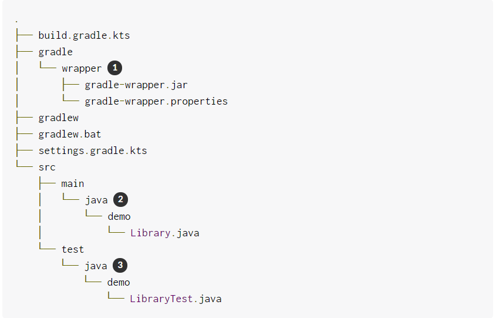

# Create a library project
Gradle comes with a built-in plugin called the Build Init plugin. The plugin provides a task, called `init`, that generates the project. The `init` task use the (also built-in) `wrapper` task to create a Graddle wrapper script, `gradlew`
The first step is to create a folder for the new project and change directory into it.
```bash
$ mkdir demo
$ cd demo
```
# Run the init task
From inside the new project directory, run the `init` task and select `java-library` project type when prompted. For the other questions, press enter to use the default values.
```bash
$ gradle init
Select type of project to generate:
  1: basic
  2: cpp-application
  3: cpp-library
  4: groovy-application
  5: groovy-library
  6: java-application
  7: java-library
  8: kotlin-application
  9: kotlin-library
  10: scala-library
Enter selection (default: basic) [1..10] 7

Select build script DSL:
  1: groovy
  2: kotlin
Enter selection (default: groovy) [1..2]

Select test framework:
  1: junit
  2: testng
  3: spock
Enter selection (default: junit) [1..3]

Project name (default: demo):

Source package (default: demo):


BUILD SUCCESSFUL in 1s
2 actionable tasks: 2 executed
```
If you prefer the Kotlin DSL, you can select `kotlin` for the build script DSL.
The `init` task runs the `wrapper` task first, which generates the `gradlew` and `gradlew.bat` wrapper script. Then it creates the new project with the following structure:


1. Generated folder for wrapper files
2. Default Java source folder
3. Default Java test folder

You now have the necessary components for a simple Java library project.

# Review the generated project files
The *settings* file is heavily commented, but has only one active line:
**Generated setting.gradle.kts**
> rootProject.name = "building-java-libraries"
Thus assigns the name of the root project.

The generate `build.gradle` file also have many comments. The active portion is reproduced here(note version numbers for the dependencies may be updated in later in version of Gradle):
**Generated build.gradle.kts**


1. Public Bintray Artifcatory repository
2. THis is an example of a dependency which is exported to consumers, that is to say found on their compile classpath.
3. This is an example of a dependency which is used internally, and not exposed to consumers on their own compile classpath.
4. JUnit testing library.

The build script adds the [java-library]() plugin. This is an extension of the `java-base` plugin and adds additional tasks for compiling Java source code.

