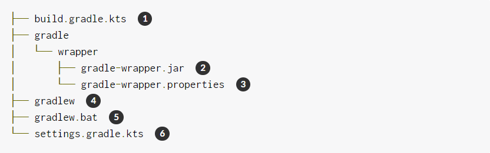

# Create New Gradle builds

## Intialize a projet
First, let's create a new directory where our project will go.
> mkdir basic-demo
> cd basic-demo

Now we can use Gradle's `init` command to generate a simple project. 

The command should show "BUILD SUCCESSFUL" and generates the following "empty project". If it doesn't, please ensure that Gradle is installed properly, and that you have the `JAVA_HOME` environment variable set correctly.

This is what Gradle generated for you.


1. Gradle build script for configuring the current project.
2. Gradle Wrapper executable JAR
3. Gradle Wrapper configuration properties
4. Gradle Wrapper script for Unix-based systems.
5. Gradle Wrapper script for Windows
6. Gradle settings script for configuring the Gradle build.

## Create task
Gradle provide APIs for creating and configuring tasks through a Groovy or Kotlin-based DSL. A `Project` includes a collection of Tasks, each of which perform some basic operation.
Gradle comes with a library of tasks that you can configure in your own projects. For example, there is a core type called `Copy`, which copies files from one location to another. The `Copy` task is very useful, but here, once again, let's keep it simple. Perform the following steps:
1. Create a directory called src.
2. Add a file called `myfile.txt` in the `src` directory. The contents are arbitrary(it can even be empty), but for convenience add the single line `Hello, World!` to it.
3. Define a task called `copy` of type `Copy`(note the capital letter) in your build file that copies the `src` directory to a new directory called `dest`.
**build.gradle.kts**
```gradle
tasks.create<Copy>("copy") {
    description = "Copies sources to the dest directory"
    group = "Custom"

    from("src")
    into("dest")
}
```
Here `group` and `description` can be anything you want. You can even omit them, but doing so will also omit them from the `task` report.

Now execute your new `copy` task
```bash
$ ./gradlew copy
> Task copy

BUILD SUCCESSFUL in 0s
1 actionable task: 1 executed
```
Verify that it worked as expected by checking that there is now a file called `myfile.txt` in the `dest` directory, and that it contents match the contents of the same one in the `src` directory.

## Apply a plugin
Gradle includes a range of plugins, and many, many more are avialable at the [Gradle plugin portal](https://plugins.gradle.org/). One of the plugins included with the distribution is the base plugin. Combined with  a core type called `Zip`, you can create a zip archive of your project with a configured name and location.

Add the `base` plugin to your build script file using the `plugins` syntax. Be sure to add the `plugins {}` block at the top of the file.
```kotlin
plugins {
    id("base")
}
... rest of the build file ...
```
Now add a task that creates a zip archibe from the `src` directory.
**build.gradle.kts**
```kotlin
tasks.create<Zip>("zip") {
    description = "Archives sources in a zip file"
    group = "Archive"

    from("src")
    setArchiveName("basic-demo-1.0.zip")
}
```
The base plugin works with the settings to create an archive file called `basic-demo-1.0.zip` in the `build/distributions` folder.

In this case, simply run the new `zip` task and see that the generated zip file is where you expect.

```bash
$ ./gradlew zip
> Task zip

BUILD SUCCESSFUL in 0s
1 actionable task: 1 executed
```


