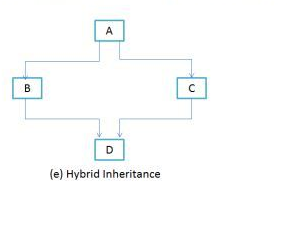

# What is an Object ?
**Object**: is a bundle of state and behaviour(often known as methods). An object stores its state in fields (variables in some programming languages) and exposes its behavior through methods (functions in some programming languages).

# Abstraction
Abstraction is a process where you show only "relevant" data and "hide" unnecessary details of an object from the user. For example, when you login to your bank account online, you enter your user_id and password and press login what happens when you press login, how the input data sent to server, how it gets verified is all abstracted from the you.

Abstraction can be achieved with either abstract classes or interfaces.

Abstract classes contain abstract methods so they can be implemented in sub classes according to their requirments. They are also called as incomplete classes as they have some unimplemented abstract methods.
Let's discuss some rules need to follow while using abstract classes and abstract methods.
* Abstract class and abstract methods are declared using `abstract` keyword. We can't create objects to those classes which are declared as abstract. But, we can create objects to sub classes of abstract class, provided they must implement abstract methods.
```java
    public class AbstractClass {
        public void abstractMethod();
    }

    public class ConcreteClass extends AbstractClass {

        public void abstractMethod() {
            System.out.println("Abstract method implementation");
        }
    }
```
* It is not compulsory that abstract class must have abstract methods. It may or may not have abstract methods. But the class which has at least one abstract method must be declared as abstract.

* Constructors and fields can not be declared as abstract
* Abstract method can not be static.

An **abstract class's purpose** is to provide an appropriate superclass from which other classes can inherit and thus share a common design.

An **interface describes** a set of methods that can be called on an object, but does not provide concreate implementations for all the methods... Once a class implements an interface, all object of that class have an is-an relationship with the interface type, and all objects of the class are guaranteed to provide the functionality described by the interface. This is true of all subclasses of that class as well

> I was wondering when I should use interfaces? I think you should use interface when you want a full implementatiion and use abstract classes when you want partial pieces for your design (for reusability).
>
> Since it’s almost impossible to add a new method on a published interface, it’s better to use abstract class, when evolution is concern. Abstract class in Java evolves better than interface. Similarly, if you have too many methods inside interface, you are creating pain for all it’s implementation, consider providing an abstract class for default implementation. This is the pattern followed in Java collection package, you can see AbstractList provides default implementation for List interface.

# Encapsulation
Encapsulation simply means binding object state(fields) and behaviour(methods) together. If you are creating class you are doing encapsulation.  The whole idea behind encapsulation is to hide the implementation details from users. If a data member is private it means it can only be accessed within the same class. No outside class can access private data member of other class.

However if we setup public getter and setter methods to update and read the private data fields then the outside class can access those private data fields via public methods. This way data can only be accessed by public methods thus making the private fields and their implementation hidden from outside classes. 

> Encapsulation refers to the bundling of related fields and methods together. This allows us to achieve data hiding. Encapsulation in itself is not data hiding.
>
> Abstraction solves the problem at the design level whereas encapsulation solves the problem at the implementation level.

# Inheritance
The process by which one class accquires the properties and functionalities of another class is called **inheritance**. The aim of inheirtance is to provide the reusability of code so that a class has to write only the unique features and rest of the common properties and functionalitis can be extended from the another class.
**Child Class:** The class that extends the features of another class is known as child class, sub class or derived class.
**Parent Class:** The class whose properties and functionalities are used(inherited) by another class is known as parent class, super class or Base class.

## Type of inheritance

| Name | Description| Image |
|------|------------|-------|
|Single inheritance| When class inherit another class, it is known as a single inheritance| |
|Multiple Inheritance|  Multiple inheritance refers to the concepts of one class extending more than one base class.| |
|Multilevel Inheritance| Multilevel inheritance refers to a mechansim in OO technology where one can inherit from a derived class, thereby making this derived class the base class for the new class.| |
|Hierarchical Inheritance| In such kind of inheritance one class is inherited by many sub classes.| |
|Hybrid Inheritance| In simple terms you can say that Hybrid inheritance is a combination of single and multiple inherirtance.| |


### Why multiple Inheritance is not supported by Java?
In order to enforce simplicity should be the main reason for omitting multiple inheritance. For instance we can consider **diamond problem of multiple inheirtance**.


We have two classes B and C inheriting from A. Assume that B and C are overriding an inherited method and they provide their own implementation. Now D inherits from both B and C doing multiple inheritance. D should inherit that overridden method, which overridden method will be used? Will it be from B and C? Here we have an ambiguity.

In C++ there is a possibility to get into the trap though it provides alternates to solve this. In java this can never occur as there is no multiple inheritance. Here even if two interfaces are going to have same method, the implementing class will have only one method and that too will be done by the implelenter. Dynamic loading of classes make the implementation of multiple inheritance is diffcult.

# Polymorphism
Polymorphism is one of the OOPs features that allows us to perform a single action in different ways. For example, let says we have a class `Animal` that has a method `sound()`. Since this is a generic class so we can't give it a implementation like: Roar, Meow, Oink etc. We had to give a generic message.

```java
public class Animal {
    public void sound() {
        System.out.println("Animal is making a sound");
    }
}
```

Now let say we two subclasses of Animal class `Horse` and `Cat` that extends `Animal` class. We can provide the implementation to the same method like this:
```java
    public class Horse extends Animal{
 
        @Override
        public void sound() {
            System.out.println("Neigh");
        }
    }
    //and
    public class Cat extends Animal {

        @Override
        public void sound() {
            System.out.println("Meow");
        }
    }    
```
As you can see that although we had the common action for all subclass `sound()` but there were different ways to do the same. This is perfect example of polymorphism.

## Method Overloading
In Java, two or more methods can have same name if they differ in parameters(different number of parameters, different typr of parameters, both). These methods are called overloaded methods and this feature is called method overloading.
```java
public class MethodOverloadExample {

    int add(int a, int b) { ... }
    long add(long a, long b, long c) { ... }
    double add(double a, double b, double c, double d) { ... }
}
```
Here  the `add()` method is overloaded. These methods have the same name but accept different arguments.

> Notice that, the return type of these methods is not the same. Overloaded methods may or may not have different return types, but they must differ in parameters they accept.

### Method Overloading Rules
There are some rules we need to follow to overload a method. Some of them are mandatory while some are optional.
Two methods will be treated as overloaded if both follow the mandatory rules below:
* Both must have same method name.
* Both must have different argument lists.
And if both methods follow the aboive mandatory rules, then they may or may not:
* Have different return types.
* Have different access modifiers.
* Throw different checked or unchecked exceptions.

Usually, method overloading happens inside a single class, but a method can also treated as overloaded in the subclass of that class - because subcass inherits one version of the method from the parent class and then can have another overloaded version in its definition.

## Method Overriding
Method overriding means defining a method in a child class that is already defined in the parent class with the same method signature - same name, arguments and return(after Java 5, you can also use covariant as the return type).

Whenever we extend a super class in a child class, the child class automatically gets all the methods defined in the super. We call them derived methods. But in some cases, we do not want some derived methods to working in the manner that they do in the parent. We can override those methods in the child class. For example, we always override `equals`, `hashCode` ,and `toString` from the `Object` class.

```java
abstract class Mammal {
    public String speak() {
        return "ohllalalalala..";
    }
}

class Cat extends Mammal {

    @Override
    public String speak() {
        return "Meow";
    }
}

Mammal mammal = new Cat();
mammal.speak();
```

At the line mammal.speak(), the compiler says the speak() method of reference type Mammal is getting called. So, for the compiler, this called is Mammal.speak().

But at execution time, the JVM clearly knowns the `mammal` reference is holding the reference of the `Cat` object, so for the JVM, this call is `Cat.speak()`. 

### Method Overriding Rules
With respect to the method it overrides, the overriding method must follow  following mandatory rules:
* It must have the same method name.
* It must have the same arguments.
* It must have the same return type. From Java 5 onward the return type can also be a subclass(subclasses are a covariant type to their parents).
* It must not have a more restrictive access modifier (if parent --> protected then child --> private is not allowed).
* It must not throw new or broader checked exceptions.

And if both overriding methods follow the above mandatory rules, then they:
* May have a less restrictive access modifier (if parent --> protected then child --> public is allowed).
* May throw fewer or narrow checked exceptions or any unchecked exception.

Apart from the above rules, there are also some facts to keep in mind:
* Only inherited methods can be overridden. That means methods can be overridden only in child class.
* Constructors and private are not inherited, so they cannot be overridden.
* Abstract methods must be overridden by the first concrete subclass.
* final methods cannot be overridden.
* A subclass can use super.overridden_emthod to call the superclass version of an overridden method.

# Association
Association is the weakest relationship between the three. It isn't a "has-a" relationship, none of the objects are parts or members of another.
**Association only means that the objects "know" each other.** For example, a mother and her child.
```java
class Child {}

class Mother {
    List<Child> children;
}
```

# Aggregation
Aggregation is also a "has-a" relationship. What distingushes it from composition, that it doesn't involve owning. As a result, the lifecycles of the objects aren't tied: every one of them can exist independently of each other.

For example, a car and its wheels. We can take off the wheels and they'll still exist. We can mount other wheels, or install these to another car and everything will work just fine.

Of course, a card without wheels or a detached wheel won't be as useful as a car with its wheels on. But that's why this relationship existed in the first place to assemble the parts to a bigger construct, which is capable of more things than its parts.

Since aggregation doesn't involve owning, a memeber doesn't need to be tied to only one container. For example, a triangle is made of segmenets. But triangle can share segments as their sides.

```java
class Wheel {
    Car car;
}

class Car {
    List<Wheel> wheels;
}
```

# Composition
Composition is a "belong-to" type of relationship. It means that one of the objects is a logically larger structure which contains the other object. In other words. it's part or memeber of the other object.

Alternatively we often call ita "has-a" relationship.

For example, a room belongs to a building or in other words a building has a room. So basically, whether we call it "belong-to" or "has-a"  is only matter of point of view.

Composition is a strong kind of "has-a" relationship because the containing object owns it. Therefore, the objects lifecycles are tied. It means that if we destroy the owner object, its members also will be destroyed with it. For example, the room is destroyed with the building.

Note that doesn't mean that the containing object can exist without any of its parts. For example we can tear down all the wall inside a building hence destroy the rooms. But the building will still exists.

In terms of cardinality, a containing object can have as many parts as we want. However, all of the part need to have exactly one container.
```
public class Building {
    
    class Room {

    }

}
```

## Inheritance versus composition: How to choose
Inheritance and composition are two programming techniques developers use to establish relationship between classes and objects. Whereas inheritance derives one class from another, composition defines a class as the sum of its parts.

Classes and objects created through inheritance are tightly couples because changing the parent or superclass in an inheritance relationship risks breaking your code. Classes and objects created through composition are loosely coupled, meaning that you can more easily change the component parts without breaking your code.

