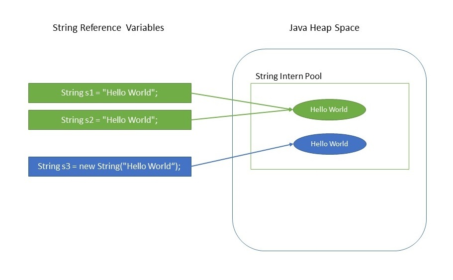

# Immutable
An immutable object is an **object whose internal state remains constants after it has been entirely created.**

An object is considered _immutable_ if its state cannot change after it is constructed. Maximum reliance on immutable objects is widely accepted as a sound strategy for creating simple, reliable code.

Immutable objects are particularly useful in concurrent applications. Since they cannot change state, they cannot be corrupted by thread interference or observed in an inconsistent state.

An immutable object is one which cannot be changes once created. You can create such an object by using `private` access modifiers, and the `final` keyword.

If an immutable object was serialized, its raw bytes could be modified so that upon deserialization the object is no longer the same.

This can't be prevented completely. Encryption, checksums, and CRC will help to prevent this though.


## A Strategy for Defining Immutable Objects
The following rules define a simple strategy for creating immutable objects. Not all class classes documented as "immutable" follow these rules. This does not necessarily mean the creators of these classes were sloppy - they may have good reason for believing that instances of their classes never change after construction. However, such strategies required sophisticated analysis and are not for beginners.
1. Don't provide "setter" methods - methods that modify fields or objects referred to by fields.
2. Make all fields _final_ and _private_
3. Don't allow subsclasses to override methods. The simplest way to do this to declare the class as final. A more sophisticated approach is to make the constructor private and construct instance in factory methods.
4. If the instance fields include references to mutable objects, don't allow those objects to be changed.
    - Don't provide methods that modify the mutable objects.
    - Don't share reference to the mutable objects. Never store references to external, mutable objects passed to the constructor, if necessary, create copies, and store reference to the copies. Similarly, create copies of your internal mutable objects when necessary to avoid returning the originals in your methods.

## Advantages of immutable objects:
1. An immutable object remains in exactly one state in which it was created. Therefore, immutable object is thread-safe so there is no synchronization issue. They cannot be corrupted by multiple threads accessing them concurrently. This is far and away the easiest approach to achieving thread safety.
2. Immutable classes are easier to design, implement and use than mutable classes.
3. Immutable objects are good Map keys and Set elements, since these typically do not change one created.
4. Immutability make it easier to write, use and reason about the code (class invariant is established once and then unchanged).
5. Immutability makes it easier to parallelize program as there are no conflicts among objects.
6. The interanl state of program will be consistent even if you have exceptions.
7. References to immutable object can be cache as they are not going to change. (i.e. in Hashing it provide fast operations).

## Disdavantage of immutable objects:
Creating an immutable class seems at first to provide an elegant solution. However, whenever you do need a modified object of that new type you must suffer the overhead of a new object creation, as well as potentially causing more frequenct garbage collections. The only real disadvantage of immutable classes is that they require a separate object for each distinct value.

```java

public final class Employee {

    private final String firstName;
    private final String lastName;
    private final Date dob;

    public Employee(String firstName, String lastName, Data dob) {
        this.firstName = firstName;
        this.lastName = lastName;
        this.dob = dob;
    }

    public String getFirstName() {
        return this.firstName
    }

    public String getLastName() {
        return this.lastName;
    }

    public Date getDob() {
        return this.dob.clone();
    }
}
```

## Why Is String Immutable in Java?
The key benefits of keeping String class as immutable are caching, security, synchronization and performance. Let's discuss how these thing work.
### 1. **Introduce to String Pool**
The string is most widely used data structure. Caching the String literals and reusing them saves a lot of heap space different String variable refers to the same object in the String pool. String intern pool serves exactly this purpose.

Java String pool is **the special the memory region where Strings are stored by the JVM**. Since Strings are immutable in Java, the JVM optimizes the amount of memory allocated for them by storing one copy of each literal String in the pool. This process is called interning.

```java
String s1 = "Hello World!";
String s2 = "Hello World!";

assertThat(s1 == s2).isTrue();
```
Because of the presence of the String pool in the preceding example, two different variables are pointing to same String object from the pool, thus saving crucial memory resource.



### 2. **Security**
The String is widely used in Java applications to store sensitive pieces of information like usernames, password, connection URLs network connections etc. It's also used extensively by JVM class loaders while loading classes.

Hence securing String class is curcial regarding the security of the whole application in general. For example, consider this simple code snippet.
```java
void criticalMethod(String username) {
    // perform security checks
    if ( !isAlphaNumeric(username)) {
        throw new SecurityException();
    }

    //do some secondary tasks
    initializeDatabase();

    //critical task
    connection.executeUpdate("UPDATE Customers SET Status = 'ACTIVE' WHERE username='"+username+"'");
}
```
In the above code snippet, let's say that we received a String object from an untrustworthy source. We're doing all necessary security checks initially to check if the String is only alphanumeric, followed by some more operations.

Remember that our unreliable source caller method still has reference to this userName object.

**If String were mutable, then by the time we execute the update, we can't be sure that String we received even after performing security checks, would be safe.** The untrustworthy caller method still has the reference and can change the String between integrity checks. Thus making our query prone to SQL injections in this case. So mutable Strings could lead to degradation of security over time.

It could also happen that the String userName is visible to another thread, which could then change its value after the integrity check.

In general, immutability come to our rescue in this case because it's easier to operate with sensitive code when values don't change because there are fewer interleaving of operations that might affect the result.

### 3. **Synchronization** 
Being immutable automatically makes the String thread safe sine  they won't be changed when accessed from multiple threeads.

Hence **immutable objects, in general, can be shared across multiple threeads running simultanesously. They're also thread-safe** because if a thread changes the value, then instead of modifying the same, a new String would be created in the String pool. Hence, Strings are safe for multi-threading.

### 4. **Hashcode Caching**
Since String objects are abundantly used as a data structure, they also widely used in hash implementations like HashMap, HashTable, HashSet, etc. When operating upon these hash implementations hashCode() method is called quite frequently for bucketing.

The immutability gurantees Strings that their values won't change. So **the hashCode method is overridden in String class to facilitate caching, such that the hash is calculated and cached during the first hashCode() call and the same value is returned ever since.**

This, in tunr improves the performance of collections that uses hash implementations where operated with the String objects.

On the other hand mutable String would produce two different hashCodes at the times of insertion and retrieval if contents of String was modified after the operation potentially losing the value object in the Map.

### 5. **Performance**
As we saw previosuly. String pool exists because String are immutable. In turn, it enhances the performance by saving heap memory and faster access of hash implementation when operated with Strings.

Since String is most widely used data structure, improving the performance of String have a considerable effect on improving the performance of the whole application in general.

> Why Char array is preferred over String for storing password?
> 
> String is immutable in java and stored in String pool. Once it's created it stay in the pool until unless garbage collected, so even though we are done with password it's available in memory for longer duration and there is no way to avoid it. It's a security risk because anyone having access to memory dump can find  the password as clear text.


