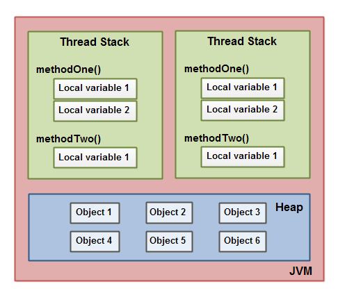
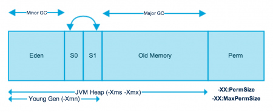

# Java Memory Model
The Java memory model specific how the Java Virtual machine works with the computer's memory (RAM). The Java virtual machine is a model of a whole computer so this model natuarally includes a memory model - AKA the Java memory model.

## The Internal Java Memory Model
The Java Memory model used internally in the JVM divides memory between thread stacks and the heap. 
The diagram illistrates the Java memory model from a logic prespective:

Each thread running in the Java virtua machine has its own stack. The thread stack contains information about what methods the thread has called to reach the current point of execution. I will refer to this as the "call stack". As the thread executes its code, the call stack changes.

The thread stack also contains all local variables for each method being executed (all methods on the call stack). A thread can only access it's own thread stack. Local variables created by a thread are invisible to all other threads than the thread who created it. Even if two threads are executing the exact same code, the two threads will still create the local variables of that code in each their own thread stack. Thus, each thread has its own version of each local variable.

All local variables of primitive types are fully stored on the thread stack and thus not visible to other threads. Once thread may pass a copy of a primitive variable to another thread, but ut cannot share the primitive local variable itself.

The heap contains all objects created in your Java application, regardless of what thread created the object. This includes the object versions of the primitive types. It does not matter if an object was created and assigned to a local variable, or created as a member variable of another object, the object is still stored on the heap.

Here is a diagram illustrating the call stack and local variables stored on the thread stacks, and object stored on the heap.

A local variable may be of a primitive type, in which case it is totally kept on the thread stack.

A local variable may also be reference to an object. In that case the reference (the local variable) is stored on the thread stack, but the object itself if stored on the heap.

An object may contain methods and these methods may contain local variables. These local variables are also stored on the thread stack, even if the object the method belongs to is stored on the heap.

An object's member variable are stored on the heap along with the object itself. That is true both when the member variable is of primitive type, and if it is a references to an object.

Static class variables are also stored on the heap along with the class definition.

Objects on the heap can be accessed by all threads that have reference to the object. When a thread has access to an object, it can also get access to that object's member variables. If two threads call a method on the same object at the same time, they wil l both have access to the object's members varaibles, but each thread will have its own copy of the local variables.

A memory model is best thought of as the architecture that determines how different parts of memory (i.e. stack and heap) interact. The Java Virtual Machine(JVM) divides the memory into two logical units.
1. Thread stack
2. Heap

Memory is the key resource an application requires to run effectively and like any resource, it is scarce. As such, it allocation and deallocation to and from applications or different parts of an application required a lot of care and consideration.

## Thread Stack
The thread stack is the part of the memory which stores the data specific to a thread. Every thread has it owns thread stack. The thread stack stores local variables (both primitive and referene variables) of each method, whether the method belongs to an object or not.

When two seperate threads call the same method, each thread creates its own copy of the local variables declared in the method; one thread cannot directly access the variables of another thread.

## Heap
There is only one shared heap for whole Java application; it stores the object created and their member variables (both primitives and references). Any thread that has a reference to an object on the heap can access its member variables. Moreover, a single object on the heap can be referenced by the local variables of different threads.

In addition the heap stores the static variables (static primitive variables) with the class definition.

Prior to Java 8 (Java 7 and Older version) static variables are stored in the PermGen (Permanent Generation) space. PermGen space is a special memory area available in the java heap. PermGen space was removed in Java 8 and introduced Metaspace to overcome limitation of the PerGen space. In Java 8, static variables are stored in the Metaspace.

### What is PermGen(Permanent Generation) and Metaspace?
PermGen space is a special memory area available in the JVM heap with Java 7 and older versions. **PermGen** was used to stored meta information about the classes that has been loaded into JVM. In addition, PermGen space is used fro storing  the static variables of the application. The problem with PermGen space is that it has a fixed max size. Since PermGen space is part if Heap, if cannot exceed the allocated memory. Therefore it throws the following error when the it reached the max PermGen space.
> java.lang.OutOfMemoryError: PermGen space.

PermGen space was completely removed in Java 8 and Metaspace was introduced as a replacement for the PermGen. Metaspace stores the class definition of your Objects, and some other metadata (like static variables).

The main advantage of Metaspace is that it resides in the main memory area of the system (not a part of the Heap) and it does not have a fixed max size. It an increases it size on runtime depending on the available memory of the system. Therefore OutOfMemoryError will not be occured with Metaspace.

Consider the following code segment
> Student student = new Student();

- **Heap**: stores "new Student()" (object that been created)
- **Stack**: stores information about "student" (reference variable)
- **PermGen Space/ Metaspace**: stores the meta information about Student class.

Here is the diagram that illustrates how the objects are stored in the heap, local variables are stored in the stack and method invocations are stored in the call stack.

If the local variable is a primitive type, then it is stored in the Thread stack.

If the local variable is a reference variable to an object, then the reference variable is stored in the Thread Stack and Object is stored in the Heap.

An object may contains methods and these methods may contain local variables. These local variables are also stored on the thread stack, even if the object belongs to the method, it is stored on the heap(any object is stored in the heap regardless of it scope).

An object's member variables (member variables of instance) are stored on the heap along with object itself. That is true in cases when the member variable is a primitive type or if it is a reference to an object.

**static variables** (class members) are also stored on the heap (PermGen space or Metaspace) along with the class definition.

Objects on the heap can be accessed by all threads that have a reference to the object. When a thread has access to an object, it can also get access to that object's member varaibles. If two threads call a method on the same object at the same time, they will both have access to the object's member variables, but each thread will have its own copy of the local variables.

# JVM Heap Memory

As you can see in the above image, JVM memory is divided into separate parts. At broad level, JVM Heap memory is physically divided into two parts - Young Generation and Old Generation.

## Young Generation
The young generation is the place where all the new objects are created. When the young generation is filled, garbage collection is performed. This garbage collection is called **Minor GC**. Yound generation is divided into three parts - Eden Memory and two Survivor memory spaces.

Important points about Young Generation Spaces:
- Most of the newly created objects are located in the Eden memory space.
- When Eden space is filled with objects, Minor GC is performed and all the survivor objects are move to one of the survivor spaces.
- Minor GC also checks the survivor objects and move them to the other survivor space. So at a time, one of the survivor space is always empty.
- Object that are survived after many cycles of GC, are moved to the Old generation memory space. Usually, it's done by setting a threshold for the age of the young generation objects before they become eligible to promote ot Old generation.

## Old Generation
Old Generation memory contains the objects that are long-lived and survived after many rounds of Minor GC. Usually garbage collection is performed in Old Generation memory when it's full. Old generation Garbage Collection is called Major GC and usually takes a longer time.

### Stop the World Event
All the Garbage Collections are "Stop the World" events because all application threads are stopped until the operation completes.

Since young generation keeps short-lived objects. Minor GC is very fast and the application doesn't get affected by this.

However, Major GC takes a long time because it checks all the live objects. Major GC should be mminimized because it will make your application unresponsive for the garbage collection duration. So if you have a responsive application and there are a lot of Major Garbage Collection happening, you will notice timeout errors.

The duration taken by garbage collector depends on the strategy used for garbage collection. That's why it's necessary to monitor and tune the garbage collector to avoid timeouts in the highly responsive applications.

# Java Heap Memory Switches
Java provides a lot of memory switches that we can use set the memory sizes and their ratios. Some of the commonly used memory switches are:

|VM Switch|VM Switch Description|
|---------|---------------------|
|-Xms|For setting the initial heap size when JVM starts|
|-Xmx| FOr setting the maximum heap size|
|-Xmn| For setting the size of the Young generation, rest of the space goes for Old generation|
|-XX:PermGen|For setting the initial size of the Perment Generation memory|
|-XX:MaxPermGen|For setting the maximum size of PermGen|
|-XX:SurvivorRatio|For providing the ratio of Eden Space and Survivor Space, for example, if Young generation size 10m and VM switch is -XX:SurvivorRation=2 then 5m will be reversed for Eden Space and 2.5m each for both Survivor spacexs. The default value is 8.|
|-XX:NewRatio| For providing ratio of old/new generation. The default value is 2.|

# Garbage Collection
Java Garbage collection is the process to identify and remove the unused objects from the memory and free space to be allocated to objects created in future processing. One of the best features of Java programming language is the **automatic garbage collection**, unlike other programming language such as C where memory allocation and dealloaction is manual process.

Garbage collector is the program running in the background that looks into the all the objects in the memory and find out objects that are not referenced by any part of the program. All these unreferenced objects are deleted and space is reclaimed for allocation to other objects.

One of the basic ways of garbage collections involes three steps:
1. **Marking**: This is the first step where garbage collector identifies which object are in used and which ones are not in use.
2. **Normal Deletion**: Garbage Collector removes the unused objects and reclaim the free space to be allocated to other objects.
3. **Deletion with Compacting**: For better performance, after deleting unused objects, all the survived object can be moved to be together. This will increase the performance of allocation of memory to newer objects.

There are two problems with a simple mark and delete approach.
1. First one is that it's not effcient because most of the newly created objects will become unused.
2. Secondly objects that are-in-use for multiple garbage collection are mostly likely to be in-use for future cycles too.

The above shortcomings with the simple approach is the reason that Java Garbage collection is generational and we have Young generation and Old generation spaces in the heap memory. I have already explained above how objects are scanned and moved from one generational space to another based on the Minor GC and Major GC.

## Garbage Collection Types
There are five types of garbage collection types that we can use in our applications. We just need to use the JVM switch to enable the garbage collection strategy for the application. Let's look at each of them one by one.

1. **Serial GC(-XX:+UseSerialGC)**: Serial GC uses the simple **mark-sweep-compact** approach for young and old generation garbage collection i.e Minor and Major GC. Serial GC is useful in client machines such as our simple standalone application and machines with smaller CPU. It is good for small applications with low memory footprint.
2. **Parallel GC(-XX:UseParallelGC)**: Parallel GC is same as Serial GC except that is spawns N thread for young generation garbage collection where N is the number of CPU cores in the system. We can control the number of thread using `-XX:ParallelGCThreads=n` JVM option. Parallel Garbage collector is also called throughput collector because it uses multiple CPUs to speed up the GC performance. Parallel GC uses a single thread for Old generation garbage collection.
3. **Parallel Old GC(-XX:UseParallelOldGC)**: This is same as Parallel GC except that is uses multiple threads for both  Young generation and Old generation garbage collection.
4. **Concurrent Mark Sweep(CMS) Collector(-XX:UseConcMarkSweepGC)**: CMS Collector is also referred as concurrent low pause collector. It does the garbage collection for the Old generation. CMS collector tries to minimize the pauses due to garbage collection by doing most of the garbage collection work concurrently with the application thread CMS collector on the young generation uses the same algorithm, as that of the parallel collector. This garbage collector is suitable for responsive applications where we can't afford longer pause times. We can limit the number of threads in CMS collector using `-XX:ParallelCMSThreads=n` JVM option.
5. **G1 Garbage Collector(-XX:UseG1GC)**: The Garbage First or G1 garbage collector is available from Java 7 and its long term goal is to replace the CMS collector. The G1 collection is a parallel, concurrent and incrementally compacting low-pause garbage collector. Garbage First collector doesn't work like other collectors and there is no concept of Young and Old generation space. It divides the heap space into multiple equal-size heap regions. When a garbage collection is invoked, it first collects the region with lesser live data, hence "Garbage First".

# Stirng Pool
String pool is a storage area in Java heap.
String allocation, like all object allocation, proves to be a costly affair in both the case of time and memory. The JVM performs some steps while initializing string literals to increase performance and decrease memory overhead. 

String pool is possible only because String is immutable in Java and its implementation of `String interning` concept. String pool is also example of `Flyweight design pattern`.

> String interning is a method of storing only one copy of each distinct string value, which must be immutable. The single copy of each string is called its intern. 

String pools helps in saving a lot of space for Java Runtime although it take more time to create the String.

When we use double quotes to create a String, it first looks for String with the same value in the String pool, if found it just returns the reference else it creates a new String in the pool and then returns the reference. 

However, using new operator, we force String class to create a new String object in heap space. We can use `intern()` method to put it into the pool or refer to another String object from the string pool having the same value.

# Interview Question

## Q1. How many objects are create with this code ?  String s = new String("abc");
Two object will be created here. One object create memory in heap with new operator and second in stack constant pool with "abc".

## Q2. What is memory leak?
In Java Garbage collector handles memory management, but when garbage collector is not able to free any object that is not used by the application but it still holds the reference to it is called memory leak. In other words, when the program/application allocates memory for the object and later when object is not longer needed, instead of marking the reference as null, application holds the indirect reference to that object. In such a way that garbage collector cannot free that object is called memory leak, slowly, application memory start growing and ultimately result in OutOfMemoryError.

## Q3 When you encounter StackOverflowError and OutOfMemoryError?
**StackOverflowError**: Stack is used in Java for method execution, for every method call, a block of memory is created in the stack. The data releated to method like parameters, local variables or references to objects are stored in this block.

When the method finishes it execution, this block is removed from the stack along with data stored in it. If a method keep calling other method recursively without returning back then one point Stack will be full and there would be any space left for allocating new stack at that time you will encounter `StackOverflowError`.

**OutOfMemoryError**: When there is no space left for creating new objects on Heap memory, java.lang.OutOfMemoryError is thrown. OutOfMemoryError is encountered in below two scenarios:
1. Java heap space issue.
2. PermGen space issue.

## Q4 When is the finalize() method called in Java?
The finalize method will be called after the GC detects that the object is no longer reachable and before it actually reclaims the memory used by the object.

Note: It is not a good practice to rely on finalize() method for clean up operation as we never know when GC will be invooked, also it is not guaranteed.

Also, finalize method may not get called if thereis always active reference to the object.

##  Suppose We Have a Circular Reference (Two Objects That Reference Each Other). Could Such Pair of Objects Become Eligible for Garbage Collection and Why?
Yes, a pair of objects with a circular reference can become eligible for garbage collection. This is beacause of how Java garbage collector handles circular references. It considers objects live not when they have any reference to them, but when they are reachable by navigating the object graph starting from some garbage collection root(a local variable of a live thread or a static field). If a pair of objects with a circular reference is not reachable from any root, it is consider eligible for garbage collection.
