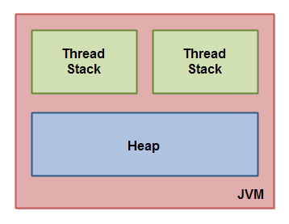

# Java Memory Model
The Java memory model specific how the Java Virtual machine works with the computer's memory (RAM). The Java virtual machine is a model of a whole computer so this model natuarally includes a memory model - AKA the Java memory model.

## The Internal Java Memory Model
The Java Memory model used internally in the JVM divides memory between thread stacks and the heap. 
The diagram illistrates the Java memory model from a logic prespective:

Each thread running in the Java virtua machine has its own stack. The thread stack contains information about what methods the thread has called to reach the current point of execution. I will refer to this as the "call stack". As the thread executes its code, the call stack changes.

The thread stack also contains all local variables for each method being executed (all methods on the call stack). A thread can only access it's own thread stack. Local variables created by a thread are invisible to all other threads than the thread who created it. Even if two threads are executing the exact same code, the two threads will still create the local variables of that code in each their own thread stack. Thus, each thread has its own version of each local variable.

All local variables of primitive types are fully stored on the thread stack and thus not visible to other threads. Once thread may pass a copy of a primitive variable to another thread, but ut cannot share the primitive local variable itself.

The heap contains all objects created in your Java application, regardless of what thread created the object. This includes the object versions of the primitive types. It does not matter if an object was created and assigned to a local variable, or created as a member variable of another object, the object is still stored on the heap.

Here is a diagram illustrating the call stack and local variables stored on the thread stacks, and object stored on the heap.

A local variable may be of a primitive type, in which case it is totally kept on the thread stack.

A local variable may also be reference to an object. In that case the reference (the local variable) is stored on the thread stack, but the object itself if stored on the heap.

An object may contain methods and these methods may contain local variables. These local variables are also stored on the thread stack, even if the object the method belongs to is stored on the heap.

An object's member variable are stored on the heap along with the object itself. That is true both when the member variable is of primitive type, and if it is a references to an object.

Static class variables are also stored on the heap along with the class definition.

Objects on the heap can be accessed by all threads that have reference to the object. When a thread has access to an object, it can also get access to that object's member variables. If two threads call a method on the same object at the same time, they wil l both have access to the object's members varaibles, but each thread will have its own copy of the local variables.

