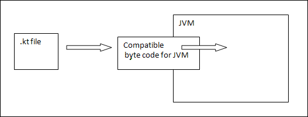

# Introduction
Kotlin is a programming language introduced by JetBrains, the offical designer of the most intelligent Java IDE, named Intellij IDEA. This is a strongly statically typed language that runs on JVM. In 2017, Google announced Kotlin is an offical language for android development. Kotlin is an open source programming language that combines object object-oriented programming and functional features into a unique platform.

# Architecture
Kotlin is a programming language and has its own architecture to allocate memory and produce a quality output to the end user. Following are the different scenarios wher Kotlin compiler will work differently whenever it is targeting different other kind of languages such as Java and Javascript.
Kotlin compiler creates a byte code and that byte code can run on the JVM, which is exactly equal to the byte code generated by the Java **.class** file. Whenever two byte coded file runs on the JVM, they can communicate with each other and this is how an interoperable feature is establsihed in Kotlin for Java.

Whenever Kotlin targets Javascript, the Kotlin compiler converts the **.kt** file into ES5.1 and generates a compatible code for Javascript. Kotlin compiler is capable of creating platform basis compatible codes via LLVM.
