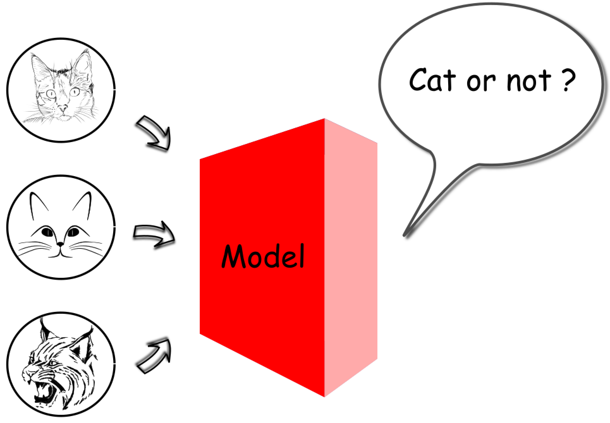

# Machine Learning Model
A machine learning algorithm is the process that uncovers the underlying relationship within the data. 

The outcome of a machine learning algorithm is called **machine learning model**, which can be considered as a `function` F, which output certain results, when given the input.

Rather than a predefined and fixed function, a machine learning model is derived from historical data. Therefore when fed with different data, the output of machine learning algorithm changes i.e. the machine learning model changes.

For example, in the scenario of image recognition, one might train a machine learning model to recognize the object in the photos. In one case, one might feed thousands of images with and without cats to a machine learning algorithm, in order to obtain a model that is capable to tell whether there is a cat in a photo. As a result, the input of the generated model would be a digital photo, and the output is a boolean value indicating the existence of a cat on the photo.

The machine learning model in the above case is a function that maps multiple dimensional pixel values to a binary value. Assume that we have a photo 3 pixels, and the value of each pixel range from 0 to 255. Then the mapping space between the input and the output would be (256 x @56 x 256) x 2, which is around 33 million. We can convince ourself that is be a daunting task to kearn this mapping (machine learning model) in a real-world case whene a normal photo accounts for millions for pixels and each pixel is composed of three coloros (RGB) instead of a single grey color.

