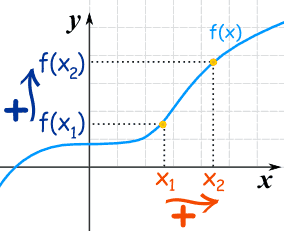
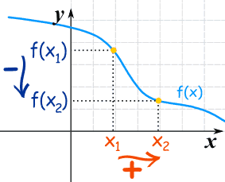

# Increasing and Decreasing Functions

## Increasing Functions 
A function is "increasing" when the y-values increase as the x-value increase, like this:

It is easy yo see that y = f(x) tends to go up as it goes along.

For a function y = f(x)

when x1 < x2 then f(x1) <= f(x2) => Increasing

when x1 < x2 then f(x1) < f(x2) => Static Increasing
 
## Decreasing Functions

The y-value decreases as the x-value increases:

For a function y = f(x)

when x1 < x2 then f(x1) >= f(x2) => Decreasing

when x1 < x2 then f(x1) > f(x2) => Strictly Decreasing

## Lines
In fact  lines are either increasing, decreasing, or constant.

The equation of a line is:

> y = mx  + b

The slope m tells us if the function is increasing, decreasing or constant.

m < 0  decreasing
m = 0 constant
m > 0 increasing
