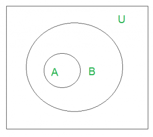
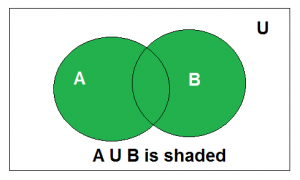
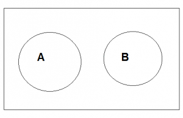
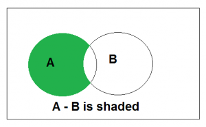
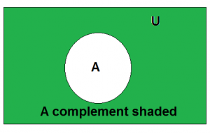

# Introduction of Set theory
A Set is an unordered collection of objects known as element or members of set. A element `a` belong to a set can be written as `a ∈ A`, `a ∉ A` denotes that a is not an element of the set A.

A set can be represented by various methods. 3 common methods used for representing set:
1. Statement form
2. Roater form or tabular form method
3. Set builder method.

### Statement form
In this representation, the well defined description of the elements of the set is given. Below are some examples of the same.
1. The set of all even number less than 10
2. The set of the number less than 10 and more than 1.

### Roater form
In this representation, elements are listed within the pair of brackets {} and are separated bt commas. Below are two examples:
1. Let N is the set of natural less than 5. N = {1,2,3,4}
2. The set of all vowels in the English alphabet. V = {'a','e','i','o','u'}

### Set builder form
In Set-builder set is described by a property that its member must satisfy. 
1. {x: x is even number divisible by 6 and less than 100}
2. {x: x is natural number less than 10}

## Equal Sets
Two sets are said to be equal if both have same elements. For example A = {1,3,9,7} and B = {3,1,7,9} are equal sets.
> Note: Order of elements of a set doesn't matter.

## Subset
A set A is said to be subset of another set B if and only if every element of Set is also a part of other set B. Denoted by '⊆'.
`A ⊆ B` denotes A is subset of B.
To prove A is the subset of B, we need to simply show that if x belong to A then x also belongs to B. To prove A is not a subset of B, we need to find out one element which is part of set A but not belong to set B.
'U' denotes the universal set.

## Size of a Set
Sizeof a set can be finite or infinite.
* Finite set: Set of natural number less than 100
* Infinite set: Set of real numbers.

Size of the set S is knowns as **Cardinality number**, denoted as |S|
Let A be a set of odd postive integer less than 10. 
A = {1, 3, 5, 7, 9}. Cardinality of the set is 5, i.e. |A| = 5
> Note: Cardinality of a null set is 0

## Union
Union of the set A and B, denoted by A U B, is the set of distinct element belongs to set A or set B, or both

Let A = {2,3,4} and B={3,4,5}, A U B = {2,3,4,5}

## Intersection
The intersection of the set A and B denoted by A ∩ B, is the set of element belongs to both A and B i.e. set of the common element in A and B.
[Venn diagram of A ∩ B](images/AinterB-300x179.png)
Consider the previous sets A and B. A ∩ B = {3,4}

## Disjoint
Two sets are said to be disjoint if their intersection is the empty set, i.e set have no common elements

Let A = {1,3,5,7,9} and B = {2, 4, 6, 8}. A and B are disjoint set both of them have no common elements.

## Set difference
Difference between sets is denoted by `A-B`, is the set containing elements of set A but not in B i.e all elements of A except the element of B.

## Complement
Complement of aset A denoted by AC is the set of all elements except A. Complement of the set is U - A

# Power Set
For a given set S, Power Set P(S) or 2^S represent the set containing all possible subsets of S as its elements, For example, 
S = {1,2,3}
P(S) = {ɸ, {1}, {2}, {3}, {1,2}, {1,3}, {2,3}, {1,2,3}}

### Number of elements in Power Set -
For a given set S with n elements, number of elements in P(S) is 2^n. As each element has two possibilities (present or absent), possible subsets are 2x2x2...n times = 2^n. Therefore power contains 2^n elements.
> Note: 
> * Power set of a finite set is finite
> * Set S is an element of power set of S which can be written as S ɛ P(S)
> * Empty Set ɸ is an element of power set of S which can be written as ɸ ɛ P(S)
> * Empty Set ɸ is an element of power set of S which can be written as ɸ ⊂ P(S)

### Countable set and its power set -
A set is called countable when its element can be counted. A countable set can be finite or infinite. For example, set S1 = {a,e,i,o,u}, representing vowels is a countably finite set. However, S2 = {1,2,3,...} representing set of natural numbers is a countably infinite set.
> Note -
> * Powner set of countably finite set and hence countable. For example, set S1 representing vowels has 5 elements and its power set contains 2^5 = 32 elements. Therefore, it is finite and hence countable.
> * Power set of countably infinite set is uncountable. For example, set S2 representing set of natural numbers is countably infinite, However, its power set is uncountable.

### Uncountable set and its power set -
A set is called uncountable when it element can't be counted. An uncountable set can be always infinite. For example, set S3 containing all fractional number betweens 1 and 10 is uncountable.
