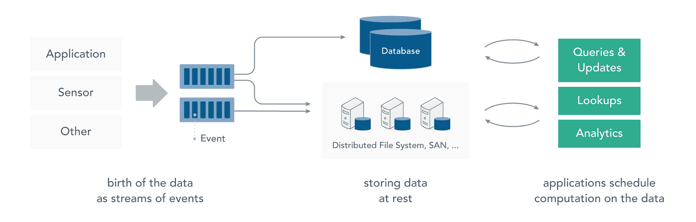

# Stream Processing
Stream processing is the processing of data in motion, or in other words, computing on data directly as it is produced or received.
The majority of data are born as continous streams: sensor events, user activity on a website, financial trades, and so on - all these data are created as a series of events over time.
Before stream processing, this data was often stored in a database, a file system or other forms of mass storage. Applications would query the data or compute over the data as needed.



Stream processing turns this paradigm around. The application logic, analytics, and queries exist continously, and data flow through them continously.

Upon receiving an event from the stream, a stream processing application reacts to that event: it may trigger an action, update an aggregate or other statistics or "remember" that  event for future reference.
Streaming computations can also process multiple data stream jointly, and each computation over the event data stream  may produce other event data streams.

The systems that receive and send data streams and execute the application or analytics logic are called **stream processore**. The basic responsibities of a stream processor are to ensure that data flow efficiently and computation scales and is fault tolerant.

# Introduction
**Apache Kafka is a distributed streaming platform. What exactly does that mean?**
A streaming platform has three ke capabilities:
* Publish and subscribe to streams of records, similar to a message queue or enterprise messaging system.
* Store streams of records in a fault-tolerant(Fault tolerance is the property that enables a system to continue operating properly in the event of the failure of (or one or more faults within) some of its components.) durable way.
* Process streams of records as they occur.

Kafka is generally used for broad  classes of applications:
* Building real-time streaming data pipelines that reliably get data betweens systems or applications.
* Building real-time streaming applications that transform or react to the streams of data.

To understand how Kafka does things, let's dive in and explore Kafka's capabilities from the bottom up.
First a few concepts:
* Kafka is run as a cluster on one or more servers that can span multiple datacenters
* The Kafka cluster  stores stream of records in categories called topics
* Each record consists of a key, a value and a timestamp.


Kafka have five core APIs:
* The _Producer API_ allows an application to publish a stream of records to one or more Kafka topics.
* The _Consumer API_ allows an application to subscribe to one or more topics and process the stream of records produced to them.
* The _Streams API_ allows an application to act as a stream processor, consuming an input stream from one or more topics and producing an output stream to one or more output topics, effectively transforming the input streams to output streams.
* The _Connector API_ allows building and running reusable producers or consumers that connect Kafka topics to existing applications or data systems. For example, a connector to a relational database might capture every change to a table.
* The _Admin API_ allows managing and inspecting topics, brokers and other Kafka objects.

## Topics and Logs
Let's first dive into the core abstraction Kafka providers for a stream of records - the topic.

**A topic is a category or feed name to which records are published. Topics in Kafka are always multi-subscriber, that is, a topic can have zero, one, or many consumers that sunscribe to the data written to it.**

For each topic, the Kafka cluster maintains a partitioned log that looks like this:


Each partition is an ordered, immutable sequence of records that is continually appended to - a structured commit log.  The records in the partitions are each assigned a sequential id number called the **offset** that uniquely identifies each record within the partition.

The Kafka cluster durable persists all published records - whether or not they have been consumed - using a configurable retention period. For example, if the retention policy is set to two days, then for the two days after a record is published, it is available for consumptiom, after which it will be discarded to free up space. Kafka's performance is effectively constant with respect to data size so storing data for a long time is not a problem.


In fact, the only metadata retained on a per-consumer basis is the offset or position of that consumer in the log. This offset is controlled by the consumer; normally a consumer will advance its offset linearly as it reads records, but, in fact, since the position is controlled by the consumer it can consume records in any order it likes. For example a consumer can reset to an older offset to reprocess data from the past or skip ahead to the most recent record and start consuming for "now".

This combination of features means that Kafka consumers are very cheap - they can come and go without much impact on the cluster or on other consumers. For example, you can use our command line tools to "tail" the contents of any topic without changing what is consumed by and existing consumers.

The partitions in the log serve several purpose. First, they allow the log to scale beyond a size that will fit on a single server. Each individual partition must fit on the servers that host it, but a topic may have many partitions so it can handle an arbitrary amount of data. Second they acts as the unit of parallelism - more on that in a bit.

## Distribution
The partitions of the log are distributed over the servers in the Kafka cluster with each server handling data and requests for a share of the partitions. Each partitions is replicated across a connfigurable number of servers for fault tolerance.

Each partition has one server which acts as the "leader" and zero or more servers which acts as "followers". The leader handles all read and write requests for the partition while the followers passively replicate the leader. If the leader fails, one of the followers will automatically become the new leader. Each server acts as a leader for some of its partitions and a follower for others so load is well balanced within the cluster.

## Geo-replication
Kafka MirrorMaker provides geo-replication support for your clusters. With MirrorMaker, messages are replicated across multiple datacenters or cloud regions. You can use this in active/passive scenarios for backup and recovery; or in active/active scenarious to place data closer to your users, or support data locally requirments.

## Producers
Producers publish data to the topic of their choice. The producer is responsible for choosing which record to assign to which partition withing the topic. This can be done in a round-robin fashion simply to balance load or it can be done according to some semantic partition functions ( say based on some key in the record). More on the use of partitioning in a second.

A Kafka client that publishes records to the Kafka cluster.

The producer is thread safe and sharing a single producer instances across threads will generally be faster than have multiple instances.

Here is a simple example of using the producer to send records with strings containing sequentical numbers as the key/value pairs.
```java
Properties props = new Properties();
 props.put("bootstrap.servers", "localhost:9092");
 props.put("acks", "all");
 props.put("key.serializer", "org.apache.kafka.common.serialization.StringSerializer");
 props.put("value.serializer", "org.apache.kafka.common.serialization.StringSerializer");

 Producer<String, String> producer = new KafkaProducer<>(props);
 for (int i = 0; i < 100; i++)
     producer.send(new ProducerRecord<String, String>("my-topic", Integer.toString(i), Integer.toString(i)));

 producer.close();
```
The producer consists of pool of buffer space that holds records that haven't yet been transmitted to the server as well as a background I/O thread that is responsible for turning these records into request and transmitting them to the cluster. Failure to close the producer after use will leak these resources.

The `send()` method is asynchronous. When called it adds the record to a buffer of pending record sends and immediately returns. This allows the producer to batch together individual record for efficiency.

The `acks` config control the criteria under which requests are considered complete. The "all" setting we have specified will result in blocking on the full commit of the record, the slowest but most durable setting.

If the request fails, the producer can automatically retry, though since we have specified retries as 0 it won't. Enabling retries also opens up the possibility of duplicates.

The producer maintains buffers of unsent records for each partition. These buffers are of a size specified by the `batch.size` config. Making this larger can result in more batching, but requires more memory.

By default a buffer is available to send immediately even if there is additional unused space in the buffer. However if you want to reduce the number of requests you can set `linger.ms` to something greater than 0. This will instruct the producer to wait up to the number of milliseconds before sending a request in hope that more records will arrive to fill up the same batch. This is analogous to Nagle's algorithm in TCP. For example in the code snippet above, likely all 100 records would be sent in a single request since we set our linger time to 1 millisecond. However this setting would add 1 millisecond of latency to our request waiting for more records to arrive if we didn't fill up the buffer. Note that records that arrive together in time will generally batch together even with `linger.ms=0` so under heavy load batching will occur regarless of the linger configuration; however setting this to something large than 0 can lead to fewer, more efficient requests when not under maximal load at the cost of a small amount of latency.

The `buffer.memory` controls the total amount of memory available to the producer for buffering. If records are sent faster than they can be transmitted to the server then this buffer space will be exhausted. When the buffer space is exhausted additional send calls will block. The threshold for time to block is determined by `max.block.ms` after which it throw a TimeoutException.

The `key.serializer` and `value.serializer` instruct how to the turn the key and value objects the user provides with thier `ProducerRecord` into bytes. You can use the included `ByteArraySerializer` or `StringSerializer` for simple string or byte types.

For **Kafka 0.11**, the KafkaProducer supports two additional modes: the idempotent producer and the transactional producer. The idempotent producer strengthens Kafka delivery semantics from at least once to exactly one delivery. In particular producer retries will no longer introduce duplicates. The transactional producer allows an application to send message to multiple partitions (and topics) atomically.

To enable idempotence, the `enable.idempotence` configuration must set to be `true`. If set the `retries` config will default to Integer.MAX_VALUE and the `acks` config will default to `all`. There are no API changes for the idempotent producer, so existing application will not needed to be modified to take advantage of this feature.

To take advantage of the idempotent  producer, it is imperative to avoid application level re-sends since these cannot be de-duplicated. As such, if an application enables idempotence, it is recommended to leave the retries config unset, as it will be defaulted to Integer.MAX_VALUE. Additionally, if `send(ProducerRecord)` returns an error even with infinite retries(for instance if the message expires in the buffer before being sent), then it is recommended to shut down the producer and check the content of the last produced message to ensure that it is not duplicated. Finally, the producer can only guarantee idempotence for messages sent with a single session.

To use the transaction producer and the attendant APIs, you must set the `transactional.id` configuration property. If the `transactional.id` set, idempotence is automatically enabled along with the producer configs with idempotence depends on. Further, topics which are included in transactions should be configured for durability. In particular, the `replication.factor` should be at least 3 ad the `min.insync.replicas` for these topics should be set to 2. Finally, in order for transactional guarantees to be realized from end-to-end, the consumers must be configured to read only committed messages as well.

The purpose of the `transactional.id` is to enable transaction recovery across multiple sessions of a single producer instance. It would typically be derived from the shared identifier in a partitioned, stateful application. As such, it should be unique to each producer instance running within partitioned application.

All the new transactional API are blocking and will throw exceptions on failure. 
```java
Properties props = new Properties();
 props.put("bootstrap.servers", "localhost:9092");
 props.put("transactional.id", "my-transactional-id");
 Producer<String, String> producer = new KafkaProducer<>(props, new StringSerializer(), new StringSerializer());

 producer.initTransactions();

 try {
     producer.beginTransaction();
     for (int i = 0; i < 100; i++)
         producer.send(new ProducerRecord<>("my-topic", Integer.toString(i), Integer.toString(i)));
     producer.commitTransaction();
 } catch (ProducerFencedException | OutOfOrderSequenceException | AuthorizationException e) {
     // We can't recover from these exceptions, so our only option is to close the producer and exit.
     producer.close();
 } catch (KafkaException e) {
     // For all other exceptions, just abort the transaction and try again.
     producer.abortTransaction();
 }
 producer.close()
```
There can be only one open transaction per producer. All messages sent between the `beginTransaction()` and `commitTransaction()` call will be part of single transaction. When the `transactional.id` specified, all messages sent by the producer must be part of a transaction.

The transaction producer uses exceptions to communicate error states. In particular, it is not required to specify callbacks for `producer.send()` or to call `.get()` on the returned Future: a `KafkaException` would be thrown if any of the producer `.send()` or transactional calls hit an irrecoverable error during a transaction. 

By calling `producer.abortTransaction()` upon receiving a `KafkaException` we can ensure that any successful writes are masked as aborted, hencekeeping the transaction gaurantess.

## Consumers
Consumers label themselves with a consumer group name, and each record published to a topic is delivered to one consumer instance within each subscribing consumer group. Consumer instances can be in separate processes or on separate machines.

A client that consumes records from a Kafka cluster.

This client transparently handles the failure of Kafka brokers, and  transparently adapts as topics partitions it fetches migrate within the cluster. This client also interact with the broker to allow groups of consumers to load balance consumption using consumer groups.

The consumer maintains TCP connections to the necessary brokers to fetch data. Failure to close the consumer after use will leak these connections. The consumer is not thread-safe. 

### Offset and Consumer Position
Kafka maintains a numerical offsets