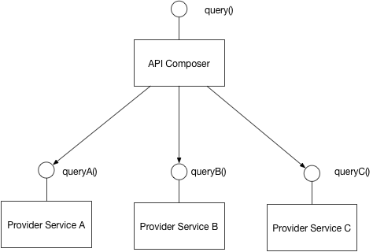

# API Composition

Implement a query by defining an API consumer, which invoking the services that own  the data and performs an in-memory join of the results.

An API Gateway often does API composition

The pattern has the following benefits:
- It a simple way to query data in microservice architecture.

This pattern has the following drawbacks:
- Some queries would result in inefficient, in-memory joins of large datasets.

# Command Query Responsibility Segregation (CORS)

