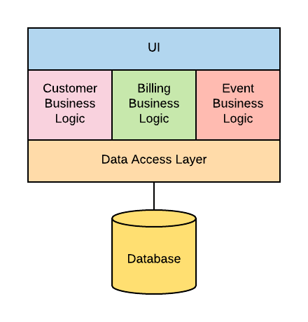

# What Is an API ?
First let's define what an API is. According to Wikipedia, an API(application programming interface) is: 
> "a set of subroutine definitions, communication protocols, and tools for building software. In general terms, it is a set of clearly defined methods of communication between various components."

An easy way to think about an API is to think of it as a contract of actions you can request for a particular service. APIs are in use today in a multitude of web applications, such as social media, banking software and much more. The standarized contract allows for external applications to interface with another.

For instances, let's say you're building an application that's going to integrate with Facebook. You would be able to use the Facebook Graph API to access data inside. Facebook, such as users, post, comments and more. The API simplifies the complexity of trying to use the data inside Facebook and provides an easy-to-use way for the developer to access that data.

# What is a Microservices?
Wikipedia defines a microservice as:
> a software development techinique - a variant of the servie-orient archiecture(SOA) architectural style that structures an application as a collection of loosely couples services. In a microservices archiecture, services are find-grained and the protocal are ligntweight.

But before we dig deeper into what microservces are and how they can be useful, let's take a quick lool into the monolith. Understanding how microservices differ from monoliths will give you a bettewr sense of the benefits of moving to a microservices architecture.

## The Precursor to Microservices: Monoliths
In the early days of software development (and continuing in many large enterprise environments today), there's the concept of a monolith. A monolith is a single application that holds a full collection of functionality, serving as one place to store everything. Architecturally, it look like this:

All of the components of the application reside in one area, including the UI layer, the business logic layer, and the data access layer. Building applications in monoliths is an easy and natural process, and most projects start this way. But adding functionality to the codebase causes an increase in both the size and complexity of the monolith, and allowing a monolith to grow large comes with disadvantages over time.