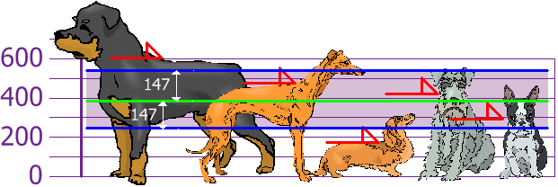

# What is Sampling Variability ? And Why is it Important ?
You can't always get what you want, but if you try sometimes, you get what you need. In term of statistics, we want to know everything that there is to know about a group (or population). But sometimes that is just not feasible. Instead, we deal with approximation of a smaller group (or sample) and hope that the answer we get isn't too far from the truth. The difference between the truth of the population and sample is called sampling variability.

In its most basic definition, sampling variability is the extend to which the measures of a sample differ from the measure of the population. 

# Measure of Variability
Variability means 'Scatter' or 'Spread'. Thus measures of variability refer to the scatter or spread of scores around their central tendency. The measures of variability how the distribution scatter above and below the central tender.

Suppose, there are two groups. In one group there are 50 boys and in another group 50 girls. A test is administered to both these groups. The mean score of boys and girls is 54.4 and we compare the mean score of both the groups, we find that there is no difference in the performance of the two group. But suppose the boy's scores are found to range from 20 to 80 and the girl's scores range from 40 to 60.

This difference in range show that the boys are more variable, because they cover more territory than the girls. If the group contains individuals of widely differing capacities, scores will be scattered from high to low, the range will be relatively wide and variability become large.

### The scatter or variability of the observations of a distribution about some measure of central tendency.

## Need of Variability
1. **Helps to as-certain the measures of deviation:** The measures of variability help us to measure the degree of deviation, which exist in the data. By that can determine the limits within which the data will navy in some measurable variety or quality.
2. **It helps to compare different group:** With the help of measure of validity we can compare the original data expressed in different units.
3. It is useful to supplement the information provided by the measures of central tendency.
4. It is useful to calculate further advance statistics based on the measure of dipersion.

There are four measures of variability:
1. The Range
2. The Quartile Deviation
3. The Average Deviation
4. The standard deviation

## The Range (R)
Range is the difference between in a series. It is the most general measure of spread or scatter. It is a measure of variability of the varities or observation among themseleves and does not given an idea about the spread of the observations around some central value.
Range = H - L
Here H = Highest score
L = Lowest Score

**Example**

**In a class, 20 students have secured the marks as following:**

22, 48, 43, 60, 55, 25, 15, 45, 35, 68, 50, 70, 35, 40, 42, 48, 53, 44, 55, 52

Here - The highest score is 70

The lowest score is 15

Range = H - L = 70 - 15 = 55

If the range is higher than the group indicates more heterogeneity(विविधता) and if the ranger is lower than the group indicates more homegeneity(एकरूपता). Thus range provides us an instant and rough indication of the variability of a ditribution.

## The Quartile Deviation (Q):
Next to range quartile deviation is another measure of variability. It is based upon the interval containing the middle fifty percent of cases in a given distribution. One quarter means 1/4th of something, when a scale is divided into to four equal parts. **"The quartile deviation or Q is the one-half the scale distance between 75th and 25th percentiles in a frequency distribution."**

## The Variance and the Standard Deviation
The other two measures of variability that we will consider are more elaborate and also depend on whether the data set is just a sample drawn from a much larger population or is the whole population.

The **sample variance** of a set of n sample data is the number s2 defined by the formula
> s2  = (Σ(x-x')2)/(n-1)

The variance is defined as:
> The average of the squared differences from the Mean

The Standard Deviation is a measure of how spread out number are.
Its symbol is σ (the greek letter sigma).
The formula is easy: it is the square root of the **Variance**.

To calculate the variance follows these steps
- Work out the Mean (the simple average of the numbers)
- Then for each number: substract the Mean and square the result(the squared difference).
- The workout the average of those squared differences.

## Why do we divide by n-1 instead of by n ?
When we calculate the sample `sd` we estimate the population mean the sample mean, and dividing by (n-1) rather than n which gives it a special property that we call an "unbiased estimator". Therefore s2 is an **unbiased estimator** for the population variance.

The sample variance (and therefore sample standard deviation) are the common default calculations used by software. When asked to calculate the variance or standard deviaton of a set of data assume - unless otherwise instructed - this sample data and therefore calculating the sample variance and sample standard deviation.

### Example
You and your friends have just measured the heights of your dogs(in millimeters):

The height (at the shoulders) are : 600mm, 470mm, 170mm, 430mm and 300mm

Find out the Mean, the Variance, and the Standard Deviation.

Your first step is to find the Mean:

Mean = (600 + 470 + 170 + 430 + 300)/5 = 1970/5 = 394

so the mean(average) height is 394mm. Let's plot this on the chart:

Now we can calulate each dog's difference from the Mean:

To calculate the Variance, take each difference, square it, and then average the result:
Variance
σ2 = (2062 + 762 + (-224)2 + 362 + (-94)2)/5 = (42436 + 5776 + 50176 + 1296 + 8836)/5	 = 1085205/5 = 21704

So the Variance is **21704**
And the Standard Deviation is just the square root of Variance, so: 
Standard Deviation 
σ = sqrt(21704) = 147.32 = 147 (to the nearest mm)

And the good thing about the Standard Deviation is that it is useful. Now we can show which heights are with one Standard Deviation (147mm) of the mean.

So, using the Standard Deviation we have a "standard" way of knowing what is normal, and what is extra large or extra small.

# Coefficient of Variation
The coefficient of variation (relative standard deviation) is a statistical measure of the dispersion of data points around the mean. The metric is commonly used to compare the data dispersion between distinct series of data. Unlike the standard deviation that must always be considered in the context of the mean of the data, the coeffcient of variation provides a relatively simple and quick tool to compare different data series.

In finance, the coefficent variation is important in investment selection. From a financial perspective, the financial metric represent the risk-to-reward ratio where the volatility shows the risk of an investment and the mean indicates the reward of an investment.

By determining the coefficient of variation of different securities, an investor identifies the risk-to-reward ratio of each security and develops an investment decision. Generally, an investor seeks a security with a lower coefficient (of variation) because it provides the most optimal risk-to-reward ratio with low volatility but high returns. However, the low coefficient is not favorable when the average (expected return) is below zero.

## Formula for Coefficient of Variation
Mathematically, the standard formula for the coefficient of variations is expressed in the following way:

> Coefficent of Variation = (σ/μ) * 100%
>
> Where:
> - σ - the standard deviation
> - μ - the mean

## What is 'biased' and 'unbiased' mean ?
The basic idea of statisitics is to make statements about a set of things using a subset (a sample) of those things.

A sample is "biased" if some members of the population are more likely to be included than others. A sample is "unbiased" if all memebers of the population are equally likely to be included.

Here are two examples. 
- Suppose I want to find out how big a typical fish is in a lake. One way of getting a sample of the fish would be to use a net. But then I will never catch any of the fish that are smaller than the holes in the net, so I'll think all the fish in the lake are big. This sample is biased because the big fish are more likely to be included in my sample; to get an unbiased sample I need to sample the fish in a different way.
- Now suppose I want to know how long a beer sleeps every day on average during the year. If I watched it for 10 days in the winter, each day it would sleep 24 hours since bears hibernate in the winter. This sample is biased because in winter the bear sleeps all day while during the reset of the year it is awake part of the day and asleep part of the day. If I want an unbiased sample, I could watch it for 1 day each month for a year, instead of just in the winter.

