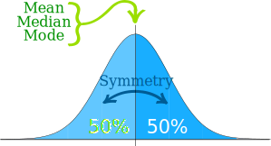

# Measures of Central Tendency

## What is Central Tendency ?
Central tendency (sometimes called 'measures of location', 'central loation' or just 'center') is a way to describe what typical for a set of data. Central tendency doesn't tell you specifies about the individual pieces of data, but it does give you an overall picture of what is going on in the entire data set. There are three major ways to show central tendency: mean, median and mode.

Think about how you describe a single piece of numerical data. This is usually done in terms of its value. For example, in order to describe the number 2, you might put up two fingers or you might say 2 = 1 + 1. How would you describe a group of data? It would not be beneficial to use your fingers in this instance. Nor is it beneficial to simply add the data together. However, you can describe a group of data in a single value by measuring of central tendency.

So, what exactly is a measure of central tendency? A measure of central tendency is a single value that describe the way in which a group of data cluster around the central value. To put in other words, it is way to describe the center of a data set. There are three measaures of central tendency: the mean, the median and the mode.

## Why is Central tendency Important?
**Central tendency** is very useful in psychology. It let us know what is normal or 'average' for a set of data. It also condenses the data set down to one representative value, which is useful when you are working with large amount of data. Could you imagine how diffcult it would be to describe the central location of a 1000-item data set if you had to consider every number individually?

Central tendency also allows you to compare one data set to another. For example, let's say you have a sample girls and a sample of boys, and you are insterested in comparing their heights. By calculating the average height for each sample you could easily draw comparisions between the girls and boys.

Central tendency is also useful when you want to compare one piece of data to the entire data set. Let's say you received a 60% on your last psychology quiz which is usually in D range. You go around and talk to your classmates and find out average score on the quiz was 43%. In this instance your score was significantly higher than those of your classmates. Since your teacher grades on a curve, your 60% becomes an A. Had you not known about the measures of central tendency, you probably would have really upset by your grade and assumed that you bombed the test.

## Mean
The mean is the average of a set numbers. Add up all the numbers in a set of data and then divide by the number of items in the set. For example, the mean of 2, 3, 5, 9, 11 is:
(2+3+5+9+11)/5 = 30/5 = 6

> Mean = (x1 + x2 + x3 + ... + xn)/n  

## Median
The median is the middle of a set of numbers. Think of it like the median in a road (that grassy area in the middle that separates traffic). Place your data in order, and the number in the exact center of a list is the median. For example: 1,2,3,4,5,6,7
The median is 4 because it's in the center, with three number either side. The median is less affected by outliers and skewed data. 

## Mode
The mode is the most common number in a set of data. For example, the mode of 1,2,2,3,5,6 is 2. Some data sets have no mode, like 1,2,3,4,5,6. Others have multiple modes like this one: 1,1,2,3,3. Normally the mode is used for categorical data where we wish to know which is the most common category.

## When to use the mean, median and mode
Please use the following summary table to know what the best measure of central tendency is with respect to the different types of variable.

|Type of Variable| Best measure of central tendency|
|----------------|---------------------------------|
|Nominal| Mode|
|Ordinal| Median|
|Interval/Ratio(not skewed)| Mean|
|Interval/Ratio(skewed) | Median|

## Outliers
Outliers are extremely high or extremly low values. Outliers can affect central tendency, especially the mean. For example, if you got paid three weeks in a row but took vacation in the fourth week, your paychecks might be: $300, $300, $300, $0. Your four week mean would be ($300+$300+$300+0)/4 = $225. That outlier of zero dollars brought your mean down very low.

## Normal Distribution
Data can be distributed (spread out) in different ways:

But there are many cases where the data tends to be around a central value with no bias left or right, and it gets close to a normal distribution.

The "Bell Curve" is a Normal distribution. And the yellow histogram shows some data that is follows it closely, but not prefectly( which is usual).

We say the data is "normally distributed"?  
The normal distribution has:
mean = median = mode

symmetry about the center. 50% of values less than the mean and 50% greater than the mean.

## What is Skew Distribution?
If one tail is longer than another, the distribution is skewed. These distribution are sometimes called asymmetric or asymmertical distributions as they don't show any kind of symmetry. Symmetry means that one half of the distribution is a mirror of the other half. For example, the normal distribution is a symmetric distribution with no skew. The tail are exactly same.

A **left-skewed distribution** has a long left tail. Left-skewed distribution are also called negatively-skewed distributions. That's because there is a long tail in the negative direction on the number line. The mean is also to the left of the peak.

A **right-skewed distribution** has a long right tail. Right-skewed distributions are also called postive-skew distributions. That's because there is a long tail in the postive direction on the number line. The mean is also to the right of the peak.

