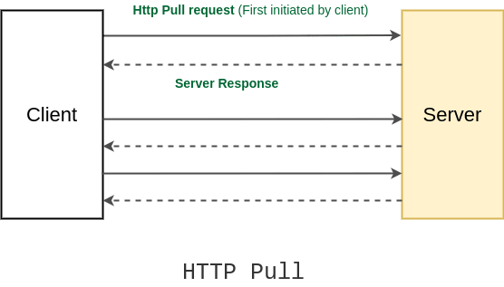
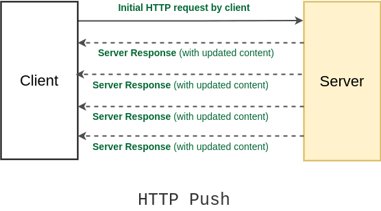
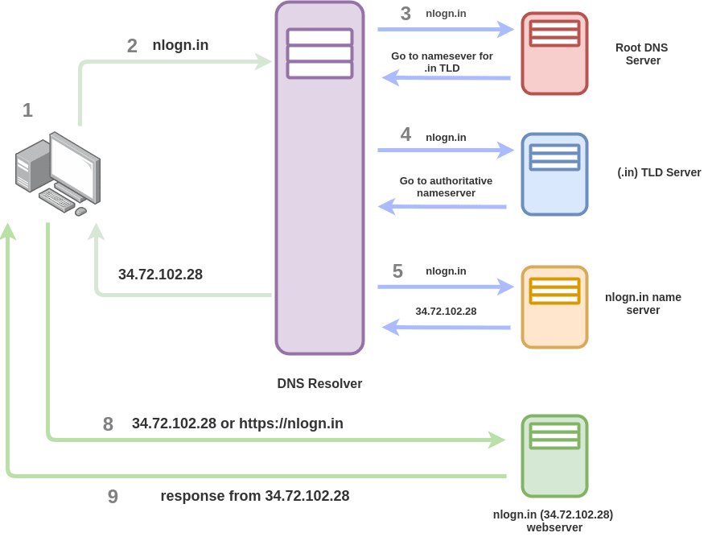
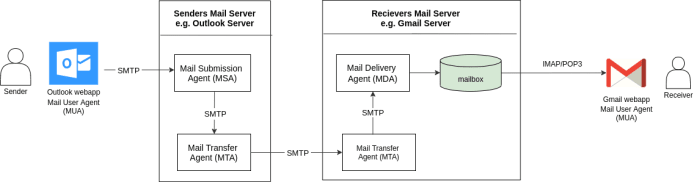

# System Design Basic Concepts

## 1. Network Protocol

### HTTP Push and Pull
HTTP is the most common method of data transfer in client server-based architecture. But there are two ways for data transfer. HTTP push and HTTP pull. Let's understand them.

#### HTTP Pull
In the HTTP pull method, the client sends a request to the server and the server responds to that request(and the connection is closed). The client pulls the data from the server whenever it requires (by creating new  connection). And it keeps doing it over to fetch the updated data.

The most common example of this REST API calls or Remote Procedure Calls (RPC). In both of these methods, the first client initiates a request to a server and ther server after processing the request, replies with the result to the client.

This is the default HTTP Communication method and is extensively on the Internet for fetching HTTP pages from websites.

In this method, the client experience a small time delay in receiving updated content.

The disadantage of the HTTP pull method is that if client keep on periodically makes the pull request for updated data, but there are no updated at the server hence, every time the client will get the same result, bandwidth will be wasted and the server will be busy too. 

Also, excessive pulls by the clients have the potential to bring down the server.

#### HTTP Push
To overcome the problem with HTTP pull, an HTTP push was introduced. In the HTTP push method, the client opens a connection to the server by requesting a server only the first time and after that server keeps on pushing back updated content to the client, whenever there's any.

In this method, the client receives the updated content instantly.

The HTTP push mechanism,leverage the persistent connection i.e the connection remains constantly active for further communications instead of being closed after a single request and response, just like in HTTP pull.

Push servies are often based on the information perferences of users expressed in advance. This is called a publish/subscribe model.

A client `subscribe` to various information `channels` provided by a server and whenever new content is available on any one of those channels, the server pushes that information out to the client or notifies the client.

An example of the HTTP push request is `Facebook` or `Twitter` notification. You get a notification instantly when someone texts you or likes or comment on you post etc.

### What is DNS and how does DNS lookup work?
DNS (Domain Name System) is a decentralized naming system that converts domain names(such as nlogn.in) to its conrresponding IP address.

Each device connected to the internet has a unique IP address, which is a 32-bit number for example - 152.52.0.1(in IPv4), and remembering such an IP address is almost impossible. The solution to this problem was using English letter, as we human beings are good at memorizing English words. Hence the concept of Domain name came into the picture. Each domain name is combination of English alphabets and points to an IP address.

To create a mapping between domain names and IP address, DNS(Domain Name System) was introduced. Now, whenever a user type a domain name, the DNS translates it into corresponding IP addresses so browsers can load Internet resources.

#### Type of DNS Server
1. **Root Domain Name Server** - Root DNS servers are the first in the process of resolution of Domain name into IP address. The mapping of a domain name to an IP address is a hierarchical process, and the distribution is done on the basis of DNS zones and Root DNS sites on the top of this hierarchy.

    The root-level directly responds to the queries that are for the root zone or refer queries to appropriate TLD nameserver. Generally, most of the queries are contains referring to TLD's hence Root DNS servers are not involved in name resolution.

2. **Top-Level Domain (TLD) Server** - Top-level domains are first tier domains available for the use of the general public. They are installed in the Root DNS Server and all the other domains are the part of TLDs. For example google.com or nlogn.in are top-level domains, which nlog.co.in or google.co.in are secondary level domains.

3. **Authoritative DNS Server** - It is the last stop for a DNS and returns. It is a nameserver that has the original DNS records such as (A record, MX record, etc.). The request to them reach from resolving names server and they are the endpoint of any request. Note , they don't respond to recursive queries.

#### DNS Lookup
DNS lookup is a process by which an IP address(one of the DNS record) is returned for a domain name by a DNS server. The DNS is lookup is not only limited to returning the IP Address, but it can also return all the records associated with a domain name(such as IP, IPv6 address or MX record, etc).

The above diagram explains how DNS lookup happens and how DNS route traffic to a website.
1. A user opens a web browser, enter webiste in the address bar and presses Enter button.
2. The request for website is routed to a DNS resolver, which is typically managed by the user's Internet service Provider.
3. The DNS resolver forwards the request for website to a root DNS server.
4. The DNS resolver again forwards the request for website this time to one of the TLD name servers for domains. The name server for domains responds to the request with the nanes of the 2 or 4 name server that ate associated with the website domain.
5. The DNS resolver chooses a website the authoritative name server and forward the request for website to that names server.
6. The website's name server looks in the website hosted zone. for the webiste. A record, to get the associated value, such as the IP address for a web server 34.72.102.28, and returns the IP address to the DNS resolver.
7. The DNS resolver for the ISP finally has the IP addresses that the user needs. The resolver returns that value to the web browser. The DNS resolver also caches (Stores) the IP address for website for an amount of time that you specify so that it can respond more quickly the next time someone browses to website.
8. The web browser sends a request for website using the IP address that it got from the DNS resolver . This is where the actual content is. For example, a web server running on a Google VM instances that's configured as a website endpoint.
9. The web server or other resources at 34.72.102.28 returns the web pages for website to the browser and the web browser displays the page.

### Simple Mail Transfer Protocol - SMTP

Simple Mail Transfer Protocol (SMTP) is a protocol to send electronic mail from one user to another user in a reliable and efficient manner. Mail servers such as Gmail, Outlook, etc use SMTP for sending an email. SMTP use transmission contro protocol and run on port number 25. For SMTP to work, both sender and receiver need not be online at the same time.

## 2. Scaling
Scaling  is the ability of a system to grow or shrink in size to meet the increasing user requirement. A scalable system has an advantage because it is adaptable to changing needs or demands of its users. Scaling can be achieved either by adding more resources to the current system, or by adding new systems in the existing one or by both.

### Vertical Scaling
In vertical scaling, we add more new resources to the same system i.e increate the amount of RAM, CPU, GPU and other resources to meet the increased computing requirement. It is easy to accomplish. It also consumes lees power.

But, Vertical Scaling does not make the system fault-tolerant i.e. if we are scaling application running with a single server and ig that server goes down, our entire system will go down. Also, it is often limited to the capacity of a single maching i.e. scaling beyond that capacity of a machine often involves downtime. 

### 
In horizontal Scaling, we scale by adding more systems into the existing pool of systems. Since all server works independently and is equally capable of handling the request, hence this will eventually decrease the load of requests on each server and also make the entire system fault-tolerant i.e. even if one server goes down other system will handle the upcoming request.

Also there is no limit, we can add as many new servers as we want.

It is hard to implement as it requires all the system to be synchronized with each other also, we need to use a load balancer to distribute the load equally among all systems, which is an additional overhead.

# How Do You Design the Vending Machine in Java?

# How Do You Design a URL Shortening Service Like Goo.gl or Bit.Ly?

# How Do You Design a Traffic Control System?

# How to Design a Limit Order Book?

# How Do You Design a Website Like Pastebin?

# How Would You Create Your Own Instagram?

# How Do You Design a Global File Sharing and Storage Apps Like Google Drive or Dropbox?

# How Do You Design a Chat Application Like Whatsapp or Facebook Messenger?

# How Do You Design a Twitter Clone?

# How to Design a Global Video Streaming Service Like YouTube or Netflix?

# How to Design an ATM Machine?

# How Do You Design an API Rate Limiter?

# How Do You Design Twitter Search?

# How to Design a Web Crawler Like Google?

# How to Design Facebook's Newsfeed? What Kind of Algorithm Will You Use?

# How to Design Yelp or Nearby Friends?

#  How to Design a Global Ride-Hailing Service E.G. Uber, Grab, or Ola Backend?

# How to Design BookMyShow?

# How to Design a Social Network + Message Board Service Sites Like Quora, Reddit, or Hackernews?

# How Do You Design an Application Like Airbnb?

# How Do You Design an Elevator of the Lift System?

System Design Basics

Key Characteristics of Distributed Systems

Load Balancing

Caching

Data Partitioning

Indexes

Proxies

Redundancy and Replication

SQL vs. NoSQL

CAP Theorem

Consistent Hashing

Long-Polling vs WebSockets vs Server-Sent Events