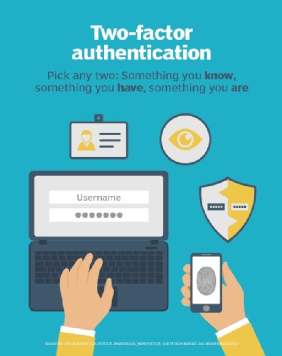

# Two-factor Authentication
Two-factor authentication (2FA), sometimes referred to as *two-step verification* or *dual-factor authentication*, is a security process in which users provide two different `authentication factors` to verify themselves. This process is done to better protect both the user's credentials and the resources the user can access. Two-factor authentication provides a higher level of assurance than authentication methods that depend on single-factor authentication (SFA), in which the user provides only one factor - typically, a password or passcode. Two-factor authentication methods rely on a user providing a password, as well as a second factor, usually either a security token or a biometric factor, such as a fingerprint or facial scan.
Two factor authentication adds an additional layer of security to the authentication process by making it harder for attackers to gain access to a person's devices or online accounts because knowing the victim's password alone is not enough to pass the authentication check. Two-factor authentication has long been used to control access to sensitive system and data, and online service providers are increasingly using 2FA to protet their users credentials from being used by hackers who have stolen a password database or used phising campaigns to obtain user passwords.

## What are authentication factors?
There are several different ways in which someone can be authenticated using more than one authenticated methods rely on knowledge factors, such as a traditional password, while two-factor authentication methods add either a possession factor or an inherence factor.
Authentication factor, listed approximate order of adoption for computing, including the following:
1. A **knowledge factor** is something the user knows such as a password, a PIN(personal indentification number) or some other type of shared secret.
2. A **possession factor** is something the user has, such as an ID card, a security token, a cellphone, a mobile device or smartphone app, to approve authentication requests.
3. An **inherence factor**, more commonly called a *biometric factor*, is something inherent in the user's physical self. These may be personal attributes mapped from physical characteristics, such as fingerprints authenticated through a fingerprint reader. Other commonly used inherence factors include facial and voice recognition. They also include behavioral biometrics such as keystroke dynamics, gait or speech patterns.
4. A **location factor**, usually denoted by the location from which an authentication attempts is being made, can be enforced by limiting authentication attempts to specific devices in a particular location or, more commonly, by tracking the geographic source of an authentication attempt based on the source Internet protocol (IP) address or some other geolocation information such as Global Positioning System (GPS) data, derived from the user's mobile phone or other device.
5. A **time factor** restrict user authentication to a specific time window in which logging on is permitted and restricts access to the system outside of that window.

It should be noted that the vast majority of two-factor authentication methods rely on the first three authentication factors, through systems requiring grater security may use them to implement multifactor authentication (MFA), which can rely on two or more independent credentials for more secure authentication.

## What is two-factor authentication ?
Two-factor authentication is a form of MFA. Technically, it is in use any time two authentication factors are required to gain access to a system or service. However, using two factors from the same category doesn't constitute 2FA; for example, requiring a password and a shared secret is still considered SFA as they both belong to the same authentication factor type: knowledge.

As far as SFA services go, user ID and password are not the most secure. One problem with password-based authentication is it requires knowledge and diligence to create and remember strong passwords. Passwords require protection from many inside threats, like carelessly stored sticky notes with login credentials, old hard drives and social engineering exploits. Password are also prey to exterbal threeats, such as hackers using brute-force, dictionary or raindow-table attacks.
Given enough time and resources, an attacker can usually breech password-based secuirty systems and steal corporate data, including user's personal information. Password have remained the most common form of SFA because of their low cost, ease of implementation and familiarity. Multiple challenge-response questions can provide more security, depending on how they are implemented, and stand-alone biometric verification methods can also provide a more secure method of SFA.

## Type of two-factor authentication products
There are many different devices and services for implementing 2FA - from tokens to radio frequency identification (RFID) cards to smartphone apps.

Two-factor authentication products can be divided into two categories: tokens that are given to users to use when logging in and infrastructure or software that recognizes and authenticates access for users who are using their tokens correctly.

Authentication token may be phyiscal devices, such as key fobs or smart cards, or they may exist in software as mobile or desktop apps that generate PIN codes for authentication. These authentication codes also knows as *one-time passwords(OTP)*, are usually generated by a server and can be recognized as authentic by an authentication device or app. The authentication code is a short sequence linked to a particular device, user or account and can be used onces as part of an authentication process.
Organizations need to deploy a system to accept, process and allow -- or deny -- access to users authenticating with their tokens. This may be deployed in the form of server software, a dedicated hardware server or provided as a service by a third-party vendor.
An important aspect of 2FA is ascertaining that the authenticated user is given access to all resources the user is approved for -- and only those resources. As a result, one key function of 2FA is linking the authentication system with an organization's authentication data Microsoft provides some of the infrastructure necessary for organization to support 2FA in Windows 10 through Windows Hello, which can operate with Microsoft accounts, as well authenticating users through Microsoft Active Directory, Azure AD or Fast Identity Online (FIDO 2.0).
