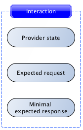
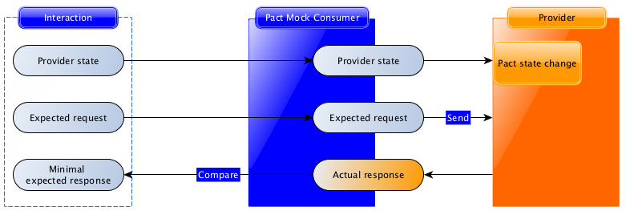

# Pact

## Introduction
> Pact (noun) :
> A formal agreement between individuals or parties.
> "The country negotiated a trade pact with the US"

Pact is a contract testing tool. Contract testing is a way to ensure that services (such as an API provider and a client) can communicate with each other. Without contract testing, the only way to know that services can communicate is by using expensive and brittle integration tests.

Do you `set your house on fire to test your smoke alarm?` No you test the contract it holds with your ears by using the testing button. Pact provides that testing button for your code, allowing you to safely confirm that your applications will work together without having to deploy the world first.

---

## Contract Testing
Contract testing is immediately applicable anywhere where you have two services that need to communicate - such as an API client and a web front-end. Although a single client and single service is a common use case, contract testing really shines in an environment with many services (as is common for a microservice architecture). Having well-formed contract tests makes it easy for developers to avoid version hell. Contract testing is the killer app for microservice development and deployment.

In general, a contract is between a consumer(for example, a client that wants to receive some data) and a provider(for example, an API on a server that provides the data the client needs). In microservice architectures, the traditional term client and server are not always appropriate -- for example, when communication is achieved through message queues. For this reason, we stick to consumer and provider in this documentation.

## Consumer Driven Contracts
Pact is a `consumer-driven` contract testing tool. This means the contract is written as part of the consumer tests. A major advantage of this pattern is that only parts of the communication that are actually used by the consumer(s) get tested. This in turn means that any provider behaviour not used by current consumers is free to change without breaking tests.
Unlike a schema or specification (eg. OAS), which is a static artifact that describes all possible states of a resource, a Pact contract is enforced by executing a collection of test cases each of which describes a single concrete request/response pair - Pact is, in effect "contract by example".

## How Pact works
Remember these definitions from the introduction:
- **Consumer**: A client that wants to receive some data(for example, a web frontend, or a message receiving endpoint)
- **Provider**: A service or server that provides the data( for example, an API on server that provides the data the client needs, or the service the send messages).

A contract between a consumer and provider is called a `pact`. Each pact is collection of `interactions`. Each interactions describes:
- An expected request - describing what the consumer is expected to send to the provider(this is always present for synchronous interaction like HTTP requests, but not required for asynchronous interaction like message queues)
- a minimal expected response - describing the parts of the response the consumer wants the provider to return.


The first step in writing a pact test is to describe this interaction.

## Consumer testing
Consumer Pact test operate on each interaction described eariler to say "assuming the provider returns the expected response for this request, does the consumer code correctly generate the request and handle the expected response?".

Each interaction is tested using the pact framework, driven by the unit test framework inside the consumer codebase:
Following the diagram:


1. Using the Pact DSL, the expected request and response are registered with the mock service.
2. The consumer test code fires a real request to a mock provider(created by the Pact framework).
3. The mock provider compares the actual request with the expected request, and emits the expected response if the comparison is successful.
4. The consumer test code confirms that the response was correctly understood.

Pact tests are only successful if each step completes with error.

Usually, the interaction definition and consumer test are written together, such as this example :
```bash
# Describe the interaction
before do
    event_api.upon_receiving('A POST request with an event').
    with(method: post, path: '/events', headers : {'Content-Type' => 'application/json'}, body: event_json).
    will_respond_with(status: 200, headers: {'Content-Type' => 'application/json'})
end

# Trigger the client code to generate the request and receive the response
it 'is successful' do
    expect(subject.save_event(event)).to be_true
end    
```

Although there is conceptually a lot going on in a pact interaction test, the actual test code is very straightforward. This is a major selling point of Pact.

In Pact, each interaction is considered to be independent. This means that each test only tests one interaction. If you need to describe interactions that depend on each other, you can use `provider states` to do it. Provider states allow you describe the preconditions on the provider required to generate the expected response - for example, the existence of specific user data. This is explained further in the provider verification section below.


Instead of writing a test that says "create user 123, then log in", you would write two separate interactions - one that says "create user 123", and one with provider state "user 123 exists" that says "log in as user 123".

Once all of the interactions have been tested on the consumer side, the Pact framework generates a pact file, which describes each interaction:


This pact file can be used to verify the provider.

## Provider Verification
In constrast to the consumer tests, provider verification is entirely driven by the Pact framework:


In provider verification, each request is sent to the provider, and the actual response it generates is compared with the minimal expected response described in the consumer test.

Provider verification passes if each request generates a response that contains at least the data described in the minimal expected response.

In many cases, your provider will need to be in a particular state (such as "user 123 is logged in", or "customer 456 has an invoice #678"). The Pact framework supports this be letting you set up the data described by the provider state before the interaction is replayed:


## Putting it all together
Here's a repeat of the two diagrams above:


If we pair the test and verification process for each interaction, the contract between the consumer and provider is fully tested with having to sping up the services together.

## Terminology - Pact

### Service Consumer
A component that initiates a HTTP request to another component(the service provider). Note that this does not depend on the way the data flows - whether it is a `GET` or  `PUT / POST / PATCH`, the consumer is the initiator of the HTTP request.

### Service Provider
A server that responds to an HTTP request from another component(the service consumer). A service provider may have one or more HTTP endpoints, ad should be thought of as the "deployable unit" - endpoints that get deployed together should be considered part of the same provider.

### Mock Service Provider
Used by tests in the consumer project to mock out the actual service provider, meaning that integration-like tests can be run without requiring the actual service provider to be available.

### Interaction
A request and response pair. A pact consists of a collection of interactions.

### Pact file
A file containing the JSON serialised interactions (request and responses) that were defined in the consumer tests. THis is the Contract. A Pact defines:
- the consumer name
- the provider name
- a collection of interactions
- the pact specification version

### Pact verification
To verify Pact Contract, the requests contained in a Pact file are replayed against the provider code, and the responses returned are checked to ensure they match those expected in the Pact file.

### Provider State
A name describing a "state" (like a fixture) that provider should be in when a given request is replayed against it - e.g. "when user John Doe exists" or "when user John Doe has a bank account". These allow the same endpoint to be tested under different scenarios.

A provider state name is specified when writing the consumer specs, then when the pact verification is set up in the provider the same name will be used to identify the set up code block that should be run before the request is executed.

### Pact Specifiation
The Pact Specifiation is a document that governs the structure of the actual generated Pact files to allow for interoperability between languages (consider, for example, a Javscript consumer connecting to a Scala JVM-based provider), using semantic version to indicate breaking changes.
Each language implementation of Pact needs to implements the rules of this specification, and advertise which version(s) are supported, corresponding closely to which features are available.

## Getting Started
To get started, you will need to install the relevant pact components for the language(s) you're using for your consumer (or provider). These need not be the same for both consumer and provider - part of the value of the Pact format is that different frameworks and languages can be used for consumers and providers.

## An example scenario
Here we have an example describing Pact tests between a consumer(the Zoo App), and the provider(the Animal Service).

In the Consumer project, we're going to need:
- A model (the Alligator class) to represent the data returned from the Animal Service.
- A client(the AnimalServiceClient) which will be responsible for making the HTTP calls to the Animal Service.

Note that to create a pact, you do need to write the code that executes the HTTP requests to your service(in your client class), but you don't need to write the full stack of consumer code (eg, the UI).

Ideally, the Pact tests should be "unit tests" for your client class, and they should just focus on ensuring that the request creation and response handling are correct. If you use pact for your UI tests, you'll end up with an explosion of redundant interactions that will make the verification process tedious. Remember that pact is for testing the contract used for communication, and not for testing particular UI behavior or business logic.


## In the Zoo App(consumer) project
### 1. Start with your model
Imagine a model class that looks something like this. The attributes for a Alligator live on a remote server, and will need to be retrieved by an HTTP call to the Animal Service:
```ruby
class Alligator
    attr_reader: name

    def initialize name
        @name = name
    end
    
    def == other
        other.is_a?(Alligator) && other.name == name
    end
end        
```

### 2. Create a skeleton Animal Service client class
Perhaps we have an Animal Service client class that looks something like this(please excuse the use of httpparty):
```ruby
require 'httparty'

class AnimalServiceClient
    include HttParty
    base_uri 'http://animal-service.com'

    def get_alligator
        # Yet to be implemented because we're doing Test First Development...
    end
end    
```
### 3. Configure the mock Animal Service
The following code will create a mock service on `localhost:1234` which will respond to your application's queries over HTTP as if it were the real Animal Service app. It also creates a mock provider object which you will use to setup your expecations. The method name to access the mock service provider will be what ever name you give as the service argument- in this case `animal_service`.

```ruby
# In /spec/service_providers/pact_helpers.rb

require 'pact/consumer/rspec'
# or require 'pact/consumer/minitest' if you are using Minitest

Pact.service_consumer "Zoo App" do
    has_pact_with "Animal Service" do
        mock_service: animal_service do
            port 1234
        end   
    end
end    
```

### 4. Write a failing spec for the Animal Service client
```ruby
# In /spec/service_providers/animal_service_client_spec.rb

# When using RSpec, use the metadata `:pact => true` to include all the pact functionality in your spec.
# When using Minitest, include Pact::Consumer::Minitest in your spec.

describe AnimalServiceClient, :pact => true do

  before do
    # Configure your client to point to the stub service on localhost using the port you have specified
    AnimalServiceClient.base_uri 'localhost:1234'
  end

  subject { AnimalServiceClient.new }

  describe "get_alligator" do

    before do
      animal_service.given("an alligator exists").
        upon_receiving("a request for an alligator").
        with(method: :get, path: '/alligator', query: '').
        will_respond_with(
          status: 200,
          headers: {'Content-Type' => 'application/json'},
          body: {name: 'Betty'} )
    end

    it "returns a alligator" do
      expect(subject.get_alligator).to eq(Alligator.new('Betty'))
    end

  end

end
```

### 5. Run the specs
Of course, the above specs will fail because the Animal Service client method is not implemented. No pact file has beem generated yet because only interactions that were correctly executed will be written to the file, and we don't have any of those yet.

### 6. Implement the Animal Service client consumer methods.
```ruby
class AnimalServiceClient
  include HTTParty
  base_uri 'http://animal-service.com'

  def get_alligator
    name = JSON.parse(self.class.get("/alligator").body)['name']
    Alligator.new(name)
  end
end
```
### 7. Run the specs again
Green!

Running the passing AnimalServiceClient spec will generate a pact file in the configured pact dir(`spec/pacts` by default). Logs will be output to the configured log dir (`log` by default) that can be useful when diagnosing problems.

You now have a pact file can be used to verify your expectations of the Animal Service provider project.

Now, rinse and repeat for other likely status code that may be returned. For example, consider how you want your client to respond to a "
- 404 (return null, or raise an error?)
- 400 (how should validation errors be handled, what will the body look like when there is one?)
- 500 (specifying that the response body shoild contains an error message, and ensuring that your client logs that error message will make your life much easier when things go wrong. Note that it may be hard to force your provider to generate a 500 error on demand if you are not using Ruby. Yo may need to collaborate with your provider team to create a known provider state that will artfically return a 500 error, or you may just wish to use a standard unit test without a pact to test this.)
- 401/403 if there is authorization.

## In the Animal Service (provider) projet

### 1. Create the skeleton API classes
Create your API class using the framework of your choice(the Pact authors have a preferences for Webmachine and Roar) - leave the methods unimplemented, we're doing Test First Development, remember?

### 2. Tell your provider that it needs to honour the pact file you made eariler
Require "pact/tasks" in your Rakefile
```ruby
# In Rakefile
require 'pact/tasks'
```
Create a `pact_helper.rb` in your service provider project. The recommended place is `spec/service_consumers/pact_helper.rb`.

```ruby
# In specs/service_consumers/pact_helper.rb

require 'pact/provider/rspec'

Pact.service_provider "Animal Service" do

  honours_pact_with 'Zoo App' do

    # This example points to a local file, however, on a real project with a continuous
    # integration box, you would use a [Pact Broker](https://github.com/pact-foundation/pact_broker) or publish your pacts as artifacts,
    # and point the pact_uri to the pact published by the last successful build.

    pact_uri '../zoo-app/specs/pacts/zoo_app-animal_service.json'
  end
end
```
### 3. Run your failing specs
```bash
$ rake pact:verify
```
Congratulations! You now have a failing spec to develop against.
At this stage, you will want to be able to run your specs one at a time while you implement each feature. At the bottom of the failed pact:verify output you will see the commands to rerun each failed interaction individually. A command to run just one interaction will look like this:
```bash
$ rake pact:verify PACT_DESCRIPTION="a request for an alligator" PACT_PROVIDER_STATE="an alligator exists"
```
### 4. Implement enough to make your first interaction spec pass
Rinse and repeat

### 5. Keep going til you're green
Yay! Your Animal Service provider now honours the pact it has with your Zoo App consumer. You can now have confidence that your consumer and provider will play nicely together.

## Matching
