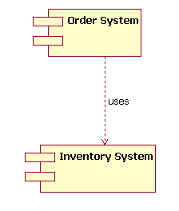
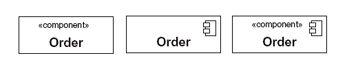
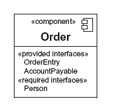
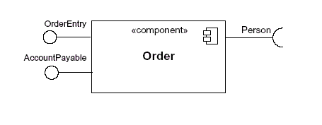
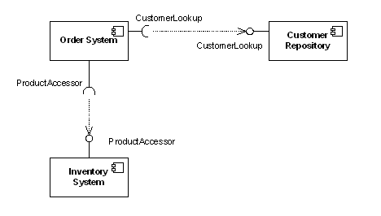
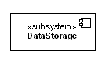
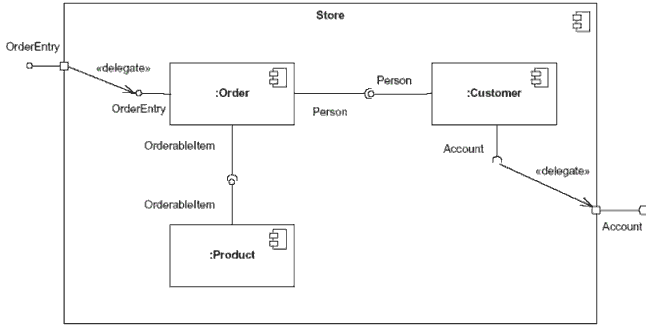

# Component Diagram

## The diagram purpose
The component diagram main purpose is to show the structural releationships between the components of a system. In UML 1.1, a component represented implementation items such as files and executables. Unfortunately, this conflicted with the more common use of the  term component, which refers to things such as COM components. Over time and across successive releases of UML, the the original UML meaning of components was mostly lost. UML 2 officially changes the essential meaning of the component concept; in UML 2, components are considered autonomous, encapsulated units within a system or subsystem that provide one or more interfaces. Although the UML 2 specification does not strictly state it, components are larger design units that represents thing that will typically be implemented using replaceable modules. But unlike UML 1.x components are now strictly logical design-time construct. The idea is that you can easily reuse and/or substitute a different component implementation in your design because a component encapsulates behavior and implements specified interfaces.[Note: The physical items that UML 1.x called components are now called "artificats", in UML 2. An artificat is a physical unit, such as a file, executable, script, database, etc. Only artificats live on physical nodes; classes and components do not have "location". However, an artifact may manifest components and other classifiers (i.e. classes). A single component could be manifested by multiple artifacts which could be on the same or different nodes, so a single component could indirectly be implemented on multiple nodes.]

In component-based development(CBD), component diagrams offer architects a natural format to being modeling a solution. Component diagrams allow an architect to verify that a system's required functionality is being implemented by components, thus ensuring that the eventual system will be acceptable.

In addition, component diagrams are useful communication tools for various groups. The diagrams can be presented to key project stakeholders and implementation staff. While components diagrams are generally geared towards a system's implementation staff, component diagrams can generally put stakeholders at ease because the diagram presents an early understanding of the overall system that is being built.

Developers find the component diagram useful because it provides them with a high-level, architectural view of the system that they will be building, which helps developers being formalizing a roadmap for the implementation and make decisions about task assignment and/or needed skill enhancements. System adminsistrators find component that will be running on their system. Although system administrator will not able to identify the physical machines or the physical executables from the diagram, a component diagra will nevertheless be welcomed because it provides early information about the components and their relationships (which allow sys-admins to loosely plan ahead).

## The notation
The component diagram notation set now makes it one of the easiest UML diagrams to draw. Figure 1 shows a simple component diagram using the former UML 1.4 notation; the example shows a relationship between two components. As you can see, a component in UML 1.4 was drawn as a rectangle with two smaller rectangles protruding from its left side.
**Figure 1: The simple component diagram show the Order System's general dependency using UML 1.4 notation**

The above UML 1.4 notation is still supported in UML 2. However, the UML 1.4 notation set did not scale will in larger systems. For that reason, UML 2 dramatically enhances the notation set of the component diagram. The UML 2 notation set scales better, and the notation set is also more informative while maintaining its ease of understanding.

## The basics
Drawing a component in UML 2 is now very similar to drawing a class on a class diagram. In fact, in UML 2 a component is merely a specialized version of the class concept. Which means that the notation rules that apply to the class classifier also apply to the component classifier.

In UML 2, a compoent is drawn as a rectangle with optional compartments stacked vertically. A component high-level, abstracted view of a component in UML 2 can be modeled as just a rectangle with the component's name and the compoent stereotype icon is rectangle with two smaller rectangles protruding on  its left side (the UML 1.4 notation element for a component). Figure 2 shows three different ways a component can be drawn using the UML 2 specification.
**Figure 2: The different ways to draw a component's name compartment**

When drawing a component on a diagram, it is important that you always include the component stereotype text(the word "component" inside double angle brackets, as shown in Figure 2) and/or icon. The reason? In UML, a rectangle without any stereotype classifier is interpreted as a class element. The component stereotype and/or icon distinguishes this rectangle as a component element.

### Modeling a component's interfae Provided/Required
The order components drawn in Figure 2 all represent valid notation elements; however, a typical component diagram includes more information. A component element can have additional compartments stacked below the name compartment. As mentioned earilier, a component is an autonomous unit that provides one or more public interfaces. The interfaces provided represent the formal contract of services the component provides to is consumers/clients. Figure 3 shows the order component provides and requires.[Note: Even though components are autonomous units thet still may depend on the services provided by other components. Because of this, documenting a component's required interfaces is useful]

**Figure 3: The additional compartment here shows the interface that the order component provides and requires**

In the example Order Component shown in Figure 3, the component provides the interfaces of OrderEntry and AccountPayable. Additionally, the component also requires another component that provides the Person interface.[Note Figure 3 does not show the Order component in its complete context. In a real-world model the OrderEntry, AccountPayable and Person interfaces would be present in the system's model.]

### Another approach to modeling a component's interfaces
UML 2 has alos introduced another way to show a component's provided and required interfaces. This second way builds off the single rectangle, with the component's name in it, and places what the UML 2 specification calls interface symbols connected to outside of the rectangle. This second approach is illustrated in Figure 4.

**Figure 4: An alternatibr approach(compare with Figure 3) to showiing a component's provided/required interfaces using interface symbols**

In this second approach the interface symbols with a complete circle at their end represent an interface that the component provides - this "lollipop" symbol is shorthand for a realization relatioship of an interface classifier. Interface symbols with only a half circle at their end(a.k.a sockets) represent an interface that component requires (in both cases, the interface's name). Even though Figure 4 looks much different from Figure 3, both figures provide the same information - i.e., the Order component provides two interfaces: OrderEntry and AccountPayable, and the Order component requires the Person interface.

### Model a component relationships
When showing a component's relationship with other components, the lollipop and socket notation must also incluse a dependency arrow(as used in the class diagram). On a component diagram with lollipops and sockets, note that dependency arrow comes out of the consuming(requiring) socket and its arrow head connects with the provider's lollipop shown in Figure 5.
**Figure 5: A compoent diagram that shows the Order System component depends on the other components.**

Figure 5 shows that the Order system component depends on the Customer Repository and Inventory system components. Notice in Figure 5 the duplicated names of the interfaces CustomerLookup and ProductAccessor. While this may seem unnecessarily repetitive in the exanple, the notation actually allow for different interfaces (and different names) on each component dpepending on the implementation differneces(eg.- one component provides an interfaces that us a subclass of a smaller required interfaces).

### Subsystems
In UML 2 the subsystem classifier is a specialized version of a component classifier. Because of this, the subsytem notation element inheirts all the same rules as the component notation element. The only difference is that subsystem notation elemenet has the keyword of subsystem "instead of component", as show in Figure 6.
**Figure 6: an example of a subsystem element**

THe UML 2 specification is quite vague on how subsystem is different from a component. THe specification does not treat a component or a subsystem any differently from a modeling prespective. Compared with UML 1.x, this UML 2 modeling ambiguity is new. But there's a reason. in UML 1.x, a subsystem was considered a package, and this package notation was confusing to many UML pratitioners; hence UML 2 aligned subsystems as a specialized component, since this is how most UML 1.x user understood it. This change did introduce fuzziness into the picture, but this fuzziness is more of a reflection of reality versus a mistake in the UML 2 specification.

So right now you are probably scatching your head wondering when to use a component element versus a subsystem element. Quite frankly, I do not have a direct answer for you. I can tell you that the UML 2 specification says that the decision on when to use a component versus a subsystem is up to the methodoology of the modeler. I personally like this answer because it help ensure that UML stays methodology indepenent, which keeps it univerisally usable in software development.

## Beyond the basics
The component diagram is one of the easier-to-understand diagrams, so there is not much to cover beyond the basis. However, there  is one are you may consider somewhat advanced.

### Showing a component's internal structure
There will be times when it makes sense to display a component's internal structure. To show a component's inner structure you merely draw the component larger than normal and place the inner parts inside the name of the encompassing component. Figure 7 show's the store component inner structure.
**Figure 7: This component's inner structure is composed of other components**

Using the example shown in Figure 7, the store component provides the interface of OrderEntry and requires the interface of Account. The Store component is made up of three components: Order, Customer, and product components. Notice how the store's OrderEntry and Account interface symbols have a square on the edge of the component. This square is called a `port`, In a simplistic sense, ports provide a way to model how a component's provided/required interfaces relate to its internal parts.[Note: In actuality, ports are applicable to any type of classifier (i.e. to a class or some other classifier your model might have). To keep this article simple, I refer to port in their use on component classifiers.]

But using a port, our diagram is able to de-couple the internals of the Store component from external entities. In Figure 7, the OrderEntry port delegates to the Order component's OrderEntry interface for processing. Also, the internal Customer component's required Account interface is delegated to the Store component (e.g. the Customer component) can have local representative of some unknown external entity which implements the port interface. The required interface will be implemented by a component outside of the Store component.[Note: Typically when you draw a dependency relationship between a port and an interface, the dependent (requiring) interface will handle all the processing logic at execution time. However, this is not a hard and fast rule - it is completely acceptable for the encompassing component (e.g. the store component in our example) to have its own processing logic instead of merely delegating to the dependant interface.]

You will also notice in Figure 7 that the interconnections between the inner components are different from those shown in Figure 5. This is because these depictions of internal structure are really collaboration diagrams nested inside the classifier (a component, in our case), since collaboration diagrams show instances or role of classifiers. The relationship modeled between the internal component's provided interface with another component's required interface. Assembly connectors are drawn as lollipop and socket symbols next to each other. Drawing these assembly connectors in this manner makes the lollipop and socket symbols very easy to read.

