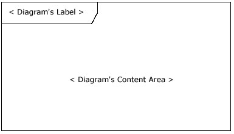
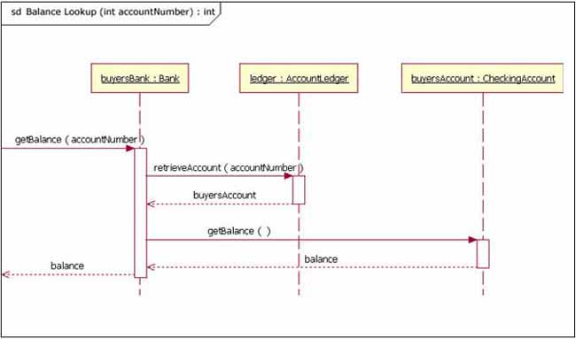

# Sequence Diagram

## The diagram's purpose
The sequence diagram is used primarily to show the interactions between object in the sequential order that those interaction occur. Much like the class diagram, developers typically sequence diagrams were meant exclusively for them. However, an organization's business staff can find sequence diagrams useful to communicate how the business staff can find sequence diagram useful to communicate how the business currently works by showing how various business objects interact. Besides documenting an organization's current affairs, a business-level sequence diagram can be used as a requirement phase of a project, analyst can take use case to the next level by providing a more formal level of refinement. When that occurs, use case are often refined into one or more sequence diagrams

An organization's technical staff can find sequence diagram useful in documenting how a future system should behave. During the design phase, architects and developers can use the diagram to force out the system's object interactions, thus fleshing out overall system design.

One of the primary uses of sequence diagrams is in the transitions from requirements expressed as use cases to the next and more formal level of refinement. Use cases are often refined into one or more sequence diagrams. In addition to their used to document how objects in an existing(call it "legacy") system currently interact.

## The notation
The frame element is used as a basis for many other diagram element in UML 2, but the first place most people encounter a frame element is as the graphical boundary of a diagram. A frame element provides a consistent place for a diagram's label, while providing a graphical boundary for the diagram. The frame element is optional in UML diagrams; as you can see in Figure 1 and 2, the diagram's label is placed in the top left corner in what I'll call the frame's "name box", a sort of dog eared rectangle, and the actual UML diagram is defined within the body of the larger enclosing rectangle.

**Figure 1: An empty UML frame element**

In addition to providing a visual border, the frame element also has an important function use in diagrams depicting interactions, such as the sequence diagram. On sequence diagram incoming and outgoing messages (a.k.a interactions) for a sequence can be modeled by connecting the message to the border of the frame element(as seen in Figure 2).

**Figure 2: A sequence diagram that has incoming and outgoing messages**

Notice that in Figure the diagram's label begin with the letter "sd", for Sequence Diagram. When using frame element to enclose a diagram's label needs to follow the format of:
> Diagram Type Diagram Name

## The basics
The main purpose of a sequence diagram is to define event sequences that result in some desired outcome. The focus is less on messages themeseleves and more on the order in which message occur; nevertheless most sequence diagrams will communicate what messages are sent between a systems object as well as the order in which they occur. The diagram conveys this information along the horizontal and vertical dimensions: the vertical dimensions shows, top down, the time sequence of message/calls as they occur, and the horizontal shows, left to right, the object instances that the messages are sent to.

### Lifelines
