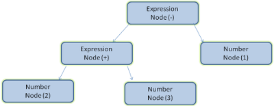

# How Browsers Work: Behind the scenes of modern web browsers

## The browser's main functionality
The main function of a browser is to present the web resource you choose by requesting it from the server and displaying it in the browser window. The resource is usually an HTML document, but may also be a PDF, image, or some other type of content. The location of the resource is specified by the user using a URI(Uniform Resource Identifier)
The way the browser interprets and display HTML files is specified in the HTML and CSS specifications. These specifications are maintained by the W3C(World Wide Wen Consortium) organization, which is the standard organization for the web. For years browsers conformed to only a part of the specifications and developed their own extensions. That caused serious compatibility issues for web authors. Today most of the browsers more or less conform to the specifications.   

## The browser's high level structure
The browser's main component are: 
1. **The user interface**: this includes the address bar, back/forward button, bookmarking menu, etc. Every part of the browser display except the window where you see the requested page.
2. **The browser engine**: marshals action between the UI and the rendering  engine.
3. **The rendering engine**: responsibe for displaying requested content. For example if the requested content is HTML, the rendering engine parses HTML and CSS, and display the parsed content on the screen.
4. **Networking**: for network call such as HTTP requests, using different implementations for different platform behind a platform-independent interface.
5. **UI Backend**: used for drawing basic widgets like combo boxes and windows. This backend exposes a generic interface that is not platform specific. Underneath it uses operating system user interface methods.
6. **Javascript interpreter**: Use to parse and execute Javascript code.
7. **Data storage**: This is a persistence layer. The browser may need to save all sorts of data locally, such as cookies. Browser also support storage mechansims such as localStorage, IndexedDB, WebSQL and FileSystem.

It is important to note that browsers such as Chrome run multiple instances of the rendering engine: one for each tab. Each tab runs in a separate process.

## The rendering engine
The responsibility of the rendering engine is well...Rendering, that is display of the requested contents on the browser screen.

By default the rendering engine can display HTML and XML documents and images. It can display other types of data via plug-ins or extension; for example displaying PDF documents using a PDF viewer plug-in.

## Rendering engines
Different browsers use different rendering engines: Internet Explorer uses Trident, Firefox uses Gecko, Safari uses Webkit. Chrome and Opera (from version 15) use Blink, a fork of Webkit.

Webkit is an open source rendering engine which start as an engine for the Linux platform and was modified by Apple to support Mac and Windows.

## The main flow
The rendering engine will start getting the contents of the requested document from the networking layer. This will usually done in 8kB chunks.

After that, this is the basic flow of the rendering engine:

The rendering engine will start parsing the HTML document and convert elements to DOM nodes in a tree called the "content tree". The engine will parse the style data, both in external CSS files and in style elements. Styling information together with visual instructions in the HTML will be used to create another tree: the render tree.

The render tree contains rectangles with visual attributes like color and dimensions. The rectange are in the right order to be displayed on the screen.

After the construction of the render tree it goes through a "layout" process. This means giving each node the exact coordinates where it should appear on the screen. The next stage is painting - the render tree will be traversed and each node will be painted using the UI backend layer.

It's important to understand that this is a gradual process. For better user experience, the rendering engine will try to display contents on the screen as soon as possible. It will not wait until all HTML is parsed before starting to build and layout the render tree. Parts of the content will be parsed and displayed, while the process continues with the rest of the contents that keeps coming from the network.

|Figure: WebKit main flow (1)|
|----------------------------|
||

|Figure: Mozilla's Gecko rendering engine main flow(2)|
|-----------------------------------------------------|
||

From figures 1 and 2 you can see that although Webkit and Gecko use slightly different terminology, the flow is basically the same.

## Parsing-general
Since parsing is a very siginifcant process within the rendering engine, we will go into it a little more deeply. Let's begin with a little introduction about parsing.
Parsing a document means translating it to structure the code can use. The result of parsing is usually a tree of nodes that represent the structure of the document. This is called a prase tree or syntax tree.
For example, parsing the expression 2 + 3 - 1 could return this tree:

## Grammars
Parsing is based on the syntax rules the document obeys: the language or format it was written in. Every format you can parse must have deterministic grammar consisting of vocabulary and syntax rules. It is called a context free grammar. Human languages are not such languages and therefore cannot be parsed with conventional parsing techniques.

