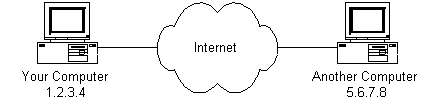

# How Does the Internet Work?

## Introduction
The internet's growth  has become explosive and it seems impossible to escape the bombardment of www.com's seen constantly on television, heard on radio and seen in magazines. Beacause the Internet has become such a large part of our lives, a good understanding is needed to use thid new tool most effectively.

## Where to Begin? Internet Address
Because the Internet is a global network of computers each computer connected to the Internet must have a unique address. Internet addresses are in the form **nnn.nnn.nnn.nnn** where *nnn* must be a number from 0-255. This address is known as an IP address (IP stands for Internet Protocol).

The picture below illustrates two computer connected to the Internet; your computer with IP address 1.2.3.4 and the another computer with IP address 5.6.7.8. The internet is represented as an abstract object in-between.

If you connect to the Internet through an Internet Service Provider(ISP), you are usually assigned a temporary IP address for the duration of your dial-in session. If you connect to the Internet from a local area network(LAN) your computer might have a permanent IP address or it might obtain temporary one from a DHCP(Dynamic Host Configuration Protocol) server. In any case, if you are connected to the Internet, your computer has a unique IP address.

|Check It out - The Ping Program|
|-------------------------------|
|If you're using Microsoft Windows or a flavor of Unix and have a connection to the Internet, there is a handy program to see if a computer on the Internet is alive. It's called **ping**, probably after the sound made by older submarine sonar systems. If you are using Window, start a command prompt window. If you're using a flavor of Unix get to a command prompt. Type *ping www.yahoo.com*. The ping program will send a 'ping' (actually an ICMP (Internet Control Message Protocol) echo request message) to the named computer. The pinged  computer will respond with a reply. The ping program will count the time expired until the reply comes back (if it does). Also, if you enter a domain name (i.e. www.yahoo.com) instead of an IP Address, ping will resolve the domain name and display the computer's IP Address.|

## Protocol Stacks and Packets
So your computer is connected to the Internet and has a unique address. How does it 'talk' to other computers connected to the Internet? An example should serve here: Let's say your IP address is 1.2.3.4 and you want to send a message to the computer 5.6.7.8. The message you want to send is "Hello Computer 5.6.7.8!". Obviously, the message must be transmitted over whatever kind of wire connects your computer to the Internet. Let's say you've dialed into your ISP from home and the message must be transmitted over line. Therefore the message must be translated from alphabetic text into electronic signals, transmitted over the Internet, then translated back into alphabetic text. How is this accomplished? Through the use of a **protocol stack**. Every computer needs one to communicate on the Internet and it is usually built into the computer operating system(i.e. Window, Unix, etc). The protocol stack used on the Internet is referred to as the TCP/IP protocol stack because of the two major communication protocol used. The TCP/IP stack looks like this:

|Protocol Layer| Comments |
|--------------|----------|
|Application Protocol Layer| Protocol specific to applications such as WWW, email, FTP, etc.|
|Transmission Control Protocal Layer|TCP directs packet to a specific application on a computer using a port number.|
|Internet Protocol Layer|IP directs packet to a specific computer using an IP address.|
|Hardware Layer|Converts binary packet data to network signals and back (E.g. ethernet network card, modem for phone lines, etc.)|

If we were to follow the path that the message "Hello computer 5.6.7.8!" took from our computer to the computer with IP Address 5.6.7.8, i would happen something like this:

1. The message would start at the top of the protocol stack on your computer and work it's way downward.
2. If the message to be sent is long, each stack layer that the message passes through may break the message up into smaller chunks of data. This is because data sent over the Internet(and most computer networks) are sent in manageable chunks. On the Internet, these chunks of data are known as **packet**.
3. The packets would go through the Application Layer and continue to the TCP layer. Each packet is assigned a **port number**. Many programms may be using the TCP/IP stack and sending messages. We need to know which program on the destination computer needs to receive the message because it will be listening on a specific port.
4. After going through the TCP layer, the packets processed to the IP layer. This is where each packet receives it's destination address 5.6.7.8.
5. Now that our message packets have a port number and an IP address, they are ready to be sent over the Internet. The hardware layer takes care of tunning our packets containing the alphabetic text to our message into electronic signals and transmitting them over the phone line.
6. On the other end of the phone line your ISP has a direct connection  to the Internet. The ISP router examines the destination address in each packet and determines wher to send it. Often, the packet's next stop is another router.
7. Eventually, the packets reach computer 5.6.7.8. Here, the packets start at the bottom of the destination computer TCP/IP stack and work upwards.
8. As the packet go upward through the stack, all routing data that the sending computer's stack added(such as IP address and port number) is stripped from the packets.
9. When the data reaches the top of the stack, the packets have been re-assembled into their original form, "Hello computer 5.6.7.8!".

## Networking Infrastructure
So now you know how packets travel from one computer to another over the internet. But what's in between? What actually makes up the Internet? Let's look at another diagram:

The physical connection through the phone network to the Internet Service provider might have been easy to guess, but beyond the might bear some explanation.
The ISP maintains a pool of modems for their dial-in customers. This is managed by some form of computer(usually a dedicated one) which controls data flow from the modem pool to a backbone or dedicated line router. This setup may be refered to as a port server, as it 'serves' access to the network. Billing and usage information is usally collected here as well.
After your packets traverse the phone network and your ISP's local equipment, they are routed onto the ISP's backbone or a backbone the ISP buys bandwidth from. From here the packets will usually journey through several routers and over several backbones, dedicated lines, and other networks until they find their destination, the computer with address 5.6.7.8. But wouldn't it would be nice if we knew the exact route our packets were taking over the Internet? As it turns out, there is a way...

|Check It Out - The Traceroute Program|
|-------------------------------------|
|If you're using Microsoft windows or a flavor of Unix and have a connection to the Internet, here is another handy Internet program. This one is called **traceroute** and it show the path your packet are taking to a given Internet destination. Like ping, you must use traceroute from a command prompt. In Windows use *tracert www.yahoo.com*. From Unix prompt, type *traceroute www.yahoo.com*. Like ping, you may also enter IP addresses instead of domain names. Traceroute will print out a list of the routers, computer and any other Internet entities that your packet must travel through to get to their destination.|

## Internet Infrastructure
The Internet backbone is made up of many large networks which interconnect with each other. These large network are knowns as **Network Service Providers** or **NSP**s. Some of the large NSPs are UUNet, CerfNet, IBM, BBN Planet, SprintNet, PSINet, as well as others. These networks **peer** with each other to exchange packet traffic. Each NSP is required to connect to three **Network Access Points** or **NAP**s. At the NAP, packet traffic may jump from NSP's backbone to another NSP's backbone. NSPs also interconnect at **Metropolitan Area Exchanges** or **MAE**s. MAEs server the same purpose as the NAPs but are privately owned. NAPs were the original Internet interconnect points. Both NAPs and MAEs are referred to as Internet Exchange Points or **IX**s. NSPs also sell bandwidth to smaller networks such as ISPs and smaller bandwidth providers. Below is a picture showing this hierarchical infrastructure.

This is not a true representation of an actual piece of the Internet. Above Diagram is only meant to demonstrate how the NSPs could interconnect with each other and smaller ISPs.

## The Internet Routing Hierarchy
So how do packets find their way across the Internet? Does every computer connected to the Internet know where the other computers are? Do packets simply get 'broadcast' to every computer on the Internet? The answer to both the preceeding question is 'no'. No computer knows where any of the other computer are, and packets do not get sent to every computer. The information used to get packets to their destination are contained in routing tables kept by each router connected to the internet.

**Routers are packet switches**. A router is usually connected between networks to route packets between them. Each router knows about it's sub-networks and which IP addresses they use. The router usually doesn't know IP address are 'above' it. Examine below diagram. The black boxes are connecting the backbones are routers. The larger NSP backbones at the top are connected at a NAP. Under them are several sub-networks and under them, more sub-networks. At the bottom are two local area networks with computer attached.

When a packet arrives at a router, the router examines the IP address put there by the IP protocol layer on the originating computer. The router checks it routing table. If the network containing the IP address is found, the packet is sent to that network. If the network containing the IP address is not found, then the router sends the packet on a default route, usually up the backbone hierarchy to the next router. Hopefully the next router will know where to send the packet. If it does not, again the packet is routed upwards until it reaches a NSP backbone. The routers connected to the NSP backbones hold the larget routing tables and here the packet will be routed to the correct backbone, where it will begin its journey 'downward' through smaller and smaller networks until it find it's destination.

## Domain Names and Address Resolution
But what if you don't know the IP address of the computer you want to connect to? What if the you need to access a web server referred to as *www.anothercomputer.com*? How does your web browser know where on the Internet this computer lives? The answer to all these questions is the **Domain Name Service** or **DNS**. The DNS is a distributed database which keeps track of computer's names and their corresponding IP address on the Internet.
Many computers connected to the Internet host part of the DNS database and the software allows other to access it. These computers are known as DNS servers. No DNS server contains the entire database; they contain only a subset of it. If a DNS server does not contain the domain name requested by another computer, the DNS server re-directs the requesting computer to another DNS server.

The Domain Name Service is structured as a hierarchy similar to the IP routing hieararchy. The computer requesting a name resolution will be re-directed 'up' the hierarchy until DNS server is found that can resolve the domain name in the request. Above figure illustrates a portion of the hierarchy. At the top of the tree are the domain roots. Some of the older, more common domains are seen near to the top. What is not show are multitude of DNS server arounds the world which form the rest of the hierarchy.

When an Internet connection is setup (eg. for a LAN or Dial-up Networking in windows), one primary and one or more secondary DNS server are usually specified as part of the installation. This way, any Internet applications that need domain name resoultion will be able to function correctly. For example, when you enter a web address into your web browser, the browser first connects to your primary DNS server. After obtaining the IP Address for the domain name you entered, the browser then connects to the target computer and requests the web page you wanted.

