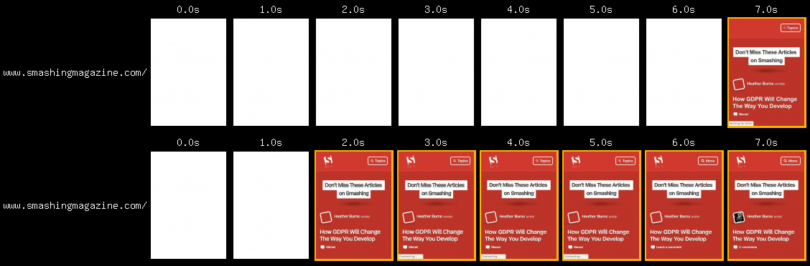
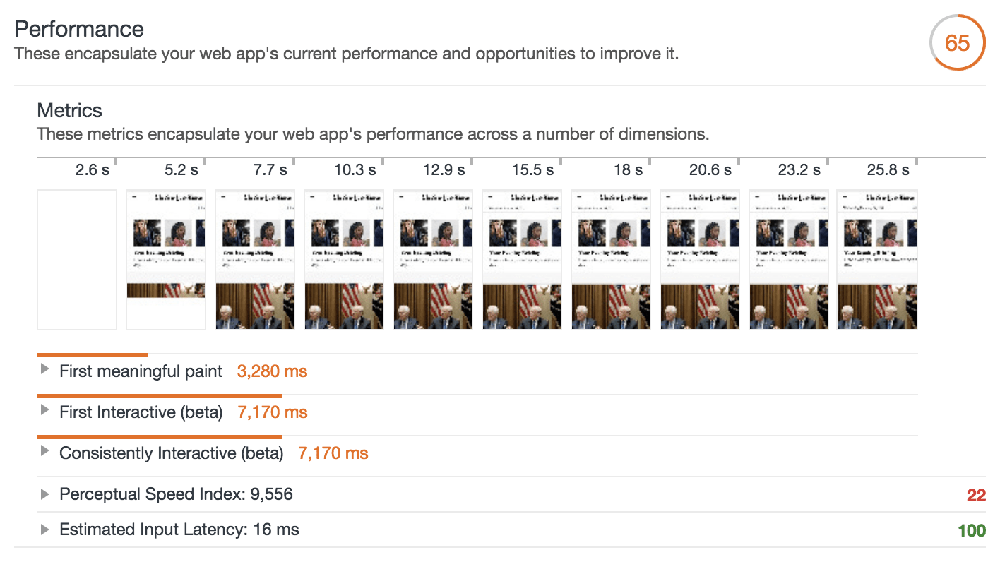

# Why Performance Matters
In our shared pursuit to push the web to do more, we're running into a comman problem: performance. Sites have more features than even before. So much so, that many sites now struggle to achieve a high level of performance across a variety of newtwork conditions and devices.
Performance issues vary. At best, they create small delays that are only briefly annoying to your users. At worst they make your site completely inaccessible, unresponsive to user input, or both.

## Performance is about retaining users
We want users to interact meaningfully with what we build. If it's a blog, we want people to read posts. If it's an online store, we want them to buy stuff. If it's social network, we want them to interact with each other.

Performance plays a major role in the success of any online venture. Here are some case studies that show high-performing sites enages and retain user beter than low performing ones:
- Pinterest increased search engine traffic and sign-ups by 15% when they reduced percevied wait times by 40%.
- COOK incresed conversions by 7%, decreased bounce rate by 7%, and increase pages per sesion by 10% when they reduced page load time by 850 milliseconds.

Here are a couple case studies where low performance had a negative impact on business goals:
- The BBC found they lost an additional 10% of users for every additional second their site took to load.
- DoubleClick by Google found 53% of mobile site visits were abandoned if a page took longer thant 3 seconds to load.

## Performance is about improving conversions
Reataining users is crucial to improving conversions. Slow sites have a negative impact on revenue, and the opposite is also true. Here are some example of how performance has played a role in making business more(or less profitable):
- For Mobify, every 100ms decrease in homepage load speed worked out to a 1.11% increase in session-based conversion, yielding an average annual revenue increase of nearly $380,000. Additionally, a 100ms decrease in checkout page load speed amounted to a 1.55% increase in session-based conversion, which in turn yielded an average annual revenue increase of nearly $530,000.
- DoubleClick found publishers whose sites loaded withing five seconds earned up to twice as much ad revenue than sites loading withing 19 seconds.
- When AutoAnything reduced page load time by half, they saw a boost of 12-13% in sales.

## Performance is about the user experience
When you navigate to a URL, you do so from any number of potential starting points. Depending on a number of condition, such as connection quality and the device you're using, your experience could be quite different from another user's.

As a site begins to load, there's a period of time where users wait for content to appear. Until this happends, there's no user experience to speak of. This lack of an experience is fleeting on fast connections. On slower connections, however, users are focused to wait. Users may experience more problems as page resource slowly trickle in.

Performance is a foundational aspect of good user experiences. When sites ship a lot of code, browsers must use megabytes of the user's data plan in order to download the code. Mobile devices have limited CPU power and memory. They often get overwhelmed with what we might consider a small amount of unoptimized code. This creates poor performance which leads to unresponsiveness. Knowing what we know about human behavior, users will only tolerate low performing applications for so long before abandoning them. If you want to know more about how to asses your site's performance and find opportunities for improvement, check out [How to Think About Speed Tools](https://developers.google.com/web/fundamentals/performance/speed-tools)

## Performance is about people
Poorly performing sites and applications can also pose real costs for the people who use them.

As mobile users continue to make up a larger portion of internet users worldwide, it's important to bear in mind that many of these user access the web through mobile LTE, 4G, 3G, and even 2G networks. As Ben Schwarz of Calibre points out in [this sudy of real world performance](https://building.calibreapp.com/beyond-the-bubble-real-world-performance-9c991dcd5342), the cost of prepaid data plans is decreasing, which in turn in making access to the internet more affordable in places where it once wasn't. Mobile devices and internet access are no longer luxuries. They are common tool necessary to navigate and function in an increasingly interconnected world.

Total page size has been steadily increasing since at least 2011, and the trend appears to be continuing. As the typical page sends more data, user must replenish their metered data plans more often, which cost them money.

In addition to saving users money, fast and lightweight user experiences can also prove crucial for users in crisis. Public resources such as hospitals, clincis, and crisis centers have online resources that give users important and specific information that they need during crisis. While design is pivotal in presenting important information efficiently in stressful moments, the importance of delivering this information fast can't be understand. It part of our job.

## Where to go from here
While the list below many seem daunting, understand you don't need to do all of these things to improve the performance of your site. They are just starting points, so don't feel overwhelmed! Anything you can do to improve performance will be helpful to your users.

### Mind what resource you send
An effective method of building high performance applications to audit what resources you send to users. While the `Network panel in Chrome DevTools` does a fantastic job of summarizing all the resources used on a given page, it can be daunting to know where to know to start if you haven't considered performance until now. Here are a few suggestions.
- If you use Bootstrap or Foundation to build your UI, ask yourself if they're neessary. Such abstraction add heaps of CSS the browser must downloaded, parse, and apply to a page, all before your site-specific CSS enters the picture. Flexbox and Grid are superb at creating both simple and complex layouts with relatively little code. Because CSS is a rendering blocking resource the overhead of a CSS framework can delay rendering significantly. You can speed up your rendering by removing unnecessary overhead whenever possible.
- Javascript libraries are convenient, but not always necessary. Take jQuery for example: Element selection has been greatly simplified thanks to methods like `querySelector` and  `querySelectorAll`. Event binding is easy with `addEventListener`. `classlist`, `setAttribute`, and `getAttribute` offer easy ways of working with classes and element attributes. If you must use a library, researcher for learner alternatives. For example, Zepto is smaller jQuery alternative, and Preact is a much smaller alternative to React.
- Not all websites need to be single page applications (SPAs), as they often make estensive use of Javascript. Javascript is the most expensive resource we serve on the web byte for byte, as it must not only be downloaded, but parsed, compiled and executed as well. For example news and blog sites with optimized front end architecture can perform well as traditional multipage experiences. Praticularly if HTTP caching is configured properly, and optionally, if a service worker is used.

### Mind how you send resources
Efficent deliverly is vital to building fast user experiences:
- Migrate to HTTP/2. HTTP/2 addresses many performance problems inherent in HTTP/1.1 such as concurrent request limits and the lack of header compression.
- Download resource eariler using resource hints `rel=preload` in one such resource hint that allow early fetched of critical resources before the browser would otherwise discover them. This can have pronounced postive effect on page rendering and lowering Time to interactive when used judiciously. `rel=preconnect` is another resource hint that can mask the latency of opening new connections for resources hosted on third part domains.
- Modern sites ship a lot of Javascript and CSS on average. It was common to bundle styles and scripts into large bundles in HTTP/1 environments. This was done because a large amount of requests was detrimental to performance. This is not longer the case now that HTTP/2 is on the scene, as multiple, simultaneous request are cheaper. Consider using code splitting in webpack to limit the amount of scripts downloaded to only what is needed by the current page or view. Separate your CSS into smaller template or component-specific files, and only include those resource where they're likely to be used.

### Mind how much data you send
Here are some suggestion for limiting how much data you send:
- Minify text assets. Minification is the removal of unnecessary whitespace, comments and other content in text-based resources. It significantly reduces the amount of data you send users without impacting functionality. Use uglification in Javascript to get more savings through shortening variable and method names. Since SVG is a text-based image format, it can be optimized with SVGO
- Configure your server to compress resources. Compression drastically reduces the amount of data you send to users, especially text assets. GZIP is a popular option, but Brotli compression can go further. Understand, however, that compression is not a catch-all for performance woes: Some file formats which are implicitly compressed (e.g JPG, PNG, GIF, WOFF etc) don't respond to compression because they're alaready compressed.
- Optimize images to ensure your site sends as little image data as possible. Since images make up a large portion of the average per-page payload on the web, image optimization represents a uniquely large opportunity to boost performance.
- If you have time, consider serving alternative image formats. WebP enjoys resonably broad browser support, and use less data than JPEG and PNG while keeping visual quality high. JPEG XR is another alternative format supported in IE and Edge offering similar savings.
- Deliver images responsively. The huge diversity of devices and their screens present a tremendous opportunity to improve performance sending images that are the best fit for the screens that view them. In the simplest use cases, you can add an `srcset attribute` to an `` element to specify an array of images the browser can choose from. One the more complex side of things, you can use `<picture>` to help the browser choose the most optimal format (e.g. WebP, JPEG or PNG) or serve altogether different treatments of images for different screen sizes.
- Use video instead of animated GIFs. Animated GIFs are massive. Videos of similar qulaity are far smaller often by 80% or so. If your site makes heavy use of animated GIFs, this is probably the most impactful thing you can do to improve loading performance.
- Client hints can tailor resource delivery based on current network conditions and device characteristics. The `DPR`, `Width` and `Viewport-Width` headers can help you deliver the best images for devices using server-side code and deliver less markup. The `Save-Data` header can help you deliver lighter application experiences for users who are specifically asking you to do so.
- The `NetworkInformation` API exposes information about the user's network connection. The information can be used to modify application experience for users on slower networks.

